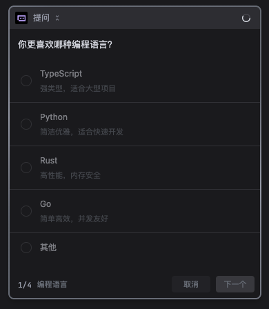

# 多智能体

## 子智能体

### 拉起子智能体

子智能体拉起时需要传入以下参数：

- **goal** — 子智能体的目标
- **context** — 上下文信息
- **tools** — 可用工具集
- **skills** — 可用技能集

> 拉起子智能体的时候，主智能体需要决定子智能体是**并行**还是**串行**执行。

### 子智能体返回值

```Bash
final_response 子 Agent 的最终文本响应
completed True 自然完成，False 达到最大迭代数
interrupted True 被中断
api_calls 实际调用的 API 次数
messages 完整对话历史
```

## 工具

### 主动询问（AskUserQuestion）

**工具定义（Tool Schema）：**

```json
{
      "function": {
          "description": "Use this tool when you need to ask the user questions during execution. This allows you to:\n1. Gather user preferences or requirements\n2. Clarify ambiguous instructions\n3. Get decisions on implementation choices as you work\n4. Offer choices to the user about what direction to take\n\n## When to Use This Tool\nUse this tool in these scenarios:\n  1. When the user's request is ambiguous and you need clarification\n  2. When there are multiple valid approaches and you want user input\n  3. When you need to confirm important decisions before proceeding\n  4. When the user might have preferences that would affect your implementation\n\n## When NOT to Use This Tool\nSkip using this tool when:\n  1. The task is clear and straightforward\n  2. You can make reasonable assumptions based on context\n  3. The decision is trivial and won't significantly impact the outcome\n  4. You've already asked similar questions in the current session\n\n## Usage Notes\n- Users will always be able to select \"Other\" to provide custom text input\n- Use multiSelect: true to allow multiple answers to be selected for a question\n- If you recommend a specific option, make that the first option in the list and add \"(Recommended)\" at the end of the label\n- Keep questions concise and clear\n- Provide helpful descriptions for each option\n- Limit to 1-4 questions per call to avoid overwhelming the user\n\n## Plan mode note\nIn plan mode, use this tool to clarify requirements or choose between approaches BEFORE finalizing your plan. Do NOT use this tool to ask \"Is my plan ready?\" or \"Should I proceed?\" - use ExitPlanMode for plan approval.\n",
          "name": "AskUserQuestion",
          "parameters": {
              "properties": {
                  "questions": {
                      "description": "Questions to ask the user (1-4 questions)",
                      "items": {
                          "properties": {
                              "header": {
                                  "description": "Very short label displayed as a chip/tag (max 12 chars). Examples: \"Auth method\", \"Library\", \"Approach\".",
                                  "type": "string"
                              },
                              "multiSelect": {
                                  "default": false,
                                  "description": "Set to true to allow the user to select multiple options instead of just one. Use when choices are not mutually exclusive.",
                                  "type": "boolean"
                              },
                              "options": {
                                  "description": "The available choices for this question. Must have 2-4 options. Each option should be a distinct, mutually exclusive choice (unless multiSelect is enabled). There should be no 'Other' option, that will be provided automatically.",
                                  "items": {
                                      "properties": {
                                          "description": {
                                              "description": "Explanation of what this option means or what will happen if chosen. Useful for providing context about trade-offs or implications.",
                                              "type": "string"
                                          },
                                          "label": {
                                              "description": "The display text for this option that the user will see and select. Should be concise (1-5 words) and clearly describe the choice.",
                                              "type": "string"
                                          }
                                      },
                                      "required": [
                                          "label",
                                          "description"
                                      ],
                                      "type": "object"
                                  },
                                  "maxItems": 4,
                                  "minItems": 2,
                                  "type": "array"
                              },
                              "question": {
                                  "description": "The complete question to ask the user. Should be clear, specific, and end with a question mark. Example: \"Which library should we use for date formatting?\" If multiSelect is true, phrase it accordingly, e.g. \"Which features do you want to enable?\"",
                                  "type": "string"
                              }
                          },
                          "required": [
                              "question",
                              "header",
                              "options",
                              "multiSelect"
                          ],
                          "type": "object"
                      },
                      "maxItems": 4,
                      "minItems": 1,
                      "type": "array"
                  }
              },
              "required": [
                  "questions"
              ],
              "type": "object"
          }
      },
      "type": "function"
  },
```


**模型调用示例（Response）：**

```
{
  "content": "",
  "reasoning_content": "The user is asking me to use the AskUserQuestion tool to ask them some random questions. Let me come up with a few interesting questions to ask.",
  "role": "assistant",
  "tool_calls": [
    {
      "function": {
        "arguments": "{\"questions\": [{\"question\": \"你更喜欢哪种编程语言？\", \"header\": \"编程语言\", \"options\": [{\"label\": \"TypeScript\", \"description\": \"强类型，适合大型项目\"}, {\"label\": \"Python\", \"description\": \"简洁优雅，适合快速开发\"}, {\"label\": \"Rust\", \"description\": \"高性能，内存安全\"}, {\"label\": \"Go\", \"description\": \"简单高效，并发友好\"}]}, {\"question\": \"你平时偏好哪种工作方式？\", \"header\": \"工作方式\", \"options\": [{\"label\": \"安静专注\", \"description\": \"喜欢大块不被打扰的时间深度工作\"}, {\"label\": \"协作交流\", \"description\": \"喜欢频繁沟通和团队协作\"}, {\"label\": \"灵活切换\", \"description\": \"根据任务类型灵活调整工作模式\"}]}, {\"question\": \"你对 AI 编程助手的期望是什么？\", \"header\": \"AI 期望\", \"options\": [{\"label\": \"快速完成任务\", \"description\": \"希望 AI 能高效准确地完成编码任务\"}, {\"label\": \"学习伙伴\", \"description\": \"希望 AI 能边做边教，帮助提升技能\"}, {\"label\": \"代码审查员\", \"description\": \"希望 AI 能帮助审查和优化代码质量\"}]}]}",
        "name": "AskUserQuestion"
      },
      "id": "call_4b393260fed4441cbab09eab",
      "type": "function"
    }
  ]
}
```

**参数结构示例：**

```json
{
    "questions": [
        {
            "question": "你更喜欢哪种编程语言？",
            "header": "编程语言",
            "options": [
                {
                    "label": "TypeScript",
                    "description": "强类型，适合大型项目"
                },
                {
                    "label": "Python",
                    "description": "简洁优雅，适合快速开发"
                },
                {
                    "label": "Rust",
                    "description": "高性能，内存安全"
                },
                {
                    "label": "Go",
                    "description": "简单高效，并发友好"
                }
            ]
        },
        {
            "question": "你平时偏好哪种工作方式？",
            "header": "工作方式",
            "options": [
                {
                    "label": "安静专注",
                    "description": "喜欢大块不被打扰的时间深度工作"
                },
                {
                    "label": "协作交流",
                    "description": "喜欢频繁沟通和团队协作"
                },
                {
                    "label": "灵活切换",
                    "description": "根据任务类型灵活调整工作模式"
                }
            ]
        },
        {
            "question": "你对 AI 编程助手的期望是什么？",
            "header": "AI 期望",
            "options": [
                {
                    "label": "快速完成任务",
                    "description": "希望 AI 能高效准确地完成编码任务"
                },
                {
                    "label": "学习伙伴",
                    "description": "希望 AI 能边做边教，帮助提升技能"
                },
                {
                    "label": "代码审查员",
                    "description": "希望 AI 能帮助审查和优化代码质量"
                }
            ]
        }
    ]
}
```




### 通知用户（NotifyUser）

```json
{
    "function": {
        "description": "Notify the user to review the current output, request feedback, update the Plan or Spec accordingly, and repeat this process until the user explicitly approves before proceeding to **EXECUTION**.\n**When to use**:\nYou are in **Plan mode**, the plan is complete, and user confirmation is required before exiting read-only Plan mode and starting execution.\nYou are in **Spec mode**, all specification artifacts (including spec.md, checklist.md, and tasks.md) are complete, and you need to notify the user that the specification phase is finished and approval is required before starting implementation.\nYou are in regular **Agent Mode** and you have invoked the **web-dev** skill, and the PRD document and technical documentation have been generated. You need to notify the user that the documents are ready for review and approval before proceeding with implementation.\n**When not to use**:\nYou are in regular Agent Mode and there are unresolved questions or decisions that require user input. Use **AskUserQuestion** instead.\nYou are in Plan or Spec mode, but the relevant documentation is **not yet complete** and clarification or confirmation is still needed. Use **AskUserQuestion** instead.\n",
        "name": "NotifyUser",
        "parameters": {
            "properties": {
                "explanation": {
                    "description": "Brief explanation of this notice.",
                    "type": "string"
                },
                "file_paths": {
                    "description": "The absolute paths of the documents which need to be notified to users for review, including plan, spec, tasks, check_list, and PRD documents generated by skills.",
                    "items": {
                        "type": "string"
                    },
                    "type": "array"
                }
            },
            "required": [
                "file_paths"
            ],
            "type": "object"
        }
    },
    "type": "function"
},
```

