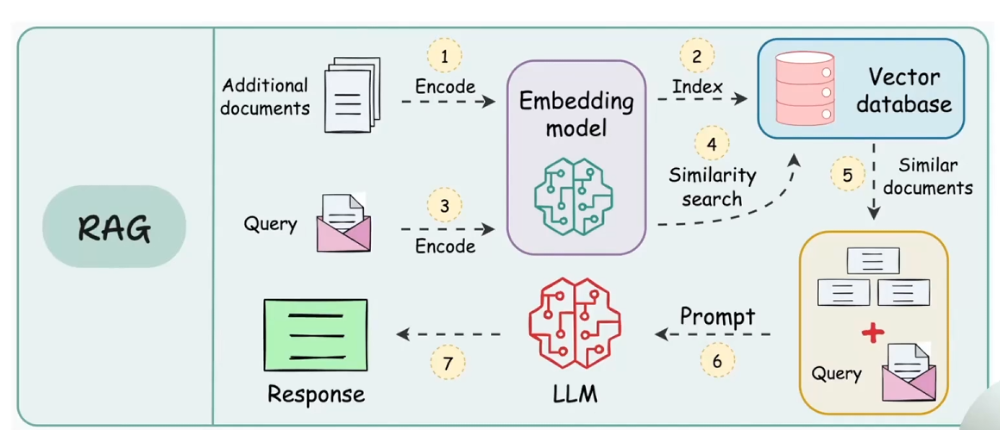
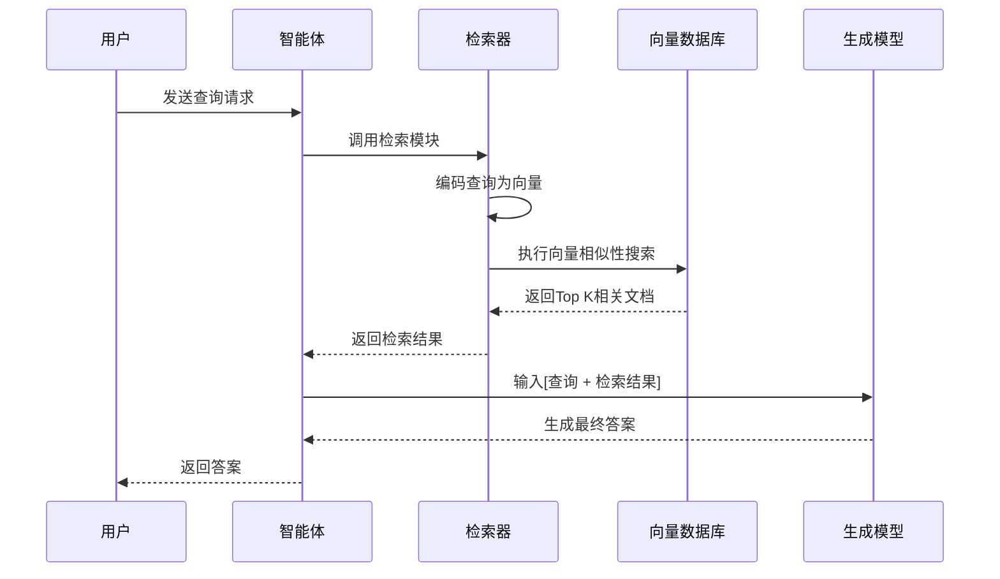

```mermaid
sequenceDiagram
    participant 用户
    participant 智能体
    participant 检索器
    participant 向量数据库
    participant 生成模型

    用户 ->> 智能体: 发送查询请求
    智能体 ->> 检索器: 调用检索模块
    检索器 ->> 检索器: 编码查询为向量
    检索器 ->> 向量数据库: 执行向量相似性搜索
    向量数据库 -->> 检索器: 返回Top K相关文档
    检索器 -->> 智能体: 返回检索结果
    智能体 ->> 生成模型: 输入[查询 + 检索结果]
    生成模型 -->> 智能体: 生成最终答案
    智能体 -->> 用户: 返回答案
```

