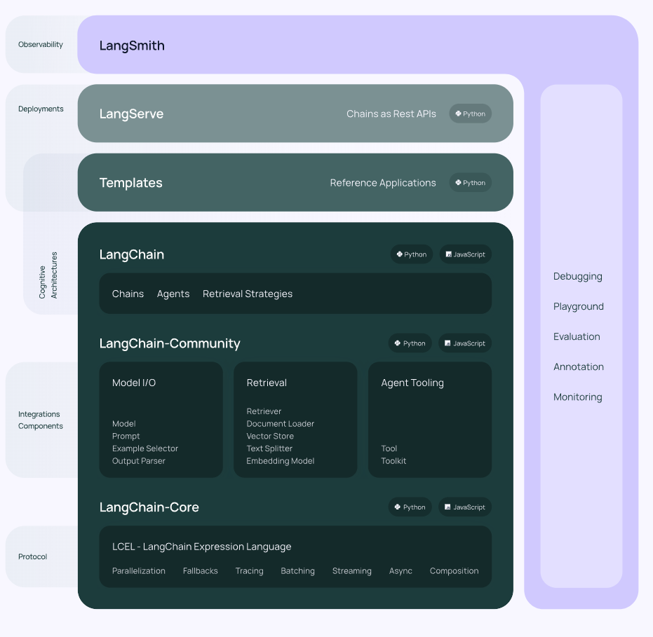

# 简介

LangChain是一个开源的Python AI应用开发框架，它提供了构建基于大模型的AI应用所需的模块和工具。通过LangChain，开发者可以轻松地与大模型（LLM）集成，完成文本生成、问答、翻译、对话等任务。LangChain降低了AI应用开发的门槛，让任何人都可以基于LLM构建属于自己的创意应用。
**LangChain特性：**

- **LLM和提示（Prompt）**：LangChain对所有LLM大模型进行了API抽象，统一了大模型访问API，同时提供了Prompt提示模板管理机制。
- **链（Chain）**: LangChain对一些常见的场景封装了一些现成的模块，例如：基于上下文信息的问答系统，自然语言生成SQL查询等等，因为实现这些任务的过程就像工作流一样，一步一步的执行，所以叫链（Chain）。
- **LCEL**：LangChain Expression Language(LCEL)，LangChain新版本的核心特性，用于解决工作流编排问题，通过LCEL表达式，我们可以灵活的自定义AI任务处理流程，也就是灵活自定义链（Chain）。
- **数据增强生成（RAG）**：因为大模型（LLM）不了解新的信息，无法回答新的问题，所以我们可以将新的信息导入到LLM，用于增强LLM生成内容的质量，这种模式叫做RAG（Retrieval Augmented Generation）
- **Agents**：是一种基于大模型（LLM）的应用设计模式，利用LLM的自然语言理解和推理能力（LLM作为大脑），根据用于的需求自动调用外部系统、设备共同去完成任务，例如：用户输入“明天请假一天”，大模型（LLM）自动调用请假系统，发起一个请假申请。
- **模型记忆（memory）**: 让大模型记住之前的对话内容，这种能力成为模型记忆（memory）。

# LangChain框架组成



LangChain框架由几个部分组成，包括：

- **LangChain库**：Python和JavaScript库。包含接口和集成多种组件的运行时基础，以及现成的链和代理的实现。
- **LangChain模板**：LangChain官方提供的一些AI任务模板。
- **LangServe**：基于FastAPI可以将LangChain定义的链（Chain），发布微REST API。
- **LangSmith**：开发平台，是个云服务，支持LangChain debug、任务监控。

## LangChain库（Libraries）

LangChain库本身由几个不同的包组成。

- `langchain-core`：基础抽象和LangChain表达语言。
- `langchain-community`：第三方集成，主要包括LangChain集成的第三方组件。
- `langchain`：主要包括链(chain)、代理（agent）和检索策略

## LangChain任务处理流程


如上图，LangChain提供一套提示词模板（prompt template）管理工具，负责处理提示词，然后传递给大模型处理，最后处理大模型返回的结果，

LangChan对大模型的封装主要包括 LLM 和 Chat Model两张类型。

- LLM - 问答模型，模型接收一个文本输入，然后返回一个文本结果。
- Chat Model - 对话模型，接受一组对话消息，然后返回对话消息，类似聊天一样。

## 核心概念

### 1. LLMs

LangChain封装的基础模型，模型接收一个文本输入，然后返回一个文本结果。

### 2. Chat Models

聊天模型（或者成为对话模型），与LLMs不同，这些模型转为对话场景而设计。模型可以接收一组对话消息，然后返回对话消息，类似聊天消息一样。

### 3. 消息（Message）

指的是聊天模型（Chat Models）的消息内容，消息类型包括HumanMesage、AIMessage、SystemMessage、FunctionMessage和ToolMessage等多种类型的消息。

### 4. 提示（prompts）

LangChain封装了一组专门用于提示词（prompts）管理的工具类，方便我们格式化提示词（prompts）内容。

### 5. 输出解析器（Output Parsers）

如上图介绍，LangChain接受大模型返回的文本内容之后，可以使用专门的输出解析器对文本内容进行格式化，例如解析json、或者将llm输出的内容转成python对象。

### 6.Retrievers

为方便我们将私有数据导入到大模型，提高模型回答问题的质量，LangChian封装了检索框架（Retrievers）,方便我们加载文档数据、切割文档数据、存储和检索文档数据。

### 7.向量存储（Vector stores）

为支持私有数据的语义相似搜索，LangChain支持多种向量数据库。

### 8.Agents

智能体（Agents），通常指的是以大模型作为决策引擎，根据用户输入的任务，自动调用外部系统、硬件设备共同完成用户的任务，是一种以大模型为核心的应用设计模式。

# 应用

- 对话机器人：构建智能的对话助手、客服机器人、聊天机器人等。
- 知识库问答：结合知识图谱，进行开放域问题的问答服务。
- 智能协作：如文中写作、创意写作、文本摘要等

# 快速入门

## 安装LangChain

要安装LangChain，可以使用pip和Conda进行安装。以下是安装LangChain的步骤：

使用pip:

```python
pip install langchain
pip install langchain-openai
```

## 初始化模型

在使用LangChain之前，需要导入LangChain x OpenAI集成包，并设置API密钥作为环境变量或直接传递给OpenAI LLM类。

首先，获取OpenAI的API密钥，可以通过创建账户并访问此链接来获取。

设置环境变量：

```bash
OPENAI_API_KEY="取得的OPENAI key"
OPENAI_API_BASE="如果不是用官网API地址可以设置这个"
```

>没有官方api key的话，可以使用[https://api.xty.app/register?aff=U22j](https://api.xty.app/register?aff=U22j) 注册一个，会送一些免费的额度，对应OPENAI_API_BASE配置为https://api.xty.app/v1

## 使用LLM

使用LLM来回答问题非常简单。可以直接调用LLM的`invoke`方法，并传入问题作为参数。此外，还可以通过提示词模板（prompt template）生成提示词，用于向模型（LLM）发送指令。

下面演示了如何构建一个简单的LLM链：

```python
# 引入langchain聊天专用提示词模板
from langchain_core.prompts import ChatPromptTemplate

# 引入langchain openai sdk
from langchain_openai import ChatOpenAI

# 如果是官方URL,使用以下即可
llm = ChatOpenAI()

# 根据message 定义提示词模板
# 这里以对话模型的消息格式为例子，不熟悉openai对话模型的话，可以参考官方文档
# 下面消息模板，定义两条消息，system消息告诉模型扮演什么角色，user消息代表用户输入的问题
prompt = ChatPromptTemplate.from_messages([
    ("system", "你是世界级的技术专家"),
    ("user", "{input}")
])

# 通过langchain的链式调用，生成一个chain
# 基于LCEL表达式构建LLM链，lcel语法类似linux的pipeline语法，从左到右顺序执行
# 下面编排了一个简单的工作流，首先执行prompt完成提示词模板（prompt template）格式化处理，然后将格式化后的结果传递给llm模型
chain = prompt | llm

result = chain.invoke({"input": "帮我写一篇关于AI的技术文章，100字"})
print(result)

```

输出示例：

```
content='人工智能（AI）是模拟人类智能的技术，涵盖机器学习、自然语言处理、计算机视觉等多个领域。通过数据训练，AI可以识别模式、进行预测、解决问题，甚至进行自动决策。近年来，深度学习的快速发展推动了AI在语音识别、图像处理、医疗诊断等领域的广泛应用。尽管AI带来了诸多创新和便利，但也伴随隐私、安全、伦理等挑战。随着技术的不断进步，AI的潜力将继续扩大，深刻影响各行各业的发展。' additional_kwargs={'refusal': None} response_metadata={'token_usage': {'completion_tokens': 225, 'prompt_tokens': 41, 'total_tokens': 266, 'completion_tokens_details': None, 'prompt_tokens_details': None}, 'model_name': 'gpt-3.5-turbo-0613', 'system_fingerprint': 'fp_b28b39ffa8', 'finish_reason': 'stop', 'logprobs': None} id='run-45ba2d20-d6a3-45a6-b25c-f22b78da66d9-0' usage_metadata={'input_tokens': 41, 'output_tokens': 225, 'total_tokens': 266, 'input_token_details': {}, 'output_token_details': {}}
```

## 输出转换

LLM的输出通常是一条信息，为了更方便处理结果，可以将消息转换为字符串。下面展示如何将LLM的输出消息转换为字符串：

```python
# 字符串输出解析器
from langchain_core.output_parsers import StrOutputParser
# 引入langchain聊天专用提示词模板
from langchain_core.prompts import ChatPromptTemplate

# 引入langchain openai sdk
from langchain_openai import ChatOpenAI

llm = ChatOpenAI()

# 根据message 定义提示词模板
prompt = ChatPromptTemplate.from_messages([
    ("system", "你是世界级的技术专家"),
    ("user", "{input}")
])

# 创建一个字符串输出解析器
out_parse = StrOutputParser()

# 将输出解析器添加到LLM链中，跟前面的例子区别就是工作流编排，最后一步将LLM模型输出的结果传递给out_parse
chain = prompt | llm | out_parse

result = chain.invoke({"input": "帮我写一篇关于AI的技术文章，100字"})
print(result)
```

输出示例：

```
人工智能（AI）是模拟人类智能过程的技术，涉及机器学习、自然语言处理、计算机视觉等领域。通过大量数据和算法，AI能够从经验中学习并做出决策，应用广泛，如自动驾驶、医疗诊断、金融预测等。深度学习作为AI的一种重要技术，通过多层神经网络处理复杂任务，显著提高了识别和预测的准确性。尽管AI发展迅速，仍面临伦理和安全等挑战，未来将推动各行业的变革，带来更多创新机会。
```

以上是关于LangChain的介绍及简单入门。

# demo源码地址

[https://github.com/lys1313013/langchain-example/tree/main/01-chat](https://github.com/lys1313013/langchain-example/tree/main/01-chat)

# 参考资料

[B站：2025吃透LangChain大模型全套教程（LLM+RAG+OpenAI+Agent）第1集](https://www.bilibili.com/video/BV1BgfBYoEpQ/?vd_source=a835ff13776aa85a80bbdcf7eec57f27)

[LangChain官网介绍](https://python.langchain.com/v0.1/docs/get_started/introduction/)

[https://lanchestios.github.io/2023/07/13/LLM-LangChain/](https://lanchestios.github.io/2023/07/13/LLM-LangChain/)
