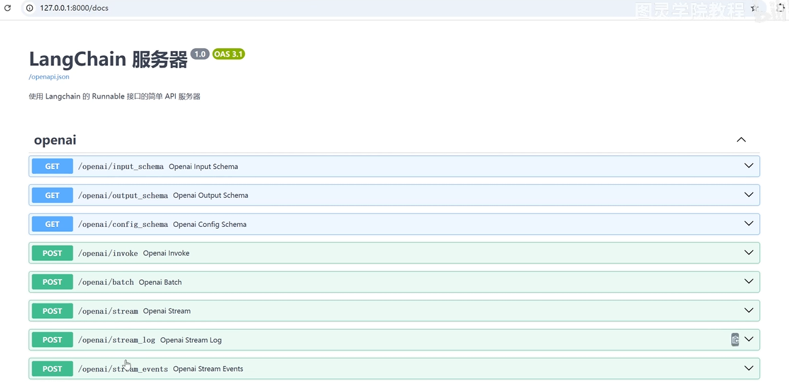
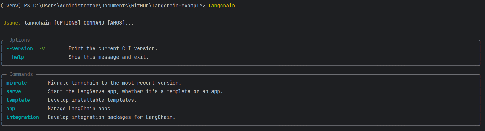

分享内容

1. LangServe服务部署
2. LangSmith Tracing（跟踪）
3. Verbose（详细日志打印）
4. Debug（调试日志打印）

# LangServe服务部署

## 概述

LangServe帮助开发者将`LangChain`可运行和链部署为REST API

该库集成了FastAPI并使用pydatic进行数据验证。

**Pydantic**是一个在Python中用于数据验证和解析的第三方库，现在是Python中使用广泛的数据验证库。

- 它利用声明式的方式定义数据模型和Python类型提示的强大功能来执行数据验证和序列化，使代码更可靠、更易读、更简洁且更易于调试。
- 它还可以从模型生成JSON架构，提供了自动生成文档等功能，从而轻松与其他工具集成

此外，它提供了一个客户端，可用于调用部署在服务器的可运行对象。JavaScript客户端可在LangChain.js中找到。

## 特性

- 从LangChain对象自动推断输入和输出模式，并在每次API调用中执行，提供丰富的错误信息
- 高效的`/invoke`、`/batch`和`/stream`端点，支持单个服务器上的多个并发请求
- `/stream_log`端点，用于流式传输链/代理的所有（或部分）中间步骤
- **新功能**自0.0.40版本起，支持`/stream_events`，使流式传输更加简便，无需解析`/stream_log`的输出。
- 使用经过严格测试的开源Python库构建，如FastAPI、Dydantic、uvloop和asyncio。
- 使用客户端SDK调用LangServe服务器，就像本地运行可运行对象一样（或直接调用HTTP API）

## 限制

- 目前不支持服务器发起的事件的客户端回调
- 当使用Pydantic V2时，将不会生成OpenAPI文档。FastAPI支持混合使用Pydantic v1和v2命名空间。




自动生成接口文档


## 安装

对于客户端和服务器

```python
pip install --upgrade "langserve[all]"
```

或者对于客户端代码，`pip install "langserve[client]"`，对于服务器代码，`pip install "langserve[server]"`。

# LangChain CLI

使用`LangChain Cli`快速启动`LangServe`项目。

要使用langchain CLI，请确保已安装最新版本的`langchain-cli`。可以使用`pip install -U langchain-cli`进行安装

安装完之后，在控制台输入`langchain`可以看到一下信息



## 设置

注意：我们使用`poetry`进行依赖管理。请参与poetry文档了解更多信息。

### 1. 使用langchain cli命令创建新应用

```bash
langchain app new 04-langserve
```

> 04-langserve 为要创建的项目名称

### 2. 在add_routes中定义可运行对象。转到server.py并编辑

```
add_routes(app. NotImplemented)
```

### 3. 使用`poetry`添加第三方包（例如langchain-openai、langchain-anthropic、langchain-mistral等）

进入04-langserve

```
cd 04-langserve
```


```
pip install pipx

pipx ensurepath

pipx install poetry

poetry add langchian
poetry add langchian-openai
```

### 4. 设置相关环境变量。例如

```
export OPENAI_API_KEY="sk-..."
```

### 5.启动您的应用

```
poetry run langchain serve --port=8000
```

## 示例应用

???

## 服务器

## 文档

？？？

## 客户端

## 端点


# 参考资料

[https://python.langchain.com/docs/langserve/](https://python.langchain.com/docs/langserve/)
