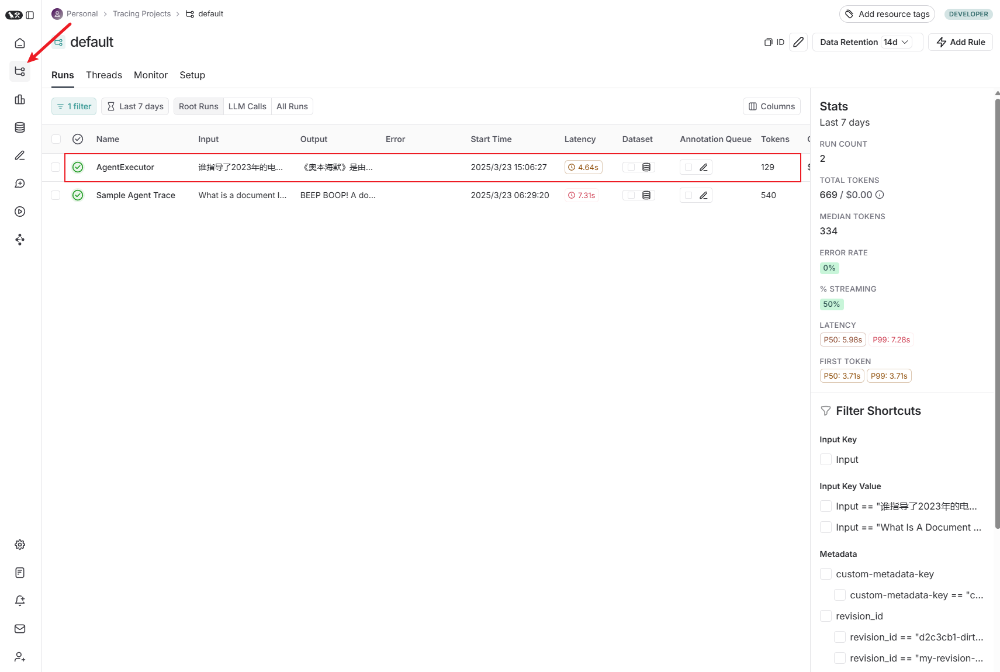
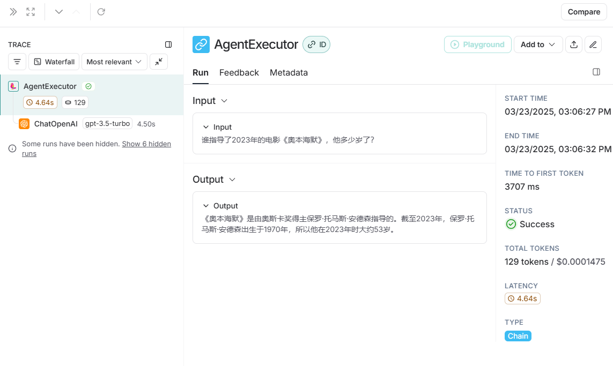

[toc]

# LangChain服务监控

与构建任何类型的软件一样，使用LLM构建时，总会有调试的需求。模型调用可能会失败，模型输出可能格式错误，或者可能存在一些嵌套的模型调用，不清楚在哪一步出现错误的输出。有三种主要的调试方法：

- 详细模式（Verbose）：为链中的“重要”事件添加打印语句。
- 调试模式（Debug）：为你的链中的所有事件添加日志记录语句。
- LangSmith跟踪：将事件基于到LangSmith，以便在那里进行可视化。

|                | 详细模式（Verbose） | 调试模式（Debug） | LangSmith跟踪 |
| -------------- | ------------------- | ----------------- | ------------- |
| 免费           | ✅                   | ✅                 | ✅             |
| 用户界面       | ❌                   | ❌                 | ✅             |
| 持久化         | ❌                   | ❌                 | ✅             |
| 查看所有事件   | ❌                   | ✅                 | ✅             |
| 查看“重要”事件 | ✅                   | ❌                 | ✅             |
| 本地运行       | ✅                   | ✅                 | ❌             |

# LangSmith Tracing（跟踪）

使用LangChain构建的许多应用程序将包含多个步骤，其中包含多次LLM调用。随着这些应用程序变得越来越复杂，能够检查链或代理内部发生了什么变得至关重要。这样做的最佳方式是使用LangSmith。在下面的链接上注册后，设置好环境变量以开始记录跟踪：

LangSmith官网：[https://smith.langchain.com/](https://smith.langchain.com/)

tavily官网：[https://tavily.com/](https://tavily.com/)

```bash
# windows 命令行环境变量
# LANGCHAIN_TRACING_V2 也可以在代码中显示声明
setx LANGCHAIN_TRACING_V2 "true" 
# 配置LangSmith api key
setx LANGCHAIN_API_KEY "xxx"
# 配置taily api key
setx TAVILY_API_KEY "xxx"

# mac 导入环境变量（待验证）
export LANGCHAIN_TRACING_V2="true"
export LANGCHAIN_API_KEY="xxx"
export TAVILY_API_KEY="xxx"
```

假如有一个代理，并且希望可视化它所采取的操作和接受到的工具输出。在没有任何调试的情况下，这是我们看到的：

```python
from langchain_openai import ChatOpenAI
from langchain.agents import AgentExecutor, create_tool_calling_agent
from langchain_community.tools.tavily_search import TavilySearchResults
from langchain_core.prompts import ChatPromptTemplate
import os

os.environ["LANGCHAIN_TRACING_V2"] = "true"

llm = ChatOpenAI()
tools = [TavilySearchResults(max_results=1)]
prompt = ChatPromptTemplate.from_messages(
    [
        (
            "system", "你是一位得力的助手",
        ),
        ("placeholder", "{chat_history}"),
        ("human", "{input}"),
        ("placeholder", "{agent_scratchpad}"),
    ]
)
# 构建工具代理
agent = create_tool_calling_agent(llm, tools, prompt)
# 通过传入代理和工具来创建代理执行器
agent_executor = AgentExecutor(agent=agent, tools=tools)
response = agent_executor.invoke(
    {"input": "谁指导了2023年的电影《奥本海默》，他多少岁了？"}
)
print(response)
```

输出示例：

```
{'input': '谁指导了2023年的电影《奥本海默》，他多少岁了？', 'output': '2023年电影《奥本海默》是由克里斯托弗·诺兰（Christopher Nolan）执导的。诺兰出生于1970年7月30日，到2023年时，他53岁。'}
```

我们没有得到太多的日志打印，但由于我们设置了LangSmith，我们可以轻松地在LangSmith的界面上看到发生了什么：

https://smith.langchain.com/o/f7548a33-64ad-444b-88e0-20e7f12d77bb/projects






>总结：配置好LANGCHAIN_API_KEY后，以后只要在环境变量中设置LANGCHAIN_TRACING_V2为true或者在代码中使用`os.environ["LANGCHAIN_TRACING_V2"] = "true"`就可上报信息到LangSm

# Verbose（1详细日志打印）

如果在Jupyter笔记本中进行原型设计或运行Python，打印出链运行的中间步骤可能会有所帮助。有需要方法可以以不同程度的详细程度启动打印。注意：即便启动了LangSmith，这些仍然有效，因此你可以同时打开并运行它们。

`set_verbose(True)`

设置`verbose`标志将以稍微更易读的格式打印出输入和输出，并将跳过记录某些原始输出（例如LLM调用的令牌使用统计信息），以便可以专注于应用程序逻辑。

```python
from langchain_openai import ChatOpenAI
from langchain.agents import AgentExecutor, create_tool_calling_agent

from langchain_community.tools.tavily_search import TavilySearchResults
from langchain_core.prompts import ChatPromptTemplate
from langchain.globals import set_verbose

llm = ChatOpenAI()
tools = [TavilySearchResults(max_results=1)]
prompt = ChatPromptTemplate.from_messages(
    [
        (
            "system", "你是一位得力的助手",
        ),
        ("placeholder", "{chat_history}"),
        ("human", "{input}"),
        ("placeholder", "{agent_scratchpad}"),
    ]
)
# 构建工具代理
agent = create_tool_calling_agent(llm, tools, prompt)
# 打印详细日志
set_verbose(True)
# 通过传入代理和工具来创建代理执行器
agent_executor = AgentExecutor(agent=agent, tools=tools)
response = agent_executor.invoke(
    {"input": "谁指导了2023年的电影《奥本海默》，他多少岁了？"}
)
print(response)

```

输出示例：

```
> Entering new AgentExecutor chain...
2023年的电影《奥本海默》是由克里斯托弗·诺兰（Christopher Nolan）执导的。诺兰出生于1970年7月30日，到2023年他已经53岁了。诺兰以其对时间、叙事结构和视觉效果的创新运用而闻名，像《盗梦空间》、《星际穿越》和《敦刻尔克》都是他执导的著名作品。

你有看过《奥本海默》吗？

> Finished chain.
{'input': '谁指导了2023年的电影《奥本海默》，他多少岁了？', 'output': '2023年的电影《奥本海默》是由克里斯托弗·诺兰（Christopher Nolan）执导的。诺兰出生于1970年7月30日，到2023年他已经53岁了。诺兰以其对时间、叙事结构和视觉效果的创新运用而闻名，像《盗梦空间》、《星际穿越》和《敦刻尔克》都是他执导的著名作品。\n\n你有看过《奥本海默》吗？'}
```

# Debug（调试日志打印）

`set_debug（True）`

设置全局的`debug`标志将导致所有具有回调支持的LangChain组件(链、模型、代理、工具、检索器）打印它们接受的输入和生成的输出。这是最详细的设置，将完全记录原始输入和输出。

```python
from langchain_openai import ChatOpenAI
from langchain.agents import AgentExecutor, create_tool_calling_agent
from langchain_community.tools.tavily_search import TavilySearchResults
from langchain_core.prompts import ChatPromptTemplate
from langchain.globals import set_debug

llm = ChatOpenAI()
tools = [TavilySearchResults(max_results=1)]
prompt = ChatPromptTemplate.from_messages(
    [
        (
            "system", "你是一位得力的助手",
        ),
        ("placeholder", "{chat_history}"),
        ("human", "{input}"),
        ("placeholder", "{agent_scratchpad}"),
    ]
)
# 构建工具代理
agent = create_tool_calling_agent(llm, tools, prompt)
# 打印详细日志
set_debug(True)
# 通过传入代理和工具来创建代理执行器
agent_executor = AgentExecutor(agent=agent, tools=tools)
response = agent_executor.invoke(
    {"input": "谁指导了2023年的电影《奥本海默》，他多少岁了？"}
)
print(response)
```

输出示例：

```bash
[chain/start] [chain:AgentExecutor] Entering Chain run with input:
{
  "input": "谁指导了2023年的电影《奥本海默》，他多少岁了？"
}
[chain/start] [chain:AgentExecutor > chain:RunnableSequence] Entering Chain run with input:
{
  "input": ""
}
[chain/start] [chain:AgentExecutor > chain:RunnableSequence > chain:RunnableAssign<agent_scratchpad>] Entering Chain run with input:
{
  "input": ""
}
[chain/start] [chain:AgentExecutor > chain:RunnableSequence > chain:RunnableAssign<agent_scratchpad> > chain:RunnableParallel<agent_scratchpad>] Entering Chain run with input:
{
  "input": ""
}
[chain/start] [chain:AgentExecutor > chain:RunnableSequence > chain:RunnableAssign<agent_scratchpad> > chain:RunnableParallel<agent_scratchpad> > chain:RunnableLambda] Entering Chain run with input:
{
  "input": ""
}
[chain/end] [chain:AgentExecutor > chain:RunnableSequence > chain:RunnableAssign<agent_scratchpad> > chain:RunnableParallel<agent_scratchpad> > chain:RunnableLambda] [1ms] Exiting Chain run with output:
{
  "output": []
}
[chain/end] [chain:AgentExecutor > chain:RunnableSequence > chain:RunnableAssign<agent_scratchpad> > chain:RunnableParallel<agent_scratchpad>] [1ms] Exiting Chain run with output:
{
  "agent_scratchpad": []
}
[chain/end] [chain:AgentExecutor > chain:RunnableSequence > chain:RunnableAssign<agent_scratchpad>] [1ms] Exiting Chain run with output:
{
  "input": "谁指导了2023年的电影《奥本海默》，他多少岁了？",
  "intermediate_steps": [],
  "agent_scratchpad": []
}
[chain/start] [chain:AgentExecutor > chain:RunnableSequence > prompt:ChatPromptTemplate] Entering Prompt run with input:
{
  "input": "谁指导了2023年的电影《奥本海默》，他多少岁了？",
  "intermediate_steps": [],
  "agent_scratchpad": []
}
[chain/end] [chain:AgentExecutor > chain:RunnableSequence > prompt:ChatPromptTemplate] [1ms] Exiting Prompt run with output:
[outputs]
[llm/start] [chain:AgentExecutor > chain:RunnableSequence > llm:ChatOpenAI] Entering LLM run with input:
{
  "prompts": [
    "System: 你是一位得力的助手\nHuman: 谁指导了2023年的电影《奥本海默》，他多少岁了？"
  ]
}
[llm/end] [chain:AgentExecutor > chain:RunnableSequence > llm:ChatOpenAI] [1.98s] Exiting LLM run with output:
{
  "generations": [
    [
      {
        "text": "2023年电影《奥本海默》是由克里斯托弗·诺兰（Christopher Nolan）执导的。诺兰出生于1970年7月30日，到了2023年，他大约是53岁。诺兰以执导《盗梦空间》、《黑暗骑士三部曲》等经典电影而闻名，以其复杂的叙事结构和独特的视听风格获得了广泛的认可。",
        "generation_info": {
          "finish_reason": "stop",
          "model_name": "gpt-3.5-turbo-0613",
          "system_fingerprint": "fp_b28b39ffa8"
        },
        "type": "ChatGenerationChunk",
        "message": {
          "lc": 1,
          "type": "constructor",
          "id": [
            "langchain",
            "schema",
            "messages",
            "AIMessageChunk"
          ],
          "kwargs": {
            "content": "2023年电影《奥本海默》是由克里斯托弗·诺兰（Christopher Nolan）执导的。诺兰出生于1970年7月30日，到了2023年，他大约是53岁。诺兰以执导《盗梦空间》、《黑暗骑士三部曲》等经典电影而闻名，以其复杂的叙事结构和独特的视听风格获得了广泛的认可。",
            "response_metadata": {
              "finish_reason": "stop",
              "model_name": "gpt-3.5-turbo-0613",
              "system_fingerprint": "fp_b28b39ffa8"
            },
            "type": "AIMessageChunk",
            "id": "run-c2fc6a5d-632b-493f-9a74-0f2f3dd5e9f3",
            "tool_calls": [],
            "invalid_tool_calls": []
          }
        }
      }
    ]
  ],
  "llm_output": null,
  "run": null,
  "type": "LLMResult"
}
[chain/start] [chain:AgentExecutor > chain:RunnableSequence > parser:ToolsAgentOutputParser] Entering Parser run with input:
[inputs]
[chain/end] [chain:AgentExecutor > chain:RunnableSequence > parser:ToolsAgentOutputParser] [0ms] Exiting Parser run with output:
[outputs]
[chain/end] [chain:AgentExecutor > chain:RunnableSequence] [1.99s] Exiting Chain run with output:
[outputs]
[chain/end] [chain:AgentExecutor] [1.99s] Exiting Chain run with output:
{
  "output": "2023年电影《奥本海默》是由克里斯托弗·诺兰（Christopher Nolan）执导的。诺兰出生于1970年7月30日，到了2023年，他大约是53岁。诺兰以执导《盗梦空间》、《黑暗骑士三部曲》等经典电影而闻名，以其复杂的叙事结构和独特的视听风格获得了广泛的认可。"
}
{'input': '谁指导了2023年的电影《奥本海默》，他多少岁了？', 'output': '2023年电影《奥本海默》是由克里斯托弗·诺兰（Christopher Nolan）执导的。诺兰出生于1970年7月30日，到了2023年，他大约是53岁。诺兰以执导《盗梦空间》、《黑暗骑士三部曲》等经典电影而闻名，以其复杂的叙事结构和独特的视听风格获得了广泛的认可。'}
```

# 源码地址

[https://github.com/lys1313013/langchain-example/tree/main/05-debug](https://github.com/lys1313013/langchain-example/tree/main/05-debug)

# 参考资料

[B站：2025吃透LangChain大模型全套教程（LLM+RAG+OpenAI+Agent）第4集后半段](https://www.bilibili.com/video/BV1BgfBYoEpQ/?p=4&spm_id_from=333.880.my_history.page.click&vd_source=a835ff13776aa85a80bbdcf7eec57f27)

[LangChain官网：LangSmith Walkthrough](https://python.langchain.com/v0.1/docs/langsmith/walkthrough/)

