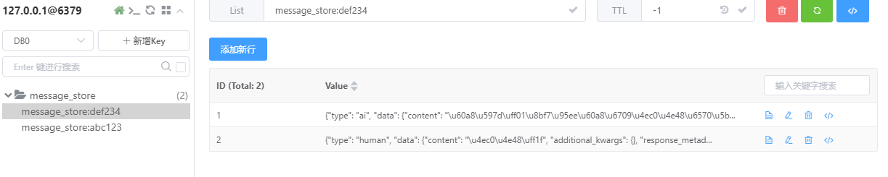

# 消息管理与聊天历史存储

[toc]

# 消息存储在内存

我们展示一个简单的示例，其中聊天历史保存在内存中，此处通过全局Python字典实现。

我们构建一个名为`get_session_history`的可调用对象，引用此字典以返回`ChatMessageHistory`实例。通过在运行时向`RunnableWithMessageHistory`传递配置，可以指定可配置对象的参数。默认情况下，期望配置参数是一个字符串`session_id`。可以通过`history_factory_config`关键字参数进行调整。

## 使用单参数session_id

```python
# 基于运行内存存储记忆,使用session_id字段
import os
from langchain_community.chat_message_histories import ChatMessageHistory
from langchain_core.prompts import ChatPromptTemplate, MessagesPlaceholder
from langchain_core.runnables.history import RunnableWithMessageHistory
from langchain_openai import ChatOpenAI
from langchain_core.chat_history import BaseChatMessageHistory

# 创建一个聊天提示词模板
prompt = ChatPromptTemplate.from_messages([
    ("system",
     "You are a helpful assistant who's good at {ability}. Respond in 20 words or fewer"),
    # 历史消息占位符
    MessagesPlaceholder(variable_name="history"),
    ("human", "{input}"),
])

# 这里使用阿里百炼的api,用官网的或者其他第三方网站也可以
llm = ChatOpenAI(
    api_key=os.getenv("DASHSCOPE_API_KEY"),
    base_url="https://dashscope.aliyuncs.com/compatible-mode/v1",
    model="qwen-turbo",
    temperature=0,
)

runnable = prompt | llm

store = {}

# 定义获取会话历史的函数,入参是session_id, 返回是会话历史记录
def get_session_history(session_id: str) -> BaseChatMessageHistory:
    if session_id not in store:
        store[session_id] = ChatMessageHistory()
    return store[session_id]


# 创建一个带历史记录的Runnable
with_message_history = RunnableWithMessageHistory(
    runnable,
    get_session_history,
    input_messages_key="input",
    history_messages_key="history"
)

response = with_message_history.invoke(
    {"ability": "math", "input": "余弦是什么意思？"},
    config={"configurable": {"session_id": "abc123"}},
)
print(response)

response = with_message_history.invoke(
    {"ability": "math", "input": "什么？"},
    config={"configurable": {"session_id": "abc123"}},
)
print(response)

response = with_message_history.invoke(
    {"ability": "math", "input": "什么？"},
    config={"configurable": {"session_id": "def234"}},
)
print(response)
```

输出示例：

```bash
content='余弦是一个数学函数，定义为在单位圆上角度的邻边与斜边之比，在三角形中表示角度相邻边与最长边的比例。' additional_kwargs={'refusal': None} response_metadata={'token_usage': {'completion_tokens': 34, 'prompt_tokens': 37, 'total_tokens': 71, 'completion_tokens_details': None, 'prompt_tokens_details': {'audio_tokens': None, 'cached_tokens': 0}}, 'model_name': 'qwen-turbo', 'system_fingerprint': None, 'id': 'chatcmpl-eb59cccb-0100-9dfd-a908-ffb02ef7bd80', 'finish_reason': 'stop', 'logprobs': None} id='run-d9dcb77a-846e-465e-af30-59d3db9dc420-0' usage_metadata={'input_tokens': 37, 'output_tokens': 34, 'total_tokens': 71, 'input_token_details': {'cache_read': 0}, 'output_token_details': {}}
content='余弦是三角函数之一，表示角的邻边与斜边的比值，在直角三角形中定义。' additional_kwargs={'refusal': None} response_metadata={'token_usage': {'completion_tokens': 26, 'prompt_tokens': 83, 'total_tokens': 109, 'completion_tokens_details': None, 'prompt_tokens_details': {'audio_tokens': None, 'cached_tokens': 0}}, 'model_name': 'qwen-turbo', 'system_fingerprint': None, 'id': 'chatcmpl-2934ecd5-f194-9ebf-b28f-6c6fb416f30a', 'finish_reason': 'stop', 'logprobs': None} id='run-cc88f2eb-ecfd-4531-b40d-5a31622b42fe-0' usage_metadata={'input_tokens': 83, 'output_tokens': 26, 'total_tokens': 109, 'input_token_details': {'cache_read': 0}, 'output_token_details': {}}
content='您好！请明确您的问题，我会尽力用20字以内解答。' additional_kwargs={'refusal': None} response_metadata={'token_usage': {'completion_tokens': 16, 'prompt_tokens': 34, 'total_tokens': 50, 'completion_tokens_details': None, 'prompt_tokens_details': {'audio_tokens': None, 'cached_tokens': 0}}, 'model_name': 'qwen-turbo', 'system_fingerprint': None, 'id': 'chatcmpl-c16193e8-a637-963f-b8b1-0699e88ce114', 'finish_reason': 'stop', 'logprobs': None} id='run-507d33d7-00b6-4b2d-b328-ffdcd324836f-0' usage_metadata={'input_tokens': 34, 'output_tokens': 16, 'total_tokens': 50, 'input_token_details': {'cache_read': 0}, 'output_token_details': {}}
```

>```python
># 第二句话和第一句话用了同样的session_id，所以第二句话获取到了第一句话的记录传给了大模型，所以第二句话接上了第一句话
># 第三局话用了不同的session_id，所以第三句话没有获取到历史记录传给大模型，所以大模型不知道是啥意思。
>```

## 配置会话唯一键

我们可以通过向`history_factory_config`参数传递一个`ConfigurableFieldSpec`对象列表来自定义跟踪消息历史的配置参数。下面我们使用了两个参数：`user_id`和`conversation_id`。

```python
# 基于内存存储记忆，使用user_id、conversation_id字段

import os
from langchain_community.chat_message_histories import ChatMessageHistory
from langchain_core.prompts import ChatPromptTemplate, MessagesPlaceholder
from langchain_core.runnables.history import RunnableWithMessageHistory
from langchain_openai import ChatOpenAI
from langchain_core.chat_history import BaseChatMessageHistory
# 引入langchain会话配置
from langchain_core.runnables import ConfigurableFieldSpec

prompt = ChatPromptTemplate.from_messages([
    ("system",
     "You are a helpful assistant who's good at {ability}. Respond in 20 words or fewer"),
    MessagesPlaceholder(variable_name="history"),
    ("human", "{input}"),
])

model = ChatOpenAI(
    api_key=os.getenv("DASHSCOPE_API_KEY"),
    base_url="https://dashscope.aliyuncs.com/compatible-mode/v1",
    model="qwen-turbo",
    temperature=0,
)
runnable = prompt | model

store = {}

def get_session_history(user_id: str, conversation_id: str) -> BaseChatMessageHistory:
    if (user_id, conversation_id) not in store:
        store[(user_id, conversation_id)] = ChatMessageHistory()
    return store[(user_id, conversation_id)]

with_message_history = RunnableWithMessageHistory(
    runnable,
    get_session_history,
    input_messages_key="input",
    history_messages_key="history",
    history_factory_config=[
        ConfigurableFieldSpec(
            id="user_id",
            annotation=str,
            name="User ID",
            description="用户唯一标识符",
            default="",
            is_shared=True
        ), ConfigurableFieldSpec(
            id="conversation_id",
            annotation=str,
            name="Conversation ID",
            description="对话的唯一标识符",
            default="",
            is_shared=True
        )
    ]
)

response = with_message_history.invoke(
    {"ability": "math", "input": "余弦是什么意思？"},
    config={"configurable": {"user_id": "abc123", "conversation_id": "1"}},
)
print(response)

response = with_message_history.invoke(
    {"ability": "math", "input": "什么？"},
    config={"configurable": {"user_id": "abc123", "conversation_id": "1"}},
)
print(response)

response = with_message_history.invoke(
    {"ability": "math", "input": "什么？"},
    config={"configurable": {"user_id": "abc123", "conversation_id": "2"}},
)
print(response)
```


# 消息持久化到redis

请查看memory integrations页面，了解使用Redis和其他提供程序实现聊天消息历史的方法。这里我们演示使用内存中的`ChatMessageHistory`以及使用`RedisChatMessageHistory`进行更持久存储。

## 安装redis依赖

```bash
pip install redis
```

## 安装redis

docker安装

```bash
docker run -p 6379:6379 --name redis -d redis
```

或参考以下链接安装

[Windows系统启动Redis](https://blog.csdn.net/weixin_43811294/article/details/138422270)

## 调用聊天接口，看Redis是否存储历史记录

更新消息历史实现只需要我们定义一个新的可调用对象，这次返回一个`RedisChatMessageHistory`示例：

```python
# 消息持久化到redis
import os
from langchain_openai import ChatOpenAI
from langchain_core.prompts import ChatPromptTemplate, MessagesPlaceholder
from langchain_core.runnables.history import RunnableWithMessageHistory
from langchain_community.chat_message_histories import RedisChatMessageHistory

prompt = ChatPromptTemplate.from_messages([
    ("system",
     "You are a helpful assistant who's good at {ability}. Respond in 20 words or fewer"),
    MessagesPlaceholder(variable_name="history"),
    ("human", "{input}"),
])

llm = ChatOpenAI(
    api_key=os.getenv("DASHSCOPE_API_KEY"),
    base_url="https://dashscope.aliyuncs.com/compatible-mode/v1",
    model="qwen-turbo",
    temperature=0,
)
runnable = prompt | llm

store = {}

REDIS_URL = "redis://localhost:6379/0"

def get_session_history(session_id: str) -> RedisChatMessageHistory:
    return RedisChatMessageHistory(session_id, url=REDIS_URL)


with_message_history = RunnableWithMessageHistory(
    runnable,
    get_session_history,
    input_messages_key="input",
    history_messages_key="history"
)

response = with_message_history.invoke(
    {"ability": "math", "input": "余弦是什么意思？"},
    config={"configurable": {"session_id": "abc123"}},
)
print(response)

response = with_message_history.invoke(
    {"ability": "math", "input": "什么？"},
    config={"configurable": {"session_id": "abc123"}},
)
print(response)

response = with_message_history.invoke(
    {"ability": "math", "input": "什么？"},
    config={"configurable": {"session_id": "def234"}},
)
print(response)
```

执行完之后，查看Redis中就会发现多了两条记录，记录里面就是与ai对话的信息



> 我这里用的软件是Another Redis Desktop Manager

# 裁剪消息

LLM和聊天模型有限的上下文窗口，有时候为了降低token消耗，就会对消息进行裁剪，只加载和存储最新的n条消息。让我们使用一个带有预加载消息的示例历史记录：

```python
# 保留两条记录测试不同的问题是否能回答
from langchain_community.chat_message_histories import ChatMessageHistory
from langchain_core.prompts import ChatPromptTemplate, MessagesPlaceholder
from langchain_core.runnables.history import RunnableWithMessageHistory
from langchain_openai import ChatOpenAI
from langchain_core.runnables import RunnablePassthrough
import os

temp_chat_history = ChatMessageHistory()
temp_chat_history.add_user_message("我叫张三，你好")
temp_chat_history.add_ai_message("你好")
temp_chat_history.add_user_message("我今天心情挺开心")
temp_chat_history.add_ai_message("你今天心情怎么样")
temp_chat_history.add_user_message("我下午在打篮球")
temp_chat_history.add_user_message("你下午在做什么")
temp_chat_history.messages

prompt = ChatPromptTemplate.from_messages(
    [
        ("system", "你是一个乐于助人的助手。尽力回答所有问题。提供的聊天历史包括与您交谈的用户试试"),
        MessagesPlaceholder(variable_name="chat_history"),
        ("human", "{input}"),
    ]
)

chat = ChatOpenAI(
    api_key=os.getenv("DASHSCOPE_API_KEY"),
    base_url="https://dashscope.aliyuncs.com/compatible-mode/v1",
    model="qwen-turbo",
    temperature=0,
)

chain = prompt | chat

# 只取最新的两条记录
def trim_messages(chain_input):
    stored_messages = temp_chat_history.messages
    if len(stored_messages) <= 2:
        return False
    temp_chat_history.clear()
    for message in stored_messages[-2:]:
        temp_chat_history.add_message(message)
    return True

chain_with_message_history = RunnableWithMessageHistory(
    chain,
    lambda session_id: temp_chat_history,
    input_messages_key="input",
    history_messages_key="chat_history",
)
chain_with_trimming = (
        RunnablePassthrough.assign(messages_trimmed=trim_messages)
        | chain_with_message_history
)

# 对话
response = chain_with_trimming.invoke(
    # {"input": "我下午在干啥"},  # 能回答
    {"input": "我是谁"},  # 不能回答
    {"configurable": {"session_id": "unused"}},
)

print(response.content)
print(temp_chat_history.messages)
```

输出示例：

input：我下午在干啥

```
你下午在打篮球呀！那应该很有趣！我下午在这里，想着帮助像你一样的大家，解答各种问题呢！你打得怎么样？
```

input：我是谁

```
根据你的描述，你是下午在打篮球的人。至于“我是谁”，从聊天内容来看，你是在和我分享你的活动，但并没有提供足够的信息让我确切知道你是谁。如果你愿意，可以告诉我更多关于你的信息！不过请记得保护个人隐私哦。
```

> 上面例子中，我们只保留2条的记忆，所以问大模型，我“下午在干啥”，他能回答在打篮球。问“我是谁”，他则回答不了。

如果将记忆片段扩大为6，他则能回答“我是谁”

input：我是谁

```
你是张三！😄 下午我在想象中陪你一起打了会儿篮球呢！运动很开心吧？我虽然不能真正参与，但能感受到你的活力！有什么趣事可以跟我分享哦~
```

# 总结记忆

我们也可以使用额外的LLM调用，来在调用链之前生成对话摘要。

> 实际场景中，可以让参数少、消耗资源的模型来生成摘要，然后再把摘要给参数大、消耗资源的模型用来对话

```python
# 过往聊天记录总结
from langchain_community.chat_message_histories import ChatMessageHistory
from langchain_core.prompts import ChatPromptTemplate, MessagesPlaceholder
from langchain_core.runnables.history import RunnableWithMessageHistory
from langchain_openai import ChatOpenAI
from langchain_core.runnables import RunnablePassthrough
import os

temp_chat_history = ChatMessageHistory()
temp_chat_history.add_user_message("我叫张三，你好")
temp_chat_history.add_ai_message("你好")
temp_chat_history.add_user_message("我今天心情挺开心")
temp_chat_history.add_ai_message("你今天心情怎么样")
temp_chat_history.add_user_message("我下午在打篮球")
temp_chat_history.add_user_message("你下午在做什么")
temp_chat_history.messages

prompt = ChatPromptTemplate.from_messages(
    [
        ("system", "你是一个乐于助人的助手。尽力回答所有问题。提供的聊天历史包括与您交谈的用户试试"),
        MessagesPlaceholder(variable_name="chat_history"),
        ("user", "{input}"),
    ]
)

chat = ChatOpenAI(
    api_key=os.getenv("DASHSCOPE_API_KEY"),
    base_url="https://dashscope.aliyuncs.com/compatible-mode/v1",
    model="qwen-turbo",
    temperature=0,
)

chain = prompt | chat
chain_with_messgaes_history = RunnableWithMessageHistory (
    chain,
    lambda session_id: temp_chat_history,
    input_messages_key="input",
    history_messages_key="chat_history",
)

def summarize_messages(chain_input):
    stored_messages = temp_chat_history.messages
    if len(stored_messages) == 0:
        return False
    summarization_prompt = ChatPromptTemplate.from_messages(
        [
            MessagesPlaceholder(variable_name="chat_history"),
            (
                "user",
                "将上述聊天消息浓缩成一条摘要消息.尽可能包含多个具体细节",
            ),
        ]
    )
    summarization_chain = summarization_prompt | chat
    summary_messages = summarization_chain.invoke({"chat_history": stored_messages})
    temp_chat_history.clear()
    temp_chat_history.add_message(summary_messages)
    return True

chain_with_summarization = (
    RunnablePassthrough.assign(messages_summarized=summarize_messages)
    | chain_with_messgaes_history
)

response = chain_with_summarization.invoke(
    {"input": "名字,下午在干嘛,心情"},
    {"configurable": {"session_id": "unused"}},
)
print(response.content)
print(temp_chat_history.messages)
```

输出示例:

```bash
名字是张三，下午在打篮球，心情很好。
[AIMessage(content='张三下午打篮球，提问关于自己下午的活动。', additional_kwargs={'refusal': None}, response_metadata={'token_usage': {'completion_tokens': 13, 'prompt_tokens': 70, 'total_tokens': 83, 'completion_tokens_details': None, 'prompt_tokens_details': {'audio_tokens': None, 'cached_tokens': 0}}, 'model_name': 'qwen-turbo', 'system_fingerprint': None, 'id': 'chatcmpl-9683a078-e696-954a-a692-073a25bff5c9', 'finish_reason': 'stop', 'logprobs': None}, id='run-588c8cca-33a0-4d71-b665-54d15c82b830-0', usage_metadata={'input_tokens': 70, 'output_tokens': 13, 'total_tokens': 83, 'input_token_details': {'cache_read': 0}, 'output_token_details': {}}), HumanMessage(content='名字,下午在干嘛,心情', additional_kwargs={}, response_metadata={}), AIMessage(content='名字是张三，下午在打篮球，心情很好。', additional_kwargs={'refusal': None}, response_metadata={'token_usage': {'completion_tokens': 13, 'prompt_tokens': 66, 'total_tokens': 79, 'completion_tokens_details': None, 'prompt_tokens_details': {'audio_tokens': None, 'cached_tokens': 0}}, 'model_name': 'qwen-turbo', 'system_fingerprint': None, 'id': 'chatcmpl-0c5e55a9-4689-9a8f-8699-5473e59247b6', 'finish_reason': 'stop', 'logprobs': None}, id='run-b7505feb-d382-48e5-9d67-0f01e6d31a5b-0', usage_metadata={'input_tokens': 66, 'output_tokens': 13, 'total_tokens': 79, 'input_token_details': {'cache_read': 0}, 'output_token_details': {}})]
```

请注意，下次调用链式模型会生成一个新的摘要，该摘要包括初始摘要以及新的消息。还可以设计一种混合方法，其中一定数量的消息保留在聊天记录中，而其他消息被摘要

# 源码地址

[https://github.com/lys1313013/langchain-example/tree/main/06-memory](https://github.com/lys1313013/langchain-example/tree/main/06-memory)

# 参考资料

[B站：2025吃透LangChain大模型全套教程（LLM+RAG+OpenAI+Agent）第5集](https://www.bilibili.com/video/BV1BgfBYoEpQ?p=5)
