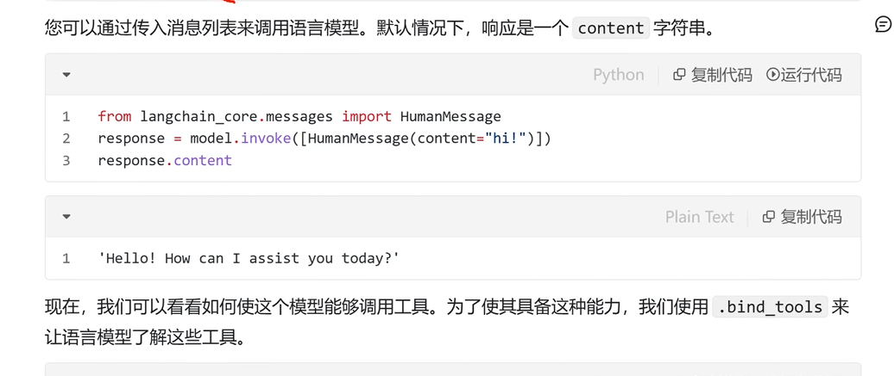
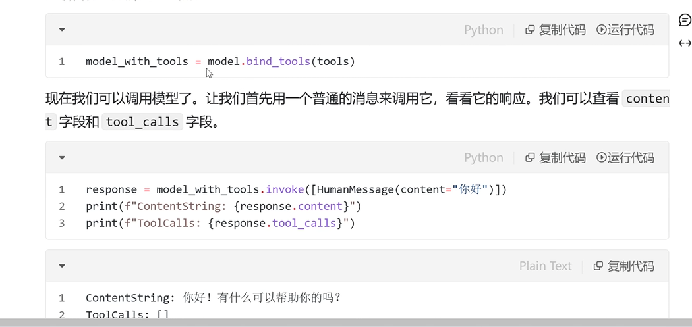
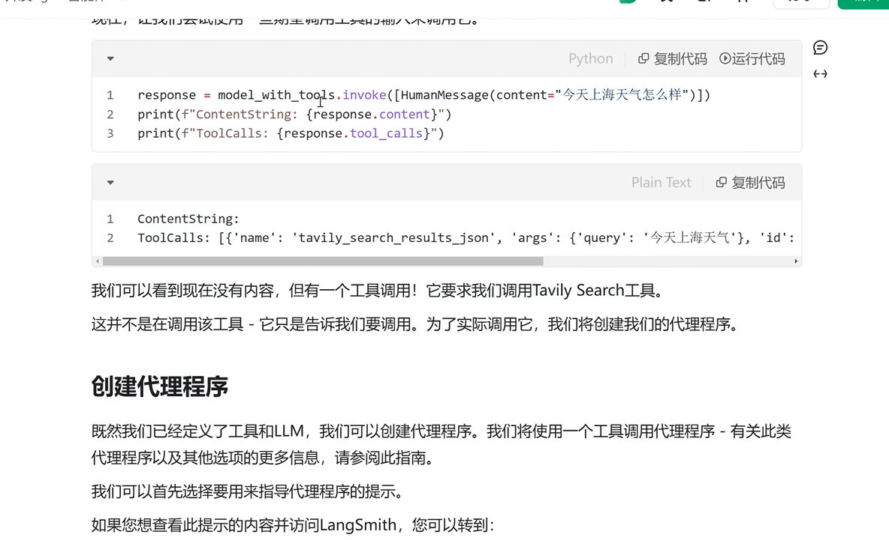
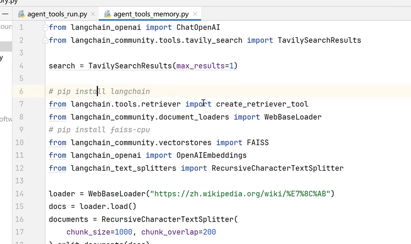
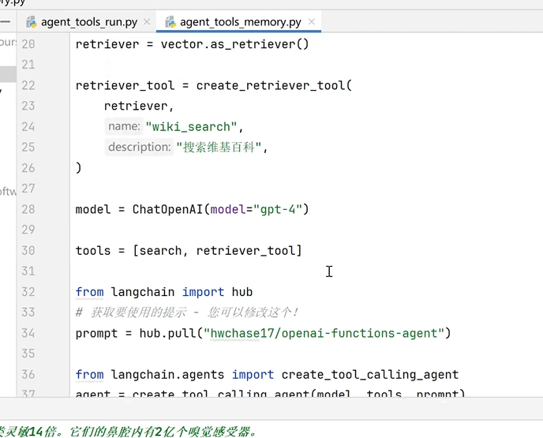
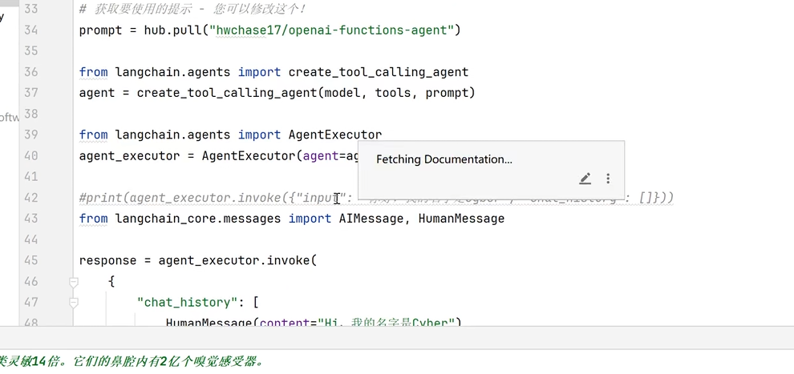
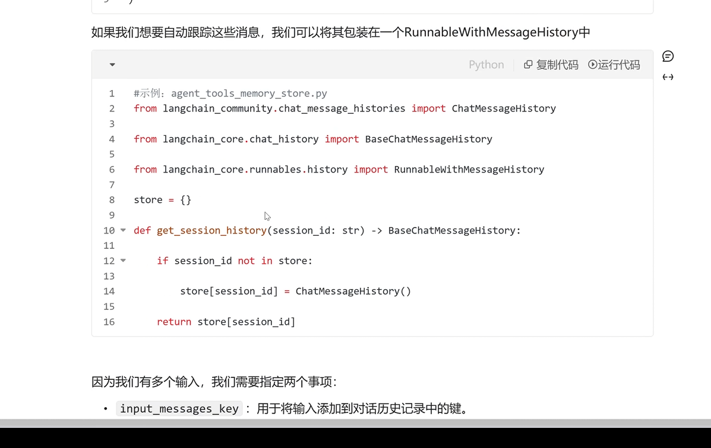

# 创建和运行Agent

单独来说，语言模型无法采取行动-它们只能输出文本。

LangChain的一个重要用例是创建**代理**。

代理是使用LLM作为推理引擎的系统，用于确定应采取哪些行动以及这些行动的输入应该是什么。

然后可以将这些行动的结果反馈给代理，并确定是否需要更多行动，或者是否可以结束。

在本次课程中，我们将构建一个可以与多种不同工具进行交互的代理：一个是本地数据库，另一个是搜索引擎。您将能够向该代理提问，观察它调用工具，并与它进行对话。

下面将介绍使用LangChain代理进行构建。LangChain代理适合入门，但在一定程序之后，我们可能希望拥有它们无法提供的灵活性和控制性。要使用跟高级的代理，我们建议查看LangGraph

# 概念

我们将涵盖的概念包括：

- 使用语言模型，特别是它们的工具调用能力
- 创建检索器以我们得代理公开特定信息
- 使用搜索工具在线查找信息
- 聊天历史，允许聊天机器人“记住”过去的交互，并在回答后续问题时考虑它们。
- 使用LangSmith调试和跟踪应用程序

## LangSmith

使用LangChain构建的许多应用程序将包含多个步骤，其中会多次调用LLM。

随着这些应用程序变得越来越复杂，能够检查链或代理内部发生了什么变得至关重要。

这样做的最佳方式是使用LangSmith。

## 定义工具

我们首先需要创建我们想要使用的工具。我们将使用两个工具：Tavily（用于在线搜索），然后是我们将创建的本地索引上的检索器

### Tavily

LangChain中有一个内置工具，可以轻松使用Tavil搜索引擎作为工具。

注册地址：https://tavily.com/ （一个月有一千次的免费搜索额度）

创建API密钥后，需要配置环境变量

```
TAVILY_API_KEY
```

代码示例：

```python
# tavily 搜索
from langchain_community.tools.tavily_search import TavilySearchResults

search = TavilySearchResults(max_results=1)
print(search.invoke("什么是LangChain"))
```

输出示例：

```python
[{'title': 'LangChain 完整指南：使用大语言模型构建强大的应用程序 - 知乎专栏', 'url': 'https://zhuanlan.zhihu.com/p/620529542', 'content': 'What is LangChain?\nLangChain是一个强大的框架，旨在帮助开发人员使用语言模型构建端到端的应用程序。它提供了一套工具、组件和接口，可简化创建由大型语言模型 (LLM) 和聊天模型提供支持的应用程序的过程。LangChain 可以轻松管理与语言模型的交互，将多个组件链接在一起，并集成额外的资源，例如 API 和数据库。\nLangChain有很多核心概念：\n1. Components and Chains\n在 LangChain 中，Component 是模块化的构建块，可以组合起来创建强大的应用程序。Chain 是组合在一起以完成特定任务的一系列 Components（或其他 Chain）。例如，一个 Chain 可能包括一个 Prompt 模板、一个语言模型和一个输出解析器，它们一起工作以处理用户输入、生成响应并处理输出。\n2. Prompt Templates and Values\nPrompt Template 负责创建 PromptValue，这是最终传递给语言模型的内容。Prompt Te\n展开阅读全文\u200b', 'score': 0.9408388}]
```

### Retriever

Retriever是LangChain库中的一个模块，用于检索工具。检索工具的主要用途是从大型文本集合或知识库中找到相关信息。它们通常用于问答系统、对话代理和其他需要大量文本数据中提取信息的应用程序。

我们还将自己的一些数据上创建Retriever。有关每个步骤的更深入解释。

```python
from langchain_community.document_loaders import WebBaseLoader
from langchain_community.vectorstores import FAISS
from langchain_core.tools import create_retriever_tool
from langchain_text_splitters import RecursiveCharacterTextSplitter

# 因为没有openai的额度了，我这里调用的是dashscope的embedding
from langchain_community.embeddings import DashScopeEmbeddings
# pip install faiss-cpu
# pip install dashscope
import os

loader = WebBaseLoader("https://zh.wikipedia.org/wiki/%E7%8C%AB")
docs = loader.load()
documents = RecursiveCharacterTextSplitter(
    # chunk_size 参数在 RecursiveCharacterTextSplitter 中用于指定每个文档块的最大字符数。它的作用主要有一下两个方面：
    # chunk_overlap 参数用于指定每个文档块之间的重叠字符数。这意味着，当文档被拆分成较小的块时，每个块的末尾部分会与下一个快的开发部分重叠。
    # 第一块包含字符1到1000, 第二个块包含字符801到1800，第三个块包含字符1601到2600。
    chunk_size=1000, chunk_overlap=200
).split_documents(docs)
# 将网页文本转换为向量并存储
embeddings = DashScopeEmbeddings(model="text-embedding-v3")
vector = FAISS.from_documents(documents, embeddings)
retriever = vector.as_retriever()

print(retriever.invoke("猫的特征")[0])

retriever_tool = create_retriever_tool(
    retriever,
    "wiki_search",
    "搜索维基百科"
)

```

## 使用语言模型

LangChain支持许多可以互换使用的不同语言模型，选择想要的模型即可

```python
from langchian_openai import ChatOpenAI
model = ChatOpenAI(model="gpt-4")
```








## 

## 创建代理程序

定义完工具和LLM，我们就可以创建代理程序

我们首先要选择要用来知道代理程序的提示。

提示词模板位置：

https://smith.langchain.com/hub/hwchase17/openai-functions-agent

```python
import os

from langchain_community.document_loaders import WebBaseLoader
from langchain_community.embeddings import DashScopeEmbeddings
from langchain_community.tools import TavilySearchResults
from langchain_community.vectorstores import FAISS
from langchain_core.tools import create_retriever_tool
from langchain_openai import ChatOpenAI
from langchain_text_splitters import RecursiveCharacterTextSplitter

loader = WebBaseLoader("https://zh.wikipedia.org/wiki/%E7%8C%AB")
docs = loader.load()
documents = RecursiveCharacterTextSplitter(
    chunk_size=1000, chunk_overlap=200
).split_documents(docs)

# 将网页文本转换为向量并存储
embeddings = DashScopeEmbeddings(model="text-embedding-v3")
vector = FAISS.from_documents(documents, embeddings)
retriever = vector.as_retriever()

retriever_tool = create_retriever_tool(
    retriever,
    "wiki_search",
    "搜索维基百科"
)

model = ChatOpenAI(
    api_key=os.getenv("DASHSCOPE_API_KEY"),
    base_url="https://dashscope.aliyuncs.com/compatible-mode/v1",
    model="qwen-turbo",
)

search = TavilySearchResults(max_results=1)

tools = [search, retriever_tool]

from langchain import hub
# 获取要使用的提示
prompt = hub.pull("hwchase17/openai-functions-agent")
print(prompt.messages)

from langchain.agents import create_tool_calling_agent
agent = create_tool_calling_agent(model, tools, prompt)

from langchain.agents import AgentExecutor
agent_exceutor = AgentExecutor(agent=agent, tools=tools)
```

输出示例：

```json
[SystemMessagePromptTemplate(prompt=PromptTemplate(input_variables=[], input_types={}, partial_variables={}, template='You are a helpful assistant'), additional_kwargs={}), MessagesPlaceholder(variable_name='chat_history', optional=True), HumanMessagePromptTemplate(prompt=PromptTemplate(input_variables=['input'], input_types={}, partial_variables={}, template='{input}'), additional_kwargs={}), MessagesPlaceholder(variable_name='agent_scratchpad')]
```

## 运行代理

现在，我们可以在几个查询上运行代理！请注意，目前这些都是**无状态**查询（它不会记住先前的交互）。


```python
import os

from langchain_community.document_loaders import WebBaseLoader
from langchain_community.embeddings import DashScopeEmbeddings
from langchain_community.tools import TavilySearchResults
from langchain_community.vectorstores import FAISS
from langchain_core.tools import create_retriever_tool
from langchain_openai import ChatOpenAI
from langchain_text_splitters import RecursiveCharacterTextSplitter

loader = WebBaseLoader("https://zh.wikipedia.org/wiki/%E7%8C%AB")
docs = loader.load()
documents = RecursiveCharacterTextSplitter(
    chunk_size=1000, chunk_overlap=200
).split_documents(docs)

# 将网页文本转换为向量并存储
embeddings = DashScopeEmbeddings(model="text-embedding-v3")
vector = FAISS.from_documents(documents, embeddings)
retriever = vector.as_retriever()

retriever_tool = create_retriever_tool(
    retriever,
    "wiki_search",
    "搜索维基百科"
)

model = ChatOpenAI(
    api_key=os.getenv("DASHSCOPE_API_KEY"),
    base_url="https://dashscope.aliyuncs.com/compatible-mode/v1",
    model="qwen-turbo",
)

search = TavilySearchResults(max_results=1)

tools = [search, retriever_tool]

from langchain import hub
# 获取要使用的提示
prompt = hub.pull("hwchase17/openai-functions-agent")
print(prompt.messages)

from langchain.agents import create_tool_calling_agent
agent = create_tool_calling_agent(model, tools, prompt)

from langchain.agents import AgentExecutor
agent_executor = AgentExecutor(agent=agent, tools=tools, verbose=True)
print(agent_executor.invoke({"input": "猫的特征？今天北京的天气怎么样"}))
```

任务拆分

## 添加记忆

如前所述，此代理是无状态的。这意味着它不会记住先前的记忆。要给它记忆，我们需要传递先前的`chat_history`。注意：由于我们使用的提示，它需要被称为`chat_history`。如果我们使用不同的提示，我们可以更改变量名










如果我们想要自动跟踪这些消息，我们可以将其包装在一个RunnableWithMessageHistory




因为我们有多个输入，我们需要指定两个事项：

- `input_messages_key`：用于将输入添加到对话历史记录中的健
- `history_messages_key`：用于将加载的消息添加到其中的键


# 参考资料

[B站：2025吃透LangChain大模型全套教程（LLM+RAG+OpenAI+Agent）第8集](https://www.bilibili.com/video/BV1BgfBYoEpQ?p=8) (这集和前面有重复)
