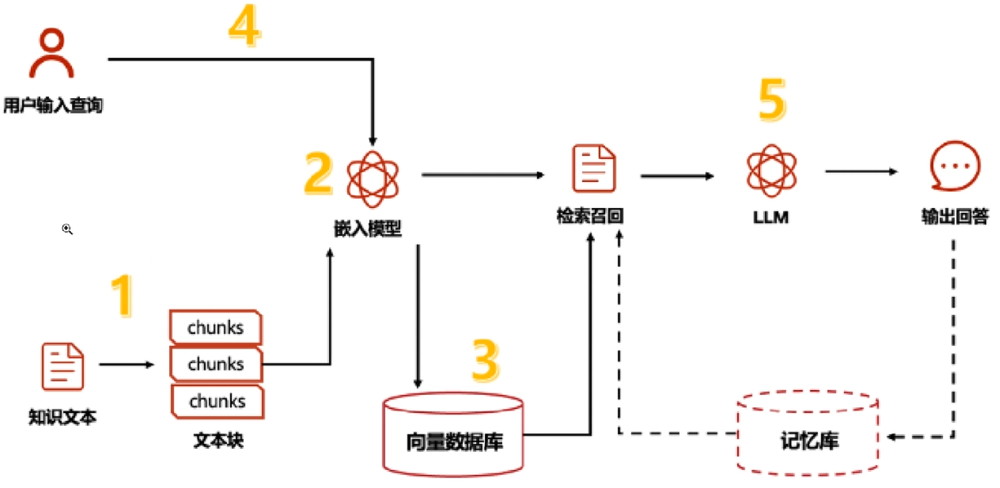
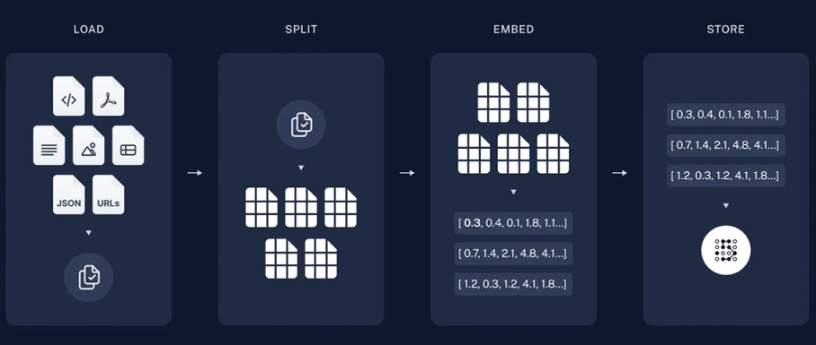
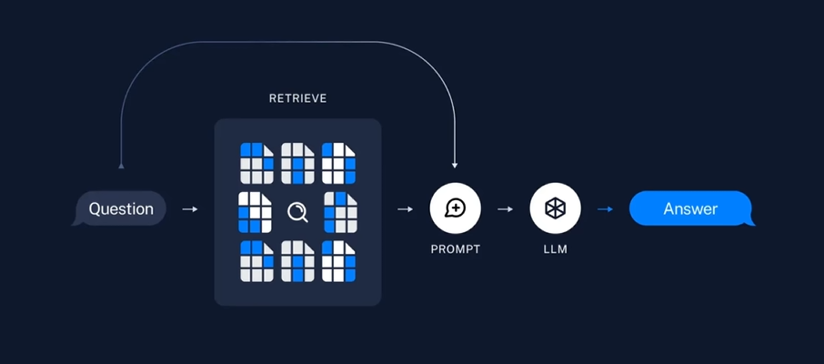
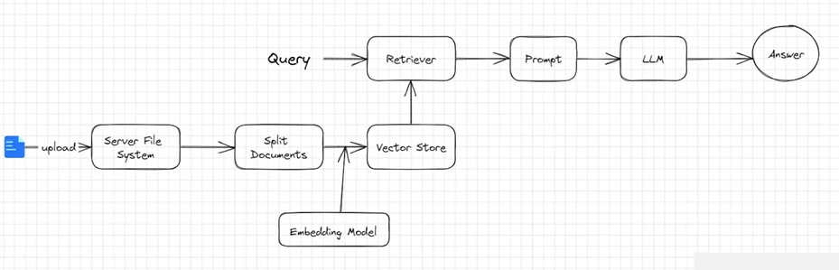
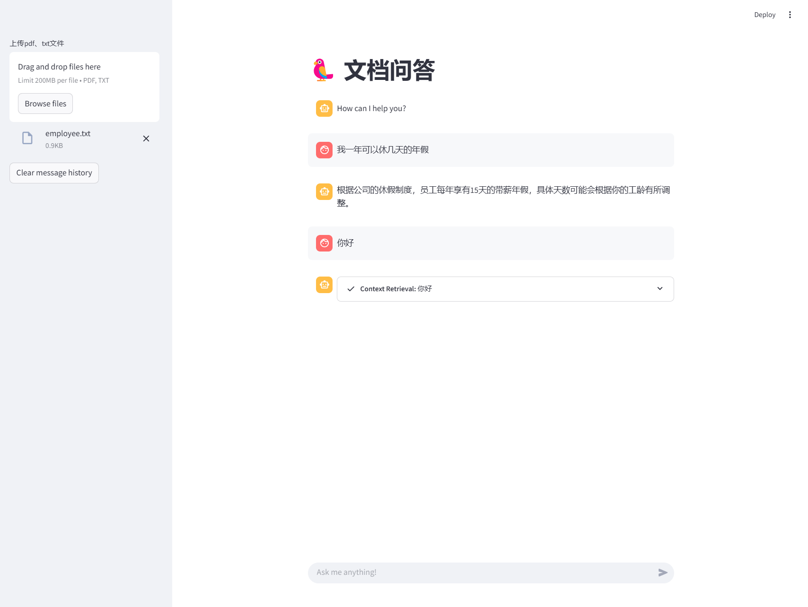

# 基于Rag实现文档回答

[toc]

# Rag是什么？

大语言模型所实现的最强大的应用之一是复杂的问答（Q&A）聊天机器人。这些应用能够回答关于特定源信息的问题。这些应用使用一种称为检索增强生成（RAG）的技术。

RAG是一种用额外数据增强大语言模型知识的技术。

大语言模型可以对广泛的主题进行推理，但它们的知识仅限于训练时截止日期前得公开数据。如果你想构建能够对私有数据或模型截止日期后引入的数据进行推理的人工智能应用，你需要用特定信息来增强模型的知识。检索适当信息并将其插入模型提示的过程被称为检索增强生成（RAG）。

LangChain有许多组件旨在帮助构建问答应用，以及更广泛的RAG应用。



# Rag工作流

一个典型的RAG应用有两个主要组成部分：

**索引（Indexing）**：从数据源获取数据并建议索引的管道（pipeline）。这通常再离线状态下进行。

**检索和生成（Retrieval and generation）**：实际的RAG链，在运行时接受用户查询，从索引中检索相关数据，然后将其传递给模型。

从原始数据到答案最常见完整顺序如下：

## 索引（Indexing）

1. 加载（Load）：首先我们需要加载数据。这是通过文档加载器Document Loaders完成的。
2. 分割（Split）: 文本分割器Text splitters 将大型文档（Documents）分割为更小的块（chunks）。这对于索引数据和将其传递给模型都很有用，因为大块数据很难搜索，而且不适合大模型有限的上下文窗口。
3. 存储（Store）：我们需要一个地方来存储和索引我们的分割（splits），以便后续可以对其进行搜索。这通常使用向量存储VectorStore和嵌入模型Embedding model来完成。



## 检索和生成（Retrieval and generation）

4. 检索（Retrieve）：给定用户输入，使用检索器Retriever从存储中检索相关的文本片段。
5. 生成（Generate）：ChatModel使用包含问题和检索到的数据的提示来生成答案。



# 文档问答

## 实现流程

一个RAG程序的APP主要有以下流程：

1. 用户在RAG客户端上传一个pdf文件
2. 服务器端接受客户端文件，存储在服务端
3. 服务器端程序对文件进行读取
4. 对文件内容进行拆分，防止一次性塞给Embedding模型超token限制
5. 把Embedding后的内容存储在向量数据库，生成检索器
6. 程序准备就绪，允许用户进行体温
7. 用户提出问题，调用检索器检索文档，把相关片段找出来后，给大模型，大模型组织后，回复用户。



## 代码实现

使用Streamlit实现文件上传，这里只实现了pdf和txt文件上传，可以在type参数里面设置多个文件类型，在后面的检索器方法里面针对每个类型进行处理即可。

```python
import os  
import tempfile  
import streamlit as st  
from langchain.chat_models import ChatOpenAI  
from langchain.document_loaders import PyPDFLoader  
from langchain.memory import ConversationBufferMemory  
from langchain.memory.chat_message_histories import StreamlitChatMessageHistory  
from langchain.embeddings import HuggingFaceEmbeddings  
from langchain.callbacks.base import BaseCallbackHandler  
from langchain.chains import ConversationalRetrievalChain  
from langchain.vectorstores import DocArrayInMemorySearch  
from langchain.text_splitter import RecursiveCharacterTextSplitter  
# pip install langchain
# pip install langchain-openai
# pip install langchain_community
# pip install sentence-transformers
# pip install docarray
# pip install pypdf
# 参考源码地址 https://github.com/langchain-ai/streamlit-agent/blob/634e1cecf23d7ca3a4c5e708944673e057765b2a/streamlit_agent/chat_with_documents.py   
st.set_page_config(page_title="PDF文档问答", page_icon="🦜")  
st.title("🦜 PDF文档问答")  
  
  
@st.cache_resource(ttl="1h")  
def configure_retriever(uploaded_files):  
    # Read documents  
    docs = []  
    temp_dir = tempfile.TemporaryDirectory()  
    for file in uploaded_files:  
        temp_filepath = os.path.join(temp_dir.name, file.name)  
        with open(temp_filepath, "wb") as f:  
            f.write(file.getvalue())  
        loader = PyPDFLoader(temp_filepath)  
        docs.extend(loader.load())  
  
    # Split documents  
    text_splitter = RecursiveCharacterTextSplitter(chunk_size=1500, chunk_overlap=200)  
    splits = text_splitter.split_documents(docs)  
  
    # Create embeddings and store in vectordb  
    embeddings = HuggingFaceEmbeddings(model_name="all-MiniLM-L6-v2")  
    vectordb = DocArrayInMemorySearch.from_documents(splits, embeddings)  
  
    # Define retriever  
    retriever = vectordb.as_retriever(search_type="mmr", search_kwargs={"k": 2, "fetch_k": 4})  
  
    return retriever  
  
  
class StreamHandler(BaseCallbackHandler):  
    def __init__(self, container: st.delta_generator.DeltaGenerator, initial_text: str = ""):  
        self.container = container  
        self.text = initial_text  
        self.run_id_ignore_token = None  
  
    def on_llm_start(self, serialized: dict, prompts: list, **kwargs):  
        # Workaround to prevent showing the rephrased question as output  
        if prompts[0].startswith("Human"):  
            self.run_id_ignore_token = kwargs.get("run_id")  
  
    def on_llm_new_token(self, token: str, **kwargs) -> None:  
        if self.run_id_ignore_token == kwargs.get("run_id", False):  
            return  
        self.text += token  
        self.container.markdown(self.text)  
  
  
class PrintRetrievalHandler(BaseCallbackHandler):  
    def __init__(self, container):  
        self.status = container.status("**Context Retrieval**")  
  
    def on_retriever_start(self, serialized: dict, query: str, **kwargs):  
        self.status.write(f"**Question:** {query}")  
        self.status.update(label=f"**Context Retrieval:** {query}")  
  
    def on_retriever_end(self, documents, **kwargs):  
        for idx, doc in enumerate(documents):  
            source = os.path.basename(doc.metadata["source"])  
            self.status.write(f"**Document {idx} from {source}**")  
            self.status.markdown(doc.page_content)  
        self.status.update(state="complete")  
  
  
openai_api_key = os.getenv("DASHSCOPE_API_KEY")  
  
uploaded_files = st.sidebar.file_uploader(  
    label="上传PDF文件", type=["pdf"], accept_multiple_files=True  
)  
if not uploaded_files:  
    st.info("上传PDF文档后使用")  
    st.stop()  
  
retriever = configure_retriever(uploaded_files)  
  
# Setup memory for contextual conversation  
msgs = StreamlitChatMessageHistory()  
memory = ConversationBufferMemory(memory_key="chat_history", chat_memory=msgs, return_messages=True)  
  
# Setup LLM and QA chain  
llm = ChatOpenAI(  
    api_key=os.getenv("DASHSCOPE_API_KEY"),  
    base_url="https://dashscope.aliyuncs.com/compatible-mode/v1",  
    model="qwen-turbo"  
)  
qa_chain = ConversationalRetrievalChain.from_llm(  
    llm, retriever=retriever, memory=memory, verbose=True  
)  
  
if len(msgs.messages) == 0 or st.sidebar.button("Clear message history"):  
    msgs.clear()  
    msgs.add_ai_message("How can I help you?")  
  
avatars = {"human": "user", "ai": "assistant"}  
for msg in msgs.messages:  
    st.chat_message(avatars[msg.type]).write(msg.content)  
  
if user_query := st.chat_input(placeholder="Ask me anything!"):  
    st.chat_message("user").write(user_query)  
  
    with st.chat_message("assistant"):  
        retrieval_handler = PrintRetrievalHandler(st.container())  
        stream_handler = StreamHandler(st.empty())  
        response = qa_chain.run(user_query, callbacks=[retrieval_handler, stream_handler])
```

安装完依赖后，使用以下命令启动

```bash
streamlit run .\11-rag\01-chat_with_documents.py
```

文档内容

```
公司休假制度

员工每年有多少天年假?
员工每年享有15天的带薪年假，具体天数根据工龄有所调整。

病假如何申请?
员工需提供医生证明，并通过人力资源部门的审批流程申请病假。

法定节假日有哪些?
公司遵循国家规定的法定节假日，包括春节、国庆节、中秋节等。

公司福利
公司提供哪些保险福利?公司为员工提供五险一金，包括养老保险、医疗保险、失业保险、工伤保险、生育保险和住房公积金

是否有员工健康体检?
公司每年为员工安排一次免费的健康体检

有哪些员工活动或俱乐部?公司定期组织团建活动，并有多个兴趣俱乐部，如球、书法、摄影等

公司规章制度

工作时间如何安排?
正常工作时间为周一至周五，上午9:00至下午6:00，每周工作40小时:
```

使用界面



# 源码地址

[https://github.com/lys1313013/langchain-example/tree/main/11-rag](https://github.com/lys1313013/langchain-example/tree/main/11-rag)

# 参考资料

[https://github.com/langchain-ai/streamlit-agent/blob/634e1cecf23d7ca3a4c5e708944673e057765b2a/streamlit_agent/chat_with_documents.py](https://github.com/langchain-ai/streamlit-agent/blob/634e1cecf23d7ca3a4c5e708944673e057765b2a/streamlit_agent/chat_with_documents.py)