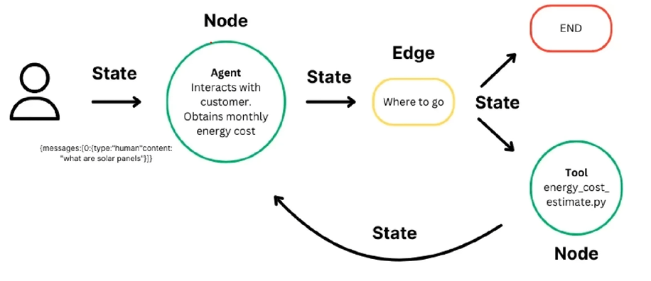
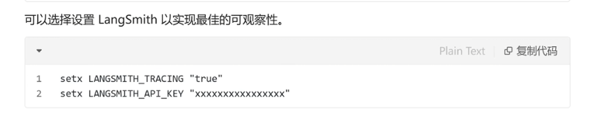

LangGraph 以图的方式构建语言代理

官网文档地址：[https://langchain-ai.github.io/langgraph/](https://langchain-ai.github.io/langgraph/)

LangGraph是一个用于构建具有LLMs的有状态、多角色应用程序的库，用于创建代理和多代理工作流。与其他LLM框架相比，它提供了以下核心优势：循环、可控和持久性。

LangGraph允许您定义设计循环的流程，这对于大多数代理架构至关重要。作为一种非常底层的框架，它提供了对应用程序的流程和状态的精细控制，这对创建可靠的代理至关重要。此外，LangGraph包含内置的持久性，可以实现高级的“人机交互”和内存功能。

LangGraph是LangChain的高级库，为大语言模型（LLM）带来了循环计算能力。它超越了LangChain的线性工作流，通过循环支持复杂的任务处理。

- 状态：维护计算过程中的上下文，实现基于积累数据的动态决策
- 节点：代表计算步骤，执行特定任务，可定制以适应不同工作流。
- 边：连接节点，定义计算流程，支持条件逻辑，实现复杂工作流。



LangGraph的一个核心概念是状态。每次突执行都会创建一个状态，该状态在图中的节点执行时传递，每个节点在执行后使用其返回值更新此内部状态。图更新其内部状态的方式由所选图类型或自定义函数定义。




```python
from langchain_core.tools import tool
from langchain_core.messages import HumanMessage
from typing import Literal
from langchain_openai import ChatOpenAI
# pip install langgraph
from langgraph.checkpoint.memory import MemorySaver
from langgraph.graph import END, StateGraph,MessagesState
from langgraph.prebuilt import ToolNode
import os

# 定义工具函数，用于代理调用外部工具
@tool
def search_tool(query: str):
    """搜索工具，可以搜索天气等信息"""
    if "上海" in query.lower() or "Shanghai" in query.lower():
        return "现在30度，有雾."
    return "现在是35度，阳光明媚"

# 将工具函数放入工具列表
tools = [search_tool]

# 创建工具节点
tool_node = ToolNode(tools)

# 1.初始化模型和工具，定义并绑定工具到模型
model = ChatOpenAI(
    api_key=os.getenv("DASHSCOPE_API_KEY"),
    base_url="https://dashscope.aliyuncs.com/compatible-mode/v1",
    model="qwen-turbo"
).bind_tools(tools)

# 定义函数，决定是否继续执行
def should_continue(state: MessagesState) -> Literal["tools", END]:
    messages = state['messages']
    last_message = messages[-1]
    # 如果LLM调用了工具，则转到“tools”节点
    if last_message.tool_calls:
        return "tools"
    # 否则，停止（回复用户）
    return END

# 定义调用模型的函数
def call_model(state: MessagesState):
    messages = state['messages']
    response = model.invoke(messages)
    # 返回列表，因为这将被添加到现有列表中
    return {"messages": [response]}

# 2. 用状态初始化图，定义一个新的状态图
workflow = StateGraph(MessagesState)
# 3. 定义图节点，定义我们将循环的两个节点
workflow.add_node("agent", call_model)
workflow.add_node("tools", tool_node)

# 4.定义入口点和图百年
# 设置入口点为“agent”
# 这意味着这是第一个被调用的节点
workflow.set_entry_point("agent")

# 添加条件边
workflow.add_conditional_edges(
    # 首先，定义起始节点。我们使用‘agent’
    # 这意味着这些边是调用`agent`节点后采取的。
    "agent",
    # 接下来，传递决定下一个调用节点的函数。
    should_continue,
)

# 添加从`tools·`到`agent`的普通边
# 这意味着在调用`tools`后，接下来调用`agent`节点
workflow.add_edge("tools", "agent")

# 初始化内存以在图运行之间持久化状态
checkpointer = MemorySaver()

# 5.编译图
# 这将其编译成一个LangChain可运行对象。
# 这意味着你可以像使用其他可运行对象一样使用它
# 注意，我们在编译图时传递内存
app = workflow.compile(checkpointer=checkpointer)

# 6. 执行图，使用可运行对象
final_state = app.invoke(
    {"messages": [HumanMessage(content="上海天气如何？")]},
    config={"configurable": {"thread_id": 42}}
)

# 从final_state中获取最后一条信息的内容
result = final_state["messages"][-1].content
print(result)
final_state = app.invoke(
    {"messages": [HumanMessage(content="我问的哪个城市？")]},
    config={"configurable": {"thread_id": 42}}
)
result = final_state["messages"][-1].content
print(result)

# 将生成的图片保存到文件
graph_png = app.get_graph().draw_mermaid_png()
with open("langgraph_base.png","wb") as f:
    f.write(graph_png)
```

输出示例：

```
当前上海的天气是30度，并且有雾。
您查询的城市是上海。
```


