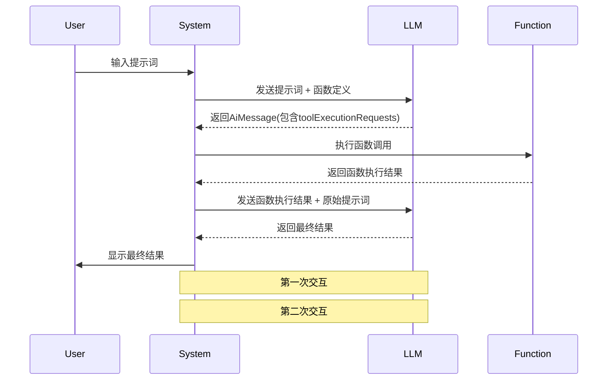

# 函数调用

在人工智能的世界里，大语言模型（LLMs）不仅仅是文本生成的能收，它们还能触发实际的操作。这种能力，我们称为函数调用。本文主要介绍LangChain4j框架是如何实现这一强大功能的。

## 函数调用：LLM的得力助手

函数调用让LLM能够根据输入的提示，生成一个调用特定函数的请求。这个请求包含了函数名称和所需的参数信息。通过这种方式，我们可以将LLM的智能与外部工具或API无缝连接。

举个例子，总所周知，LLM在复杂数学计算方面并不擅长。如果应用场景涉及大量数学运算，可以为LLM提供一个“数学工具”。LLM会根据工具的描述，返回需要调用的函数名称和参数。然后，您的系统执行该函数，获取结果，再将结果和原始提示一起发给LLM，最终得到综合的回答

**重要提示：**LLM本身并不执行函数，它只是指示应该调用哪个函数以及如何调用。

## 函数调用的应用场景

1. 出发外部操作：如发送邮件、控制智能家居设备等。
2. 实时数据获取：解决LLM只是更新滞后的问题，如进行实时搜索或数据库查询。
3. 复杂逻辑处理：处理LLM难以直接计算的复杂运算问题。



## 编码注入函数

```java
public interface FunctionAssistant {
	String chat(String message);
}
```

- 工具说明 ToolSpecification
- 业务逻辑 ToolExecutor

```java
@Bean
public FunctionAssistant functionAssistant(ChatLanguageModel chatLanguageModel) {
    // 工具说明 ToolSpecification
    ToolSpecification toolSpecification = ToolSpecification.builder()
            .name("invoice_assistant")
            .description("根据用户提交的开票信息，开具发票")
            .addParameter("companyName", type("string"), description("公司名称"))
            .addParameter("dutyNumber", type("string"), description("税号"))
            .addParameter("amount", type("number"), description("金额"))
            .build();

    // 业务逻辑 ToolExecutor
    ToolExecutor toolExecutor = (toolExecutionRequest, memoryId) -> {
        String arguments1 = toolExecutionRequest.arguments();
        System.out.println("arguments1 =>>>> " + arguments1);
        return "开具成功";
    };

    return AiServices.builder(FunctionAssistant.class)
            .chatLanguageModel(chatLanguageModel)
            .tools(Map.of(toolSpecification, toolExecutor))
            .build();
}
```

## 注解注入函数

通过使用注解`@Tool`，可以更方便地集成函数调用，LangChain4j的AI服务会自动处理工具执行，无需手动管理工具请求。

**工具定义：**只需将Java方法标注为`@Tool`，LangChain4j就会自动将其转换为`ToolSpecification`，并且在与LLM交互时调用这些方法。

```java
@Slf4j
public class InvoiceHandler {
    @Tool("根据用户提交的开票信息进行开票")
    public String handle(String companyName, String dutyNumber,@P("金额保留两位有效数字") String amount) {
        log.info("companyName =>>>> {} dutyNumber =>>>> {} amount =>>>> {}", companyName, dutyNumber, amount);
        return "开票成功";
    }
}
```

```java
@Bean
public FunctionAssistant functionAssistant(ChatLanguageModel chatLanguageModel) {
    return AiServices.builder(FunctionAssistant.class)
            .chatLanguageModel(chatLanguageModel)
            .tools(new InvoiceHandler())
            .build();
}
```

## 动态工具配置

LangChain支持动态工具配置，开发者可以基于用户输入的上下文，在运行时动态加载工具。通过`ToolProvider`接口，工具集会将每次请求时动态生成。

例如，只有当用户提到`booking`时才加载相关的工具：

```java
ToolProvider toolProvider = (toolProviderRequest) -> {
    if (toolProviderRequest.userMessage().singleText().contains("booking")) {
        ToolSpecification toolSpecification = ToolSpecification.builder()
            .name("get_booking_details")
            .description("Returns booking details")
            .addParameter("bookingNumber", type("string"))
            .build();
        return ToolProviderResult.builder()
            .add(toolSpecification, toolExecutor)
            .build();
    } else {
        return null;
    }
};
```

## 小结

函数调用为LLM增加拓展性，使其能够与外部世界互动，实现更复杂的任务。通过LangChain4j的低级和高级API，开发者可以灵活地集成和管理这些工具，从而创建智能化、自动化地应用场景。

这种灵活的架构，结合了对具体任务的自动化调用，能大大增强LLM的实用性，尤其适用于需要集成外部API、进行计算或其他任务的应用。
