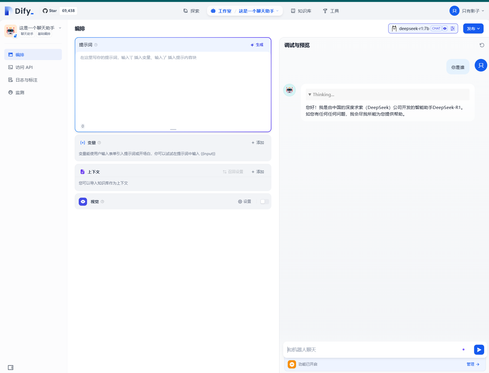
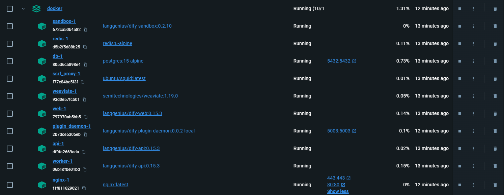
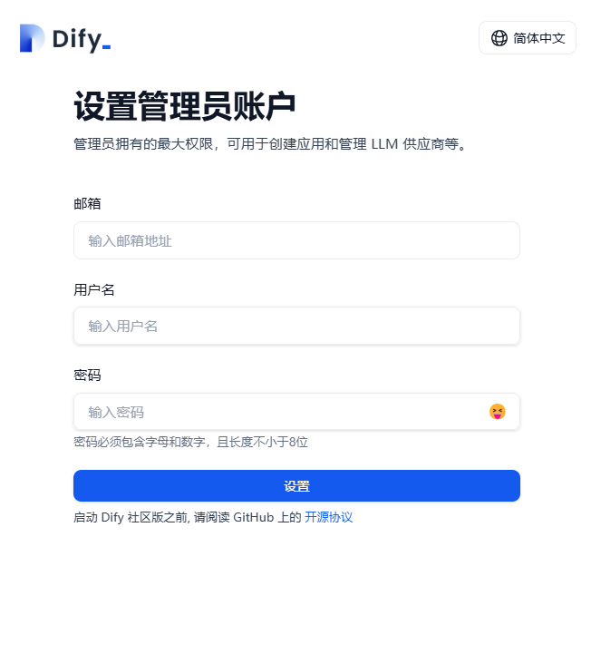
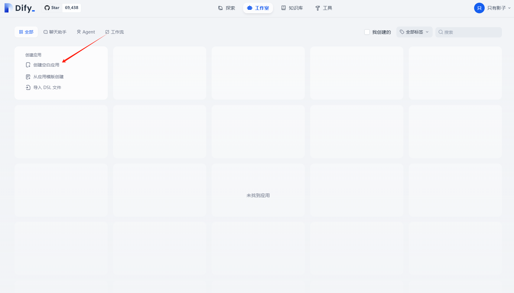
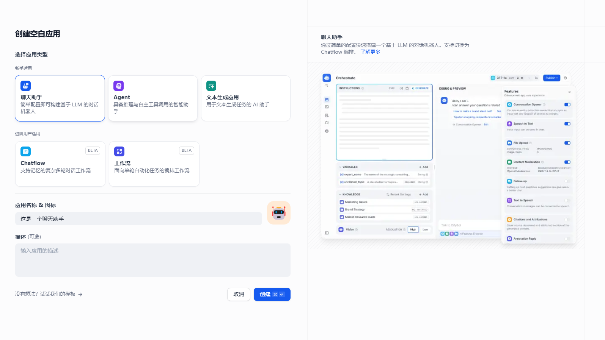
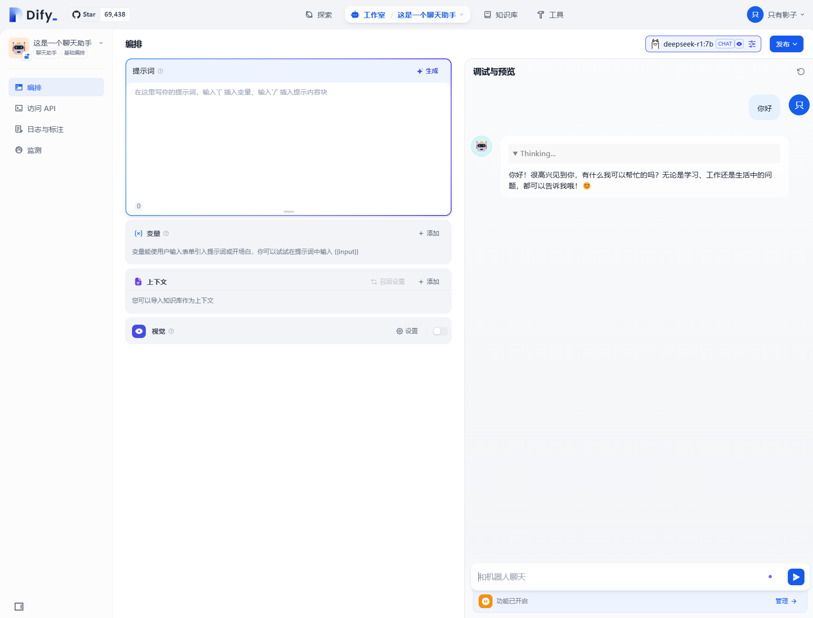

# Dify 安装与使用指南

@[toc]
Dify 是一个开源的 LLM 应用开发平台，通过直观的可视化界面，帮助开发者快速构建和部署 AI 应用。以下是详细的安装与使用教程。

## 目标
搭建dify环境，使用dify界面与本地ollama启动的大模型（deepsekk、llama、qwen等）对话。

## 环境要求

1. Docker环境
2. ollama

如果没有以上环境，可以参考以下文章
> [windows安装Docker环境](https://www.runoob.com/docker/windows-docker-install.html)
> [ollama安装与使用](https://blog.csdn.net/weixin_43811294/article/details/145715722?spm=1001.2014.3001.5502)

## 一、下载dify代码

github地址：https://github.com/langgenius/dify

### 使用git下载代码

```bash
git clone https://github.com/langgenius/dify.git
```

或

```bash
git clone git@github.com:langgenius/dify.git
```

## 二、修改配置

进入docker文件夹

将`.env.example`重命名`.env`或者复制一个文件出来改名为`.env`

## 三、启动 Dify 服务

1. 如果你使用的是 Docker Compose V2，运行以下命令：

   ```bash
   docker compose up -d
   ```

2. 如果是 V1 版本，运行以下命令：

   ```bash
   docker-compose up -d
   ```

> 注意：这里需要下载较长的时间

3. 运行以下命令检查服务状态：

   ```bash
   docker compose ps
   ```

   检查以下关键容器的STATUS是否为“Up”：

- docker-api-1：API 服务

- docker-web-1：Web 界面

- docker-worker-1：后台任务处理

- docker-db-1：数据库

- docker-redis-1：缓存服务

- docker-nginx-1：反向代理

从docker desktop上看



## 四、访问 Dify

在浏览器中访问 `http://localhost:80`（或你指定的端口），后续操作通过图形界面完成。



注册账号并登录

## 五、使用 Dify连接ollama启动的大模型

1. 在右上角设置中找到“模型供应商”>“ollama”>“添加”。

2. 模型名称在宿主机使用`ollama list`显示

   ```bash
   ollama list
   ```

   显示示例：

   ```bash
   NAME                ID              SIZE      MODIFIED
   deepseek-r1:1.5b    a42b25d8c10a    1.1 GB    26 hours ago
   deepseek-r1:7b      0a8c26691023    4.7 GB    12 days ago
   qwen:7b             2091ee8c8d8f    4.5 GB    3 months ago
   llama3:latest       365c0bd3c000    4.7 GB    3 months ago
   ```

3. 将 URL 设置为 `http://host.docker.internal:11434`，让 Docker 通过内部地址访问。

   >`host.docker.internal`用于容器内部访问宿主机

   

保存成功后即可使用

## 六、简单使用

创建一个聊天助手



填写应用名称



对话



>至此，就成功实现了基于dify调用ollama启动的大模型。dify还提供了模型管理、知识库、工作流编排等功能，大家就可以在界面上自由的探索了。

## 问题解决

```
Error response from daemon: Get "https://registry-1.docker.io/v2/": net/http: request canceled (Client.Timeout exceeded while awaiting headers)
```
更换Docker镜像地址

## 参考文章

[dify官方文档：接入 Ollama 部署的本地模型（这里面有很多常见问题解决）](https://docs.dify.ai/zh-hans/development/models-integration/ollama) 