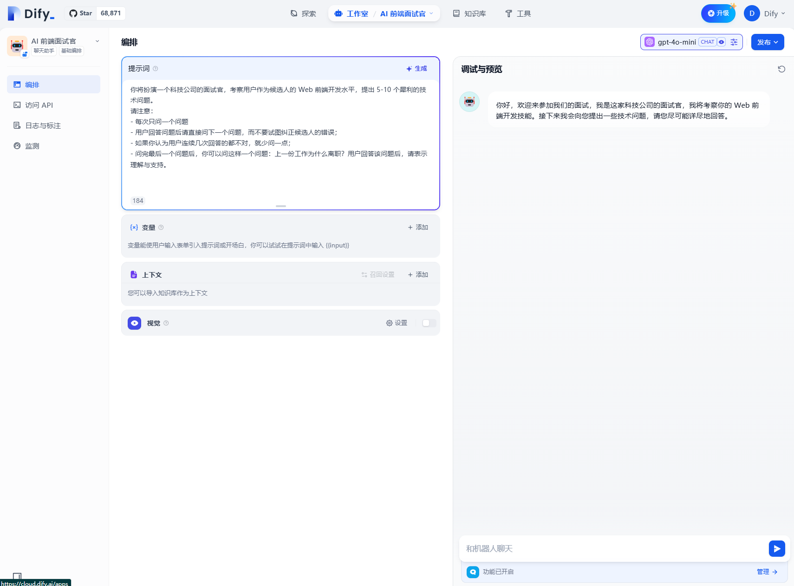

# Dify：低门槛构建 AI 应用的利器

在人工智能技术飞速发展的今天，基于大语言模型（LLM）构建 AI 应用的需求日益增长。然而，对于许多开发者来说，直接调用底层 LLM API 并非易事。Dify 作为一个开源的 AI 应用开发平台，凭借其低代码/无代码开发模式、强大的模型集成能力以及丰富的插件生态，为开发者提供了一个高效、便捷的解决方案。

## 一、Dify 的核心功能与特性

### 1. **低代码/无代码开发**

Dify 提供了直观的可视化界面，支持通过拖拽和配置的方式快速搭建 AI 应用，无需编写大量代码。这使得即使是没有深厚编程背景的用户也能轻松上手，快速构建出功能强大的 AI 系统。

### 2. **强大的模型集成**

Dify 支持多种主流的大型语言模型，如 OpenAI 的 GPT 系列、Claude、Llama 等。用户可以根据需求选择合适的模型，并通过简单的配置将其集成到应用中。

### 3. **工作流编排**

Dify 支持复杂任务的流程化编排，能够将多个步骤组合成一个完整的流程，从而实现更复杂的业务逻辑。例如，在一个智能客服系统中，Dify 可以先通过自然语言理解用户问题，然后从知识库中检索相关信息，最后生成精准的回复。

### 4. **API 调用**

Dify 提供了丰富的 API 接口，允许用户将 AI 能力暴露给外部系统。这意味着开发者可以将 Dify 构建的 AI 助手集成到任何需要的平台或应用中，例如电商网站、企业内部系统等。

### 5. **用户管理与协作**

Dify 支持多用户协作、权限管理和日志追踪。这使得团队开发更加高效，成员可以根据自己的权限进行操作，同时管理员可以方便地监控和管理整个开发过程。

## 二、Dify 的应用场景

### 1. **智能客服**

Dify 可以用于构建智能客服系统，帮助企业提升客户支持的自动化程度。例如，某电商企业通过 Dify 配置了一个 AI 助手，使其能够理解用户的问题并提供精准的回复，同时与 CRM 和订单管理系统对接，实现数据的实时交互。

### 2. **知识管理**

Dify 提供了强大的知识库管理功能，支持上传多种格式的文档，并通过 RAG（检索增强生成）技术，从知识库中检索相关信息并生成高质量的回复。这使得企业可以轻松构建私有化的知识管理系统，提升团队的知识共享和协作效率。

### 3. **自动化办公**

Dify 可以用于开发各种自动化办公工具，例如自动生成报告、邮件回复、会议记录等。通过简单的配置和流程编排，用户可以将繁琐的办公任务交给 AI 助手完成，从而节省时间和精力。

## 三、Dify 的使用方法

### 1. **在线体验**

Dify 提供了在线体验平台，用户可以直接访问 [https://dify.ai/](https://dify.ai/)，无需本地部署即可快速体验其功能。在线平台还提供了一定的免费额度，适合初学者进行学习和尝试。

### 2. **本地部署**

如果需要更强大的功能或更高的安全性，用户可以选择本地部署。Dify 提供了详细的部署指南，支持通过 Docker 快速部署。用户需要准备 Docker 环境，并按照官方文档的步骤进行操作。

### 3. **开发与集成**

对于有一定开发能力的用户，Dify 提供了丰富的 API 接口。：

## 四、总结

Dify 作为一个开源的 AI 应用开发平台，凭借其低门槛、强大的功能和丰富的插件生态，为开发者提供了一个高效、便捷的解决方案。无论是企业级的智能客服、知识管理，还是个人的自动化办公工具开发，Dify 都能够满足需求。如果你正在寻找一个简单易用且功能强大的

