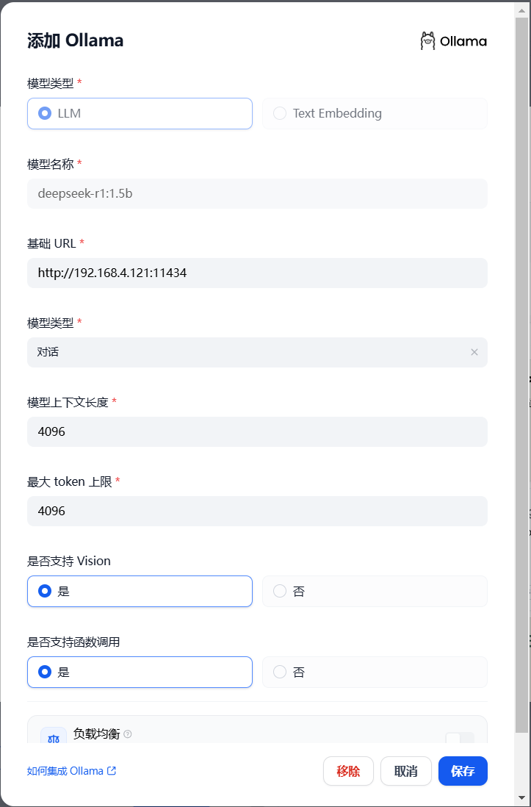
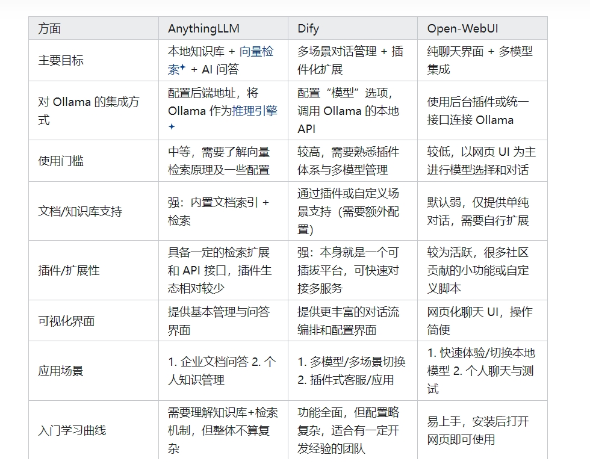

# 一、 下载

## 下载地址


 将项目克隆到本地


修改配置文件

`docker`文件夹下的`.env.example`重命名`.env`或复制一个文件出来


在当前目录终端执行以下命令

先拉取镜像
```
docker-compose pull
```

启动所有的服务
```bash
docker compose up -d
```


# 问题及解决

## langgenius/dify-web:1.0.0镜像找不到

如果用 main 分支的代码运行 docker命令 可能会遇到以下问题（2025-2-19 遇到）, 
```
Error response from daemon: manifest for langgenius/dify-web:1.0.0 not found: manifest unknown: manifest unknown
```
> 可以切换到当前最新tag执行 docker 命令


## 配置本地模型



ollama连接不通

修改ollama配置，在环境变量中，将OLLAMA_HOST修改为`0.0.0.0`


Embedding 模型


```
ollama pull bge-m3
```


参考文档：

https://github.com/datawhalechina/handy-ollama/blob/main/docs/C2/2.%20Ollama%20%E5%9C%A8%20Windows%20%E4%B8%8B%E7%9A%84%E5%AE%89%E8%A3%85%E4%B8%8E%E9%85%8D%E7%BD%AE.md



