# 轻松搭建本地大语言模型（五）Dify知识库：知识库管理利器

[toc]

## 引言

### 为什么要使用知识库？

#### （1）补充模型的局限性

在未联网的情况下，大语言模型虽然经过海量数据的训练，但其知识是静态的，通常停留在训练数据的截止日期之前。例如，对于最新的事件、行业动态或小众领域的专业知识，模型无法提供准确的信息。在这种离线场景下，网络无法提供实时更新的信息支持，模型的知识局限性会更加明显。通过引入本地部署的知识库，我们可以为模型提供最新的、特定领域的知识，从而弥补其知识的空白，确保在内网环境中也能获取准确和有用的信息。
#### （2）提升准确性和可靠性

知识库中的信息经过精心整理和验证，能够为模型提供高质量的知识支持。当模型在生成回答时，可以参考知识库中的准确信息，避免因自身的不确定性和偏差而产生错误。例如，在医疗、法律等专业领域，准确的知识库能够确保模型生成的内容符合行业标准，减少误导性信息的传播。
#### （3）增强模型的个性化能力

不同的应用场景和用户群体对知识的需求各不相同。通过定制化的知识库，我们可以为模型注入特定领域的知识，使其更好地适应特定用户的需求。比如，一个面向金融行业的聊天机器人可以使用包含金融市场数据和法规的知识库，从而为用户提供更精准的服务。

> 基于以上的原因，我们就引入了今天的目标，通过设置知识库，让大语言模型能够根据知识库回答问题。

## 目标

基于dify知识库功能实现大模型根据知识库回答问题。
效果如下：
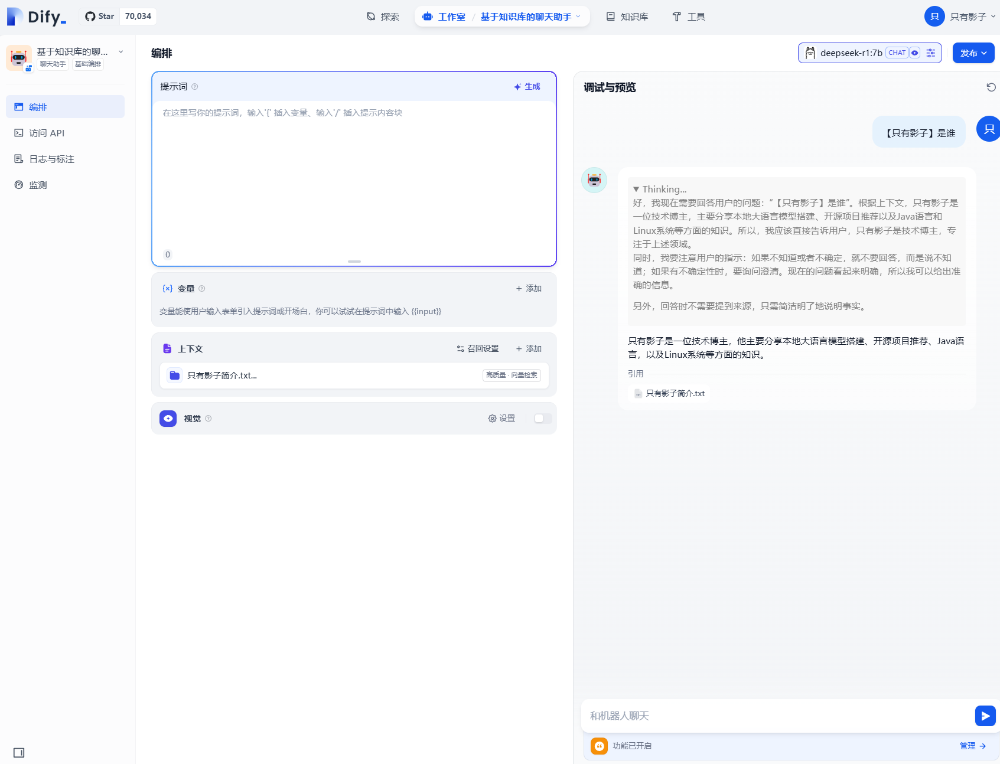

## 一、创建一个聊天助手

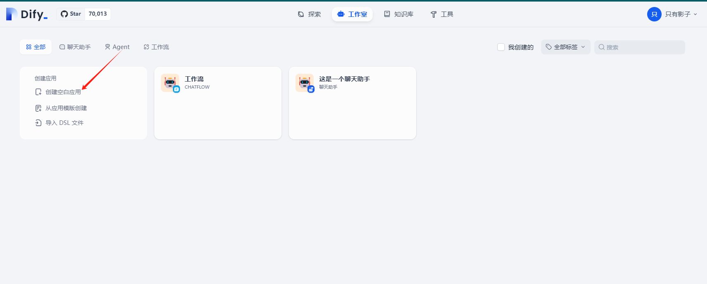

选择聊天助手，填写应用名称

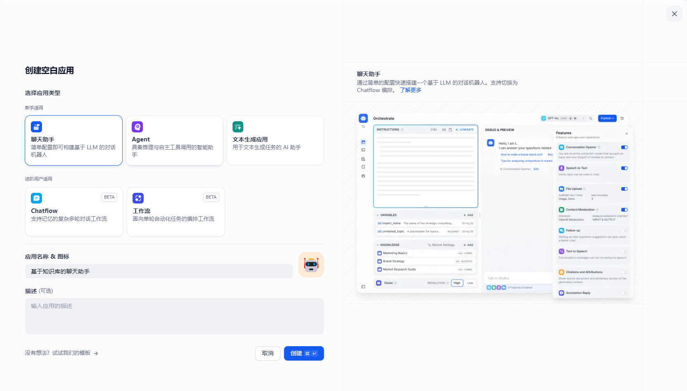

## 二、测试聊天

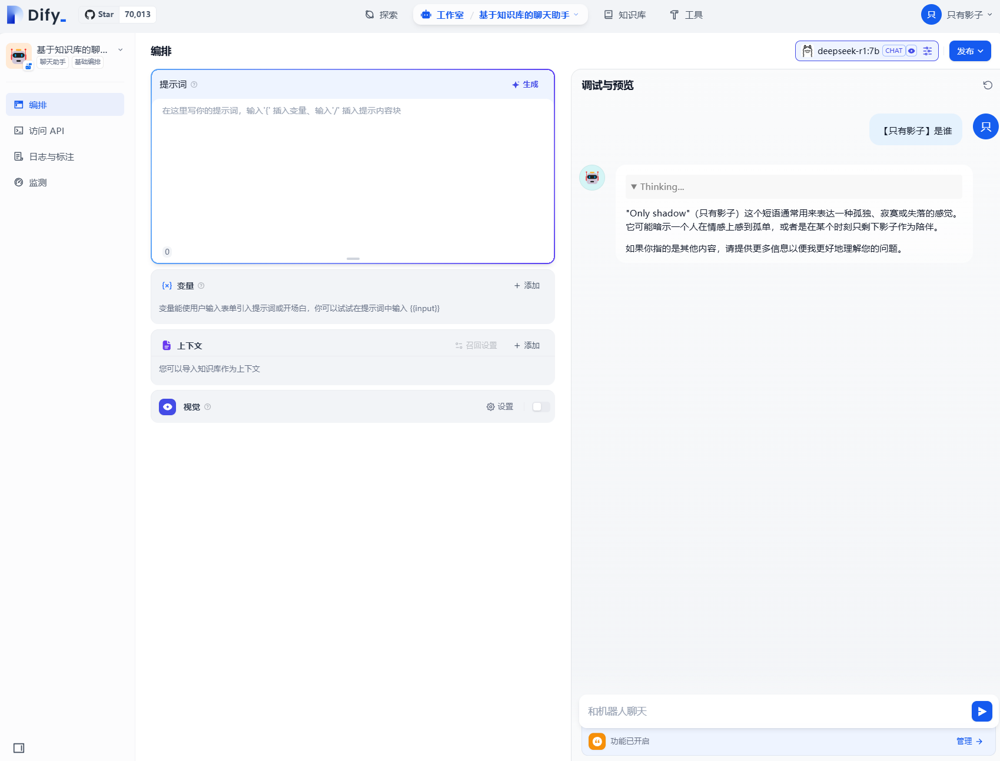

>可以看到，查询只有影子是谁，并不能返回啥信息，所以我们就要进行下一步，创建知识库并与聊天助手关联。

## 三、创建知识库并导入文件

### （1）创建知识库

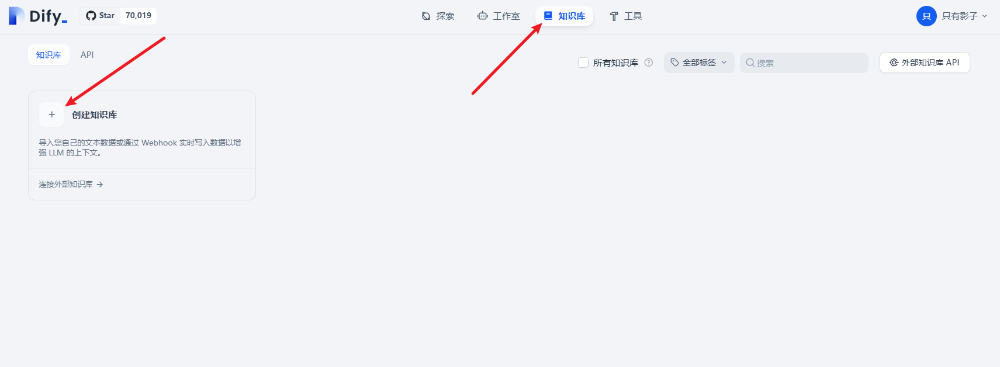

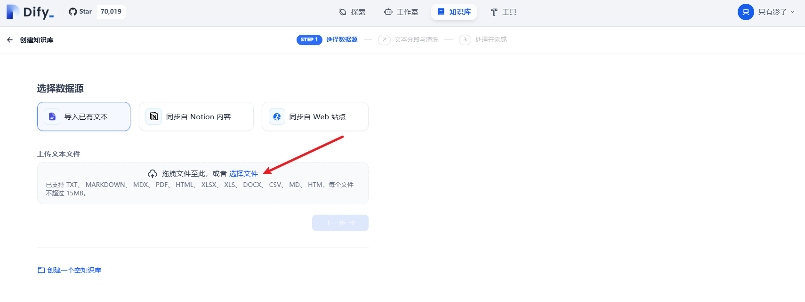

### （2）导入现有的导入现有的知识文件

支持 TXT、 MARKDOWN、 MDX、 PDF、 HTML、 XLSX、 XLS、 DOCX、 CSV、 MD、 HTM格式。

我这里只是演示，就导入一个简单的txt

文件内容：

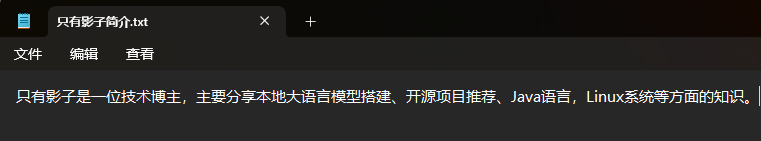

导入

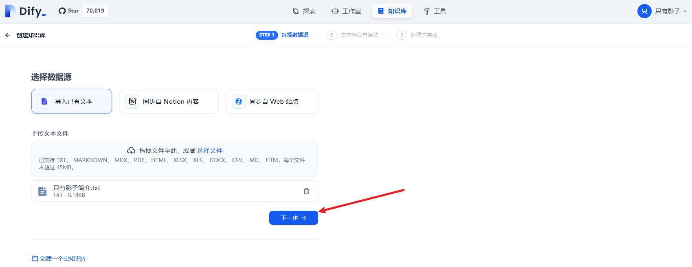


### （3）设置Embedding模型

这里可能会遇到一个问题，没有Embedding模型（Embedding模型为空或报错）。

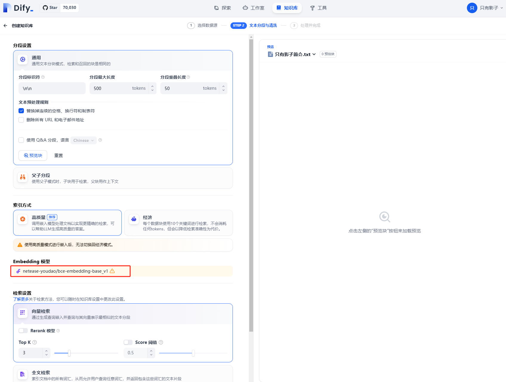

我们就需要设置Embedding模型

>Embedding模型是一种将文本转换为向量表示的技术。它能够将文本中的语义信息编码为高维向量，使得语义相似的文本在向量空间中距离更近。这种向量化的表示方式为后续的语义检索和知识匹配提供了基础。

##### 拉取Embedding模型

使用ollama执行以下命令

```bash
ollama pull bge-m3
```

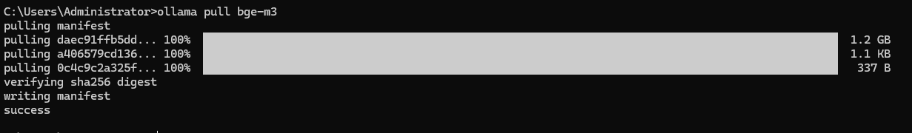

这里使用了bge-m3，更多Embedding模型选择

地址： https://ollama.com/search?c=embedding&q=bge

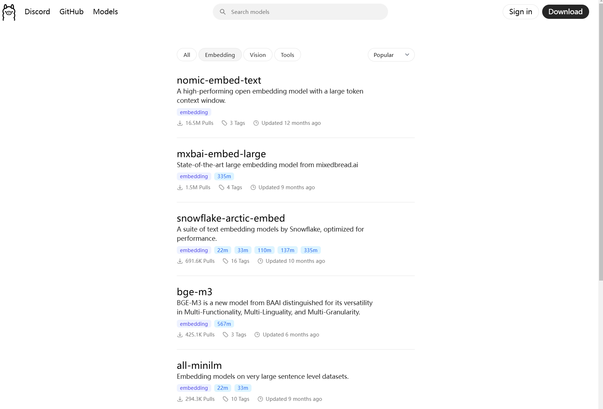

##### 添加Embedding模型

模型拉取成功后，点击右上角设置，在模型供应商中添加模型

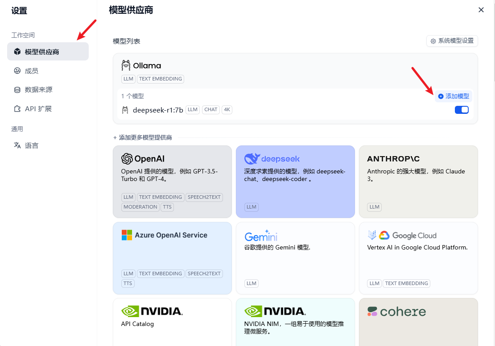


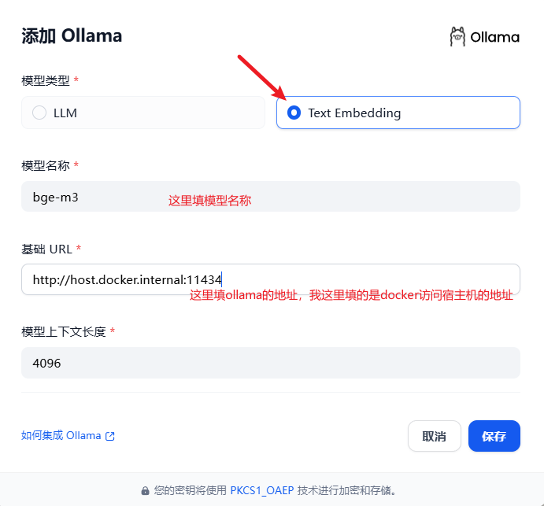

添加成功后，刷新界面，重新导入文件就可以选择Embedding模型了

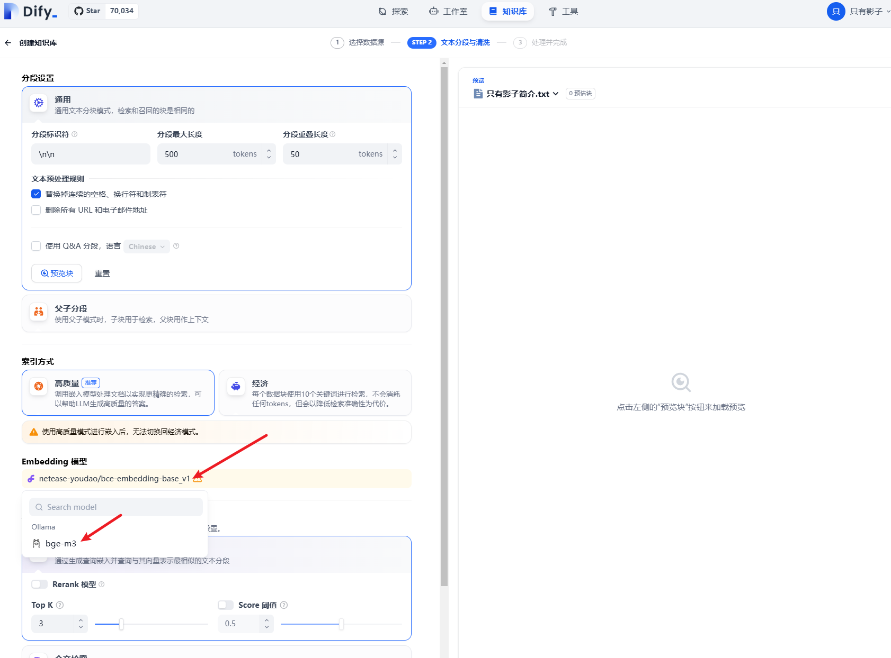

### （4）保存配置

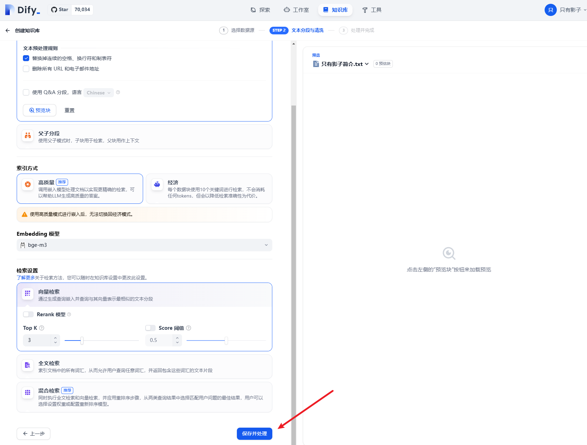

直接点保存并处理，即可使用

等待一小会后，这里就嵌入完成了

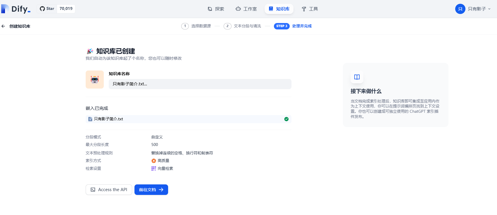

## 四、聊天助手关联知识库

回到聊天助手配置界面，在界面挂接知识库

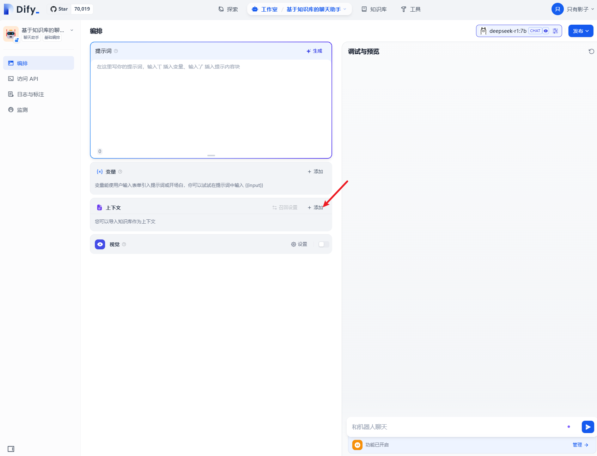

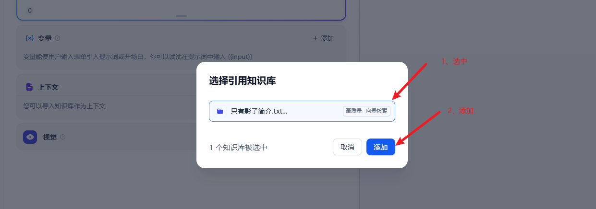

接着问刚才提问的问题，他就可以根据知识库的内容回复问题了


## 总结

本文主要介绍了如何使用Dify知识库功能实现本地大语言模型基于知识库回答问题，并详细阐述了创建聊天助手、测试聊天、创建知识库、导入文件、设置Embedding模型以及关联知识库等操作步骤。通过这些步骤，用户可以实现大模型根据知识库回答问题，从而弥补模型在离线场景下的知识局限性，提升其准确性和个性化能力。


## 参考资料

[dify官方知识库介绍](https://docs.dify.ai/zh-hans/guides/knowledge-base)
