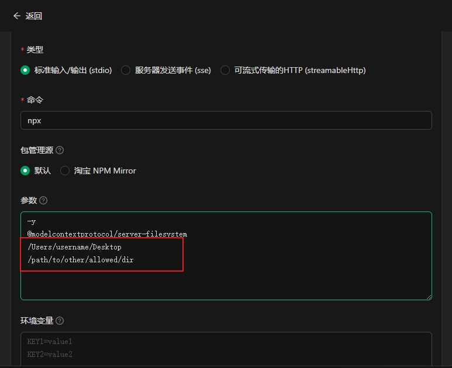
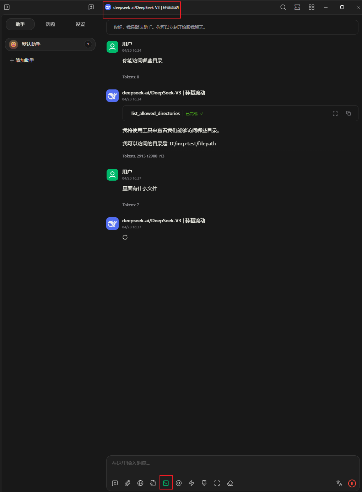
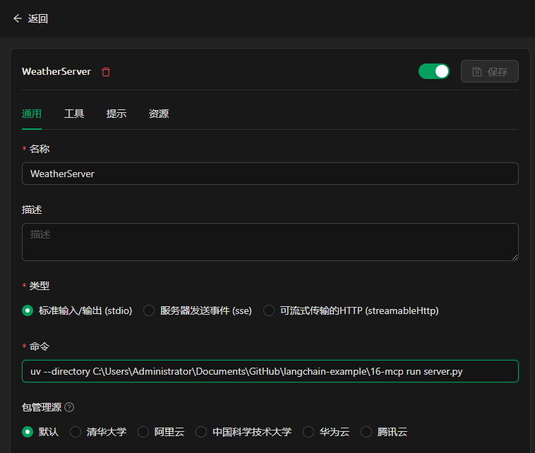
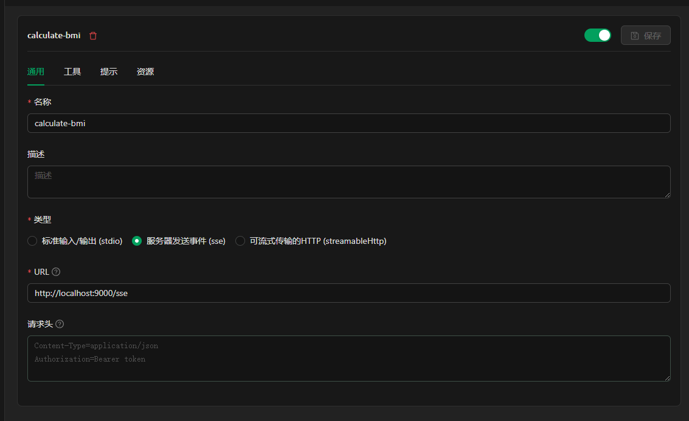

修改允许访问的路径





调用本地py代码



```
uv --directory C:\Users\Administrator\Documents\GitHub\langchain-example\16-mcp run server.py
```


sse




# 参考资料

https://modelcontextprotocol.io/quickstart/server#windows