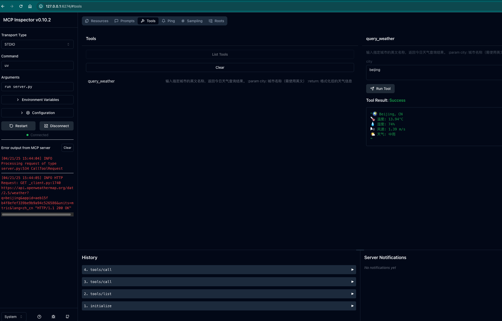

# 安装vu

```
pip install uv
```


启动
```
uv run client.py
```


# MCP服务器概念介绍

根据MCP协议定义，Server可以提供三种类型的标准能力，Resources、Tools、Prompts


# MCP服务器通讯机制
Model Context Protocol（MCP）是一种由Anthropic开源的协议，


启动客户端和服务端

```
uv run client.py server.py
```


```
npx -y @modelcontextprotocol/inspector uv run server.py
```


效果



启动一个server-filesystem
```
npx -y @modelcontextprotocol/server-filesystem
```


#### 天气 api

https://openweathermap.org/


```
curl -s "https://api.openweathermap.org/data/2.5/weather?q=Beijing&appid='YOUR_API_KEY'&units=metric&lang=zh_cn
```
