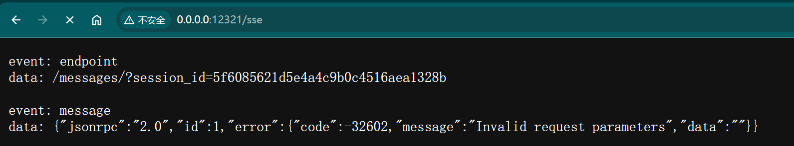

# SSE对接流程

## 1. 调用SSE接口


```bash
curl --location 'http://0.0.0.0:12321/messages?session_id=7f645334aa8d404395a882be26c3f985' \
--header 'Content-Type: application/json' \
--data '{
    "jsonrpc": "2.0",
    "id": 1,
    "method": "tools/list"
}'
```




## 2.  初始化


```json
{
    "jsonrpc": "2.0",
    "id": 1,
    "method": "initialize",
    "params": {
        "protocolVersion": "2025-03-26",
        "capabilities": {
            "roots": {
                "listChanged": true
            }
        },
        "clientInfo": {
            "name": "Visual Studio Code - Insiders",
            "version": "1.100.0-insider"
        }
    }
}
```


## 3. 初始化完成

```json
{
  "method": "notifications/initialized",
  "jsonrpc": "2.0"
}
```

## 4. 获取工具


```json
{
  "jsonrpc": "2.0",
  "id": 2,
  "method": "tools/list",
  "params": {}
}
```


## 5. 调用工具

```json
{
    "jsonrpc": "2.0",
    "id": 2,
    "method": "tools/call",
    "params": {
        "name": "get_user_info",
        "arguments": {
            "params": {
                "userId": "xxxx"
            }
        }
    }
}
```

- name 为调用的工具名称

- arguments 中的参数看具体代码


# 参考资料
- http://www.hubwiz.com/blog/understanding-model-context-protocol-through-packet-capture/