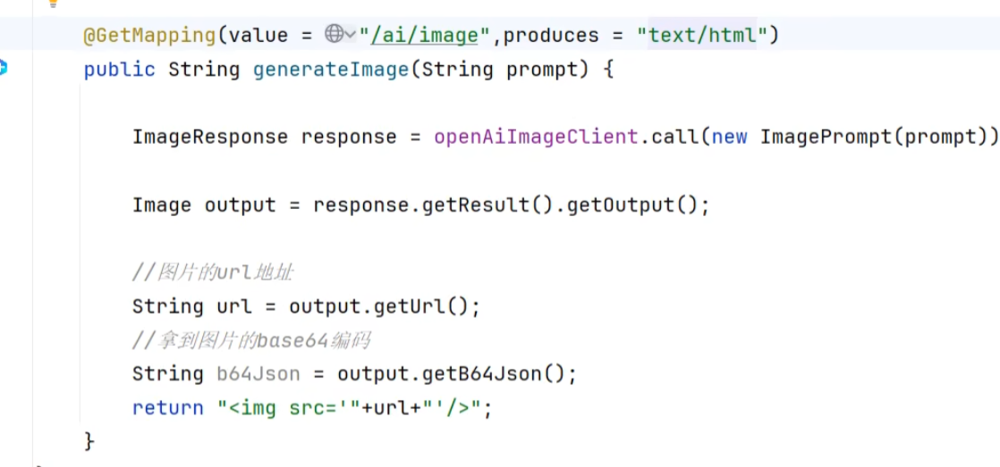
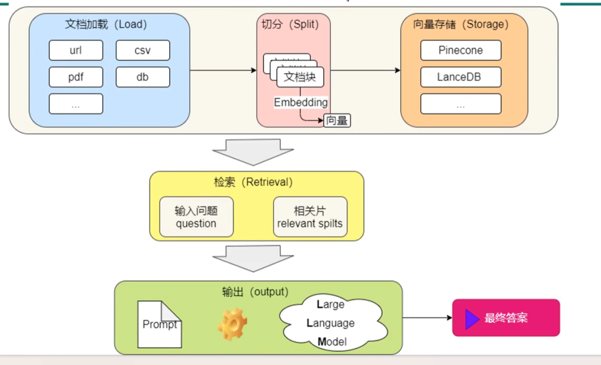
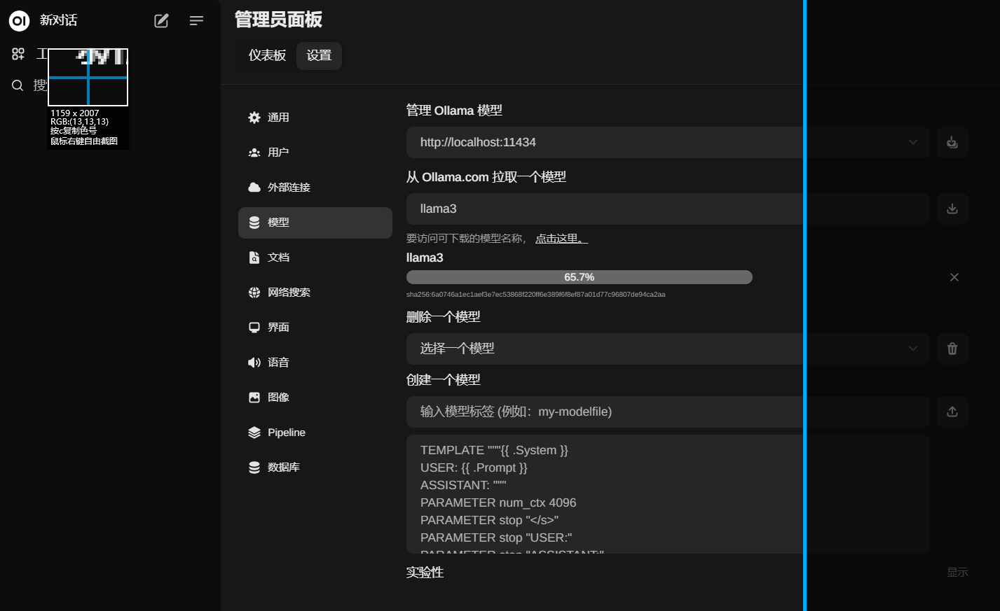
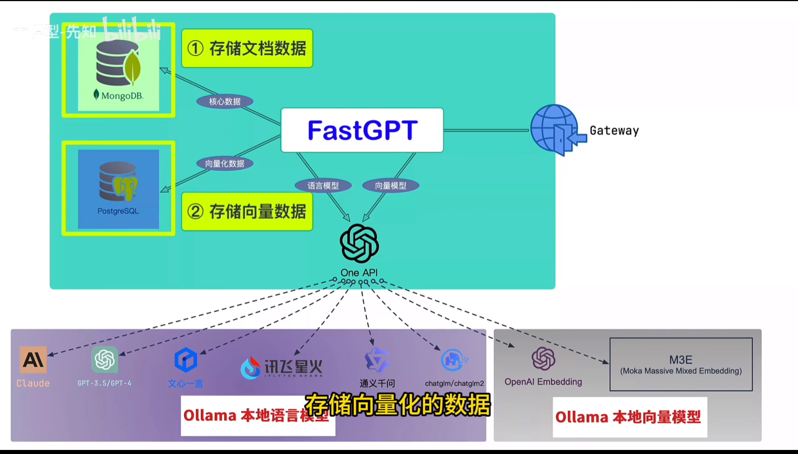
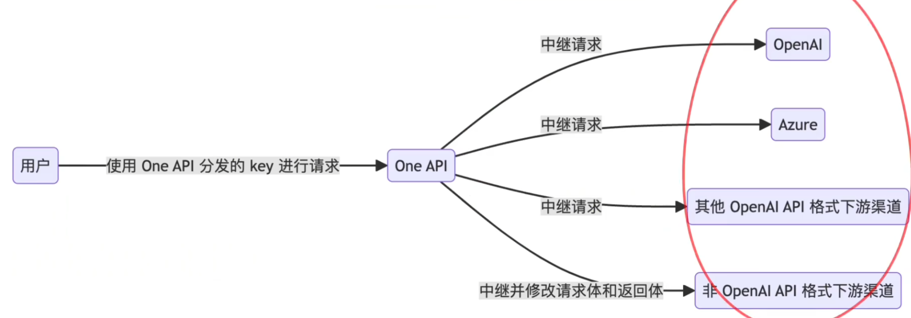
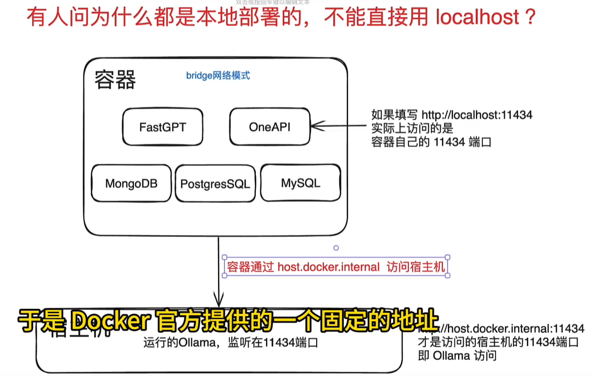

# Spring AI




下载ollama

https://ollama.com/


ollama run llama3


依赖

```xml
<dependency>
    <groupId>org.springframework.ai</groupId>
    <artifactId>spring-ai-ollama-spring-boot-starter</artifactId>
</dependency>
```


检索增强生成RAG Retrieval Augmented Generation




AnythingLLM


webui


```
docker run -d -p 3000:8080 --gpus=all -v ollama:/root/.ollama -v open-webui:/app/backend/data --name open-webui --restart always ghcr.io/open-webui/open-webui:ollama
```


```
docker run -d -p 3000:8080 --gpus=all --name open-webui --restart always ghcr.io/open-webui/open-webui:ollama
```





one API







