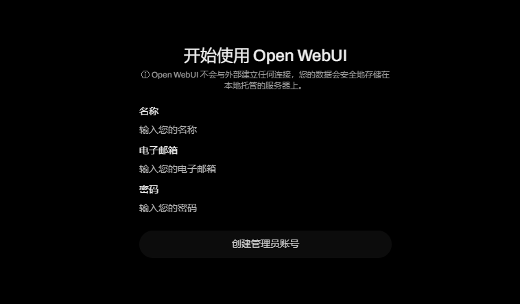
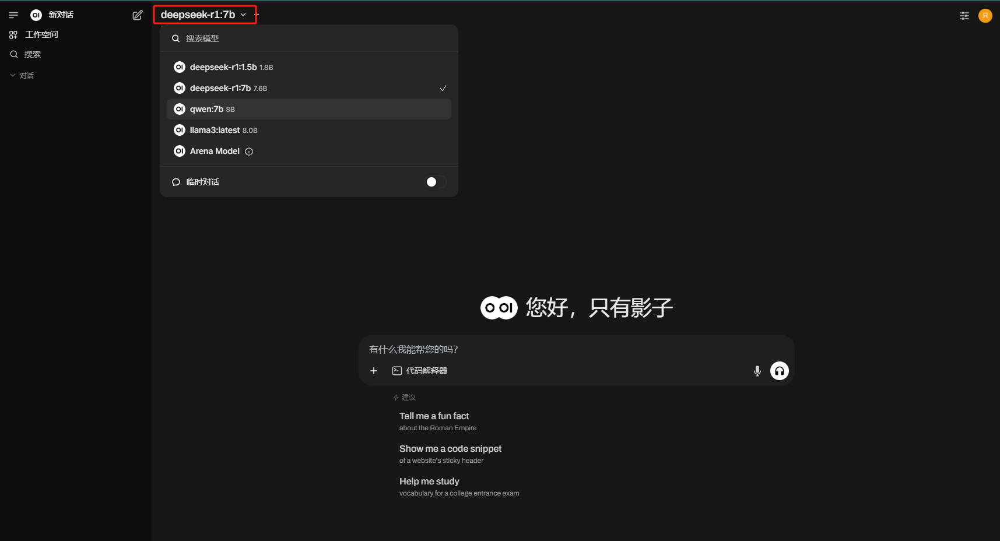
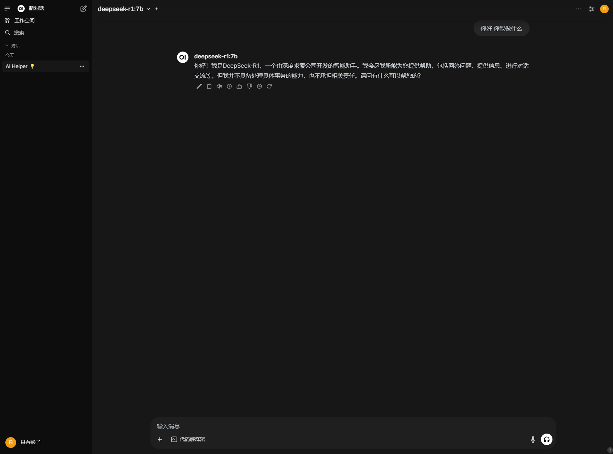

Open-WebUI 是一个功能强大的开源工具，旨在为用户提供一个简洁且功能丰富的界面来管理和使用大语言模型（LLM）。它支持与 Ollama 等后端服务集成，方便用户通过 Web 界面进行模型交互。本文将详细介绍 Open-WebUI 的安装方法和基本使用技巧。

## 前置条件

- 电脑上装有docker环境

>可以参考这个文章https://www.runoob.com/docker/windows-docker-install.html

## 目标

- 启动Open-WebUI连接本地Ollama启动的大模型

## 一、安装 Open-WebUI

### 使用 Docker 部署

如果Ollama在当前机器上，可以使用以下命令

```bash
docker run -d -p 3000:8080 --add-host=host.docker.internal:host-gateway -v open-webui:/app/backend/data --name open-webui --restart always ghcr.io/open-webui/open-webui:main
```

如果Ollama在其他服务器上，请使用此命令：

```bash
docker run -d -p 3000:8080 -e OLLAMA_BASE_URL=https://example.com -v open-webui:/app/backend/data --name open-webui --restart always ghcr.io/open-webui/open-webui:main
```

- OLLAMA_BASE_URL：ollama连接地址

## 二、使用 Open-WebUI

### （一）访问Open-WebUI

打开浏览器，访问 [http://localhost:3000](http://localhost:3000/)。

### （二）注册账号



### （三）模型选择



这里可以切换ollama中已有的模型

### （四）交互

左上角选择完想要的模型后，即可与之对话



>至此，即可在本地浏览器使用界面与大模型进行对话

## 四、常见问题

### （一）容器无法访问宿主机

如果你在部署时遇到容器无法访问宿主机的问题，确保使用了 `--add-host=host.docker.internal:host-gateway` 参数。

### （二）服务未启动

如果服务未正常启动，检查 Docker 日志以获取更多信息：

```bash
docker logs -f open-webui
```


## 参考资料

https://github.com/open-webui/open-webui