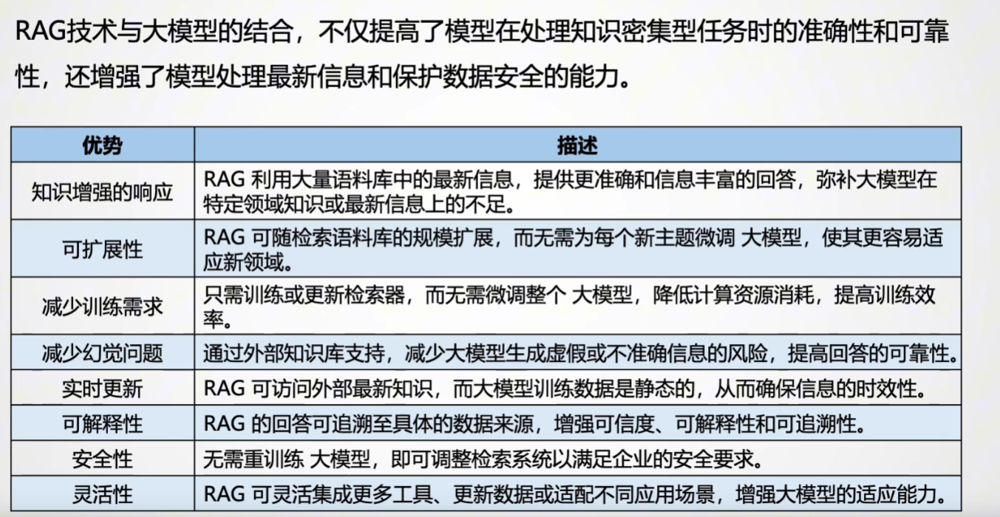

# 架构

输入层
输出层
核心处理层
decoder-only架构
encoder-only

输入层 
转换成词向量

核心处理层
主要包括自注意力机制 self-attention和前馈神经网络Feed Forward Network

输出层

受限于训练数据的局限性、上下文理解的缺陷或模型推理能力的不足，大模型经常出现“答非所问”的现象，通常情况下我们称之为“幻觉”。幻觉大体可分为事实性幻觉（Factuality)和忠实度幻觉（Faithfulness Hallucination)两种类别。

| 类别       | 问题         | 描述                                                         | 示例                                                     |
| ---------- | ------------ | ------------------------------------------------------------ | -------------------------------------------------------- |
| 事实性幻觉 | 事实不一致   | 模型输出的信息可在现实中验证，但与真实情况相矛盾。           | 问“谁是第一位登月的人”，大模型回答加加林而非阿姆斯特朗。 |
| 事实性幻觉 | 事实捏造     | 模型生成的信息完全虚构，无法通过已知知识验证                 | 询问独角兽的起源，大模型编造了一段毫无依据的历史         |
| 忠实度幻觉 | 指令不一致   | 模型的输出未能遵循用户指令                                   | 让大模型翻译句子，结果它直接回答问题而未翻译             |
| 忠实度幻觉 | 上下文不一致 | 模型未能正确利用用户提供的上下文信息，导致输出内容与上下文矛盾 | 一句上下文要求总结文章，但大模型遗漏了关键内容           |
| 忠实度幻觉 | 逻辑不一致   | 模型的输出在逻辑上自相矛盾                                   | 接方程2x+3=11，大模型正确求得2x=8,但随后错误地输出x=3    |

 参考资料
 https://www.bilibili.com/video/BV1LPGmzuEFh/?spm_id_from=333.1387.upload.video_card.click&vd_source=a835ff13776aa85a80bbdcf7eec57f27