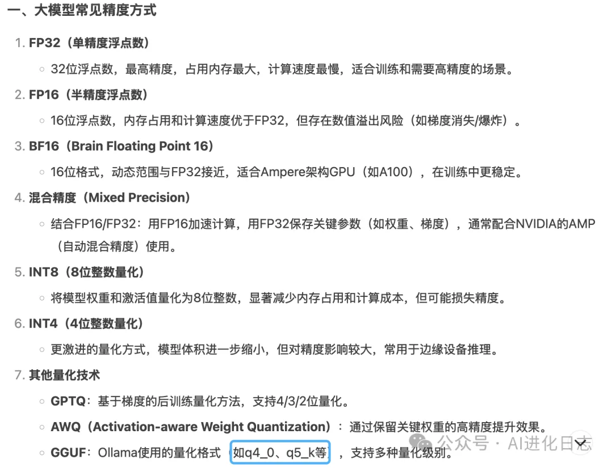

大模型量化是一种通过降低模型参数和激活值的精度来减少模型存储需求和计算复杂度的技术。其核心思想是将高精度的浮点数（如32位浮点数FP32）转换为低精度的表示形式（如16位浮点数FP16、8位整数INT8或4位整数INT4），从而实现模型的压缩和优化。

### 主要目的

1. **减少存储需求**：通过降低精度，模型参数占用的内存空间大幅减少。
2. **加快推理速度**：低精度计算通常比高精度计算更快，尤其是在支持低精度运算的硬件上。
3. **降低能源消耗**：模型在运行时消耗的能源更少。
4. **提升部署灵活性**：使得大模型能够更高效地在资源受限的设备上运行，例如移动设备、嵌入式系统等。

### 量化方法

大模型量化的主要方法包括：

1. **训练后量化（PTQ）**：在模型训练完成后进行量化，简单且不需要额外的训练数据，但可能会引入较大的精度损失。
2. **量化感知训练（QAT）**：在训练过程中模拟量化效果，使模型在训练时就适应量化带来的影响，通常能获得更好的量化效果。
3. **混合精度量化**：结合浮点型和整型运算的优点，可以在保证推理速度的同时减少精度损失。

### 量化粒度

根据量化的粒度，大模型量化还可以细分为：

- **逐层量化（Per-layer）**：每层或每个张量只有一个缩放因子。
- **逐通道量化（Per-channel）**：卷积核的每个通道都有不同的缩放因子。
- **逐Token量化（Per-token）**：针对激活值进行逐行量化。

### 应用场景

大模型量化广泛应用于需要高效部署和推理的场景，如：

- 移动设备和嵌入式系统。
- 云计算和边缘计算。
- 大语言模型的推理优化。

通过大模型量化，可以在保持模型性能的同时，显著降低模型的存储和计算成本，使其更适合在各种硬件设备上运行。

参考资料

https://cloud.tencent.com/developer/news/2137415