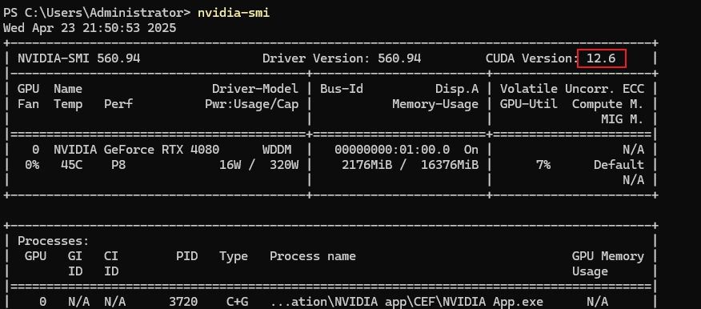
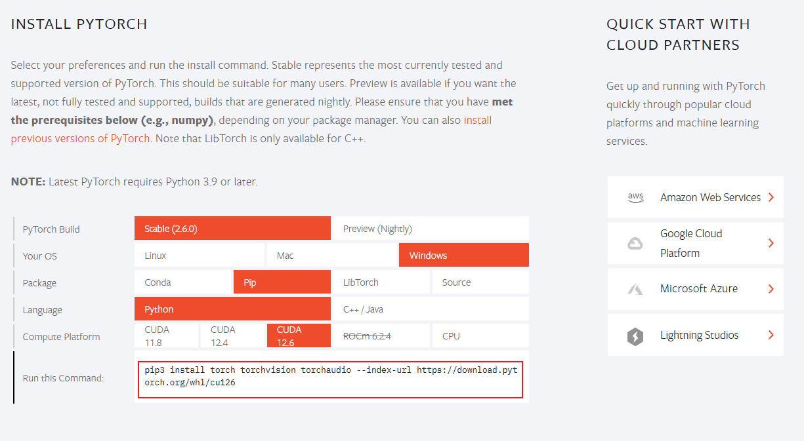

# LLaMA Factory


```bash
pip install -e .[torch,metrics]
```


```bash
llamafactory.cli webui --no-analytics --share --server_port 7860
```
或
```bash
python -m llamafactory.cli webui --no-analytics --share --server_port 7860
```

```bash
llamafactory-cli webui --no-analytics --share --server_port 7860
```

# 环境

Anaconda
没有的话 会报以下错
conda create -n llama_factory python=3.10
'conda' 不是内部或外部命令，也不是可运行的程序
或批处理文件。

```
To create a public link, set `share=True` in `launch()`.
[INFO|tokenization_auto.py:795] 2025-04-23 20:34:15,160 >> Could not locate the tokenizer configuration file, will try to use the model config instead.
Traceback (most recent call last):
  File "D:\Users\Administrator\anaconda3\Lib\site-packages\urllib3\connection.py", line 199, in _new_conn
    sock = connection.create_connection(
           ^^^^^^^^^^^^^^^^^^^^^^^^^^^^^
  File "D:\Users\Administrator\anaconda3\Lib\site-packages\urllib3\util\connection.py", line 85, in create_connection
    raise err
  File "D:\Users\Administrator\anaconda3\Lib\site-packages\urllib3\util\connection.py", line 73, in create_connection
    sock.connect(sa)
TimeoutError: timed out

The above exception was the direct cause of the following exception:

Traceback (most recent call last):
  File "D:\Users\Administrator\anaconda3\Lib\site-packages\urllib3\connectionpool.py", line 789, in urlopen
    response = self._make_request(
               ^^^^^^^^^^^^^^^^^^^
  File "D:\Users\Administrator\anaconda3\Lib\site-packages\urllib3\connectionpool.py", line 490, in _make_request
    raise new_e
  File "D:\Users\Administrator\anaconda3\Lib\site-packages\urllib3\connectionpool.py", line 466, in _make_request
    self._validate_conn(conn)
  File "D:\Users\Administrator\anaconda3\Lib\site-packages\urllib3\connectionpool.py", line 1095, in _validate_conn
    conn.connect()
  File "D:\Users\Administrator\anaconda3\Lib\site-packages\urllib3\connection.py", line 693, in connect
    self.sock = sock = self._new_conn()
                       ^^^^^^^^^^^^^^^^
  File "D:\Users\Administrator\anaconda3\Lib\site-packages\urllib3\connection.py", line 208, in _new_conn
    raise ConnectTimeoutError(
urllib3.exceptions.ConnectTimeoutError: (<urllib3.connection.HTTPSConnection object at 0x0000026F55912510>, 'Connection to huggingface.co timed out. (connect timeout=10)')

The above exception was the direct cause of the following exception:

Traceback (most recent call last):
  File "D:\Users\Administrator\anaconda3\Lib\site-packages\requests\adapters.py", line 667, in send
    resp = conn.urlopen(
           ^^^^^^^^^^^^^
  File "D:\Users\Administrator\anaconda3\Lib\site-packages\urllib3\connectionpool.py", line 843, in urlopen
    retries = retries.increment(
              ^^^^^^^^^^^^^^^^^^
  File "D:\Users\Administrator\anaconda3\Lib\site-packages\urllib3\util\retry.py", line 519, in increment
    raise MaxRetryError(_pool, url, reason) from reason  # type: ignore[arg-type]
    ^^^^^^^^^^^^^^^^^^^^^^^^^^^^^^^^^^^^^^^^^^^^^^^^^^^
urllib3.exceptions.MaxRetryError: HTTPSConnectionPool(host='huggingface.co', port=443): Max retries exceeded with url: /Qwen/Qwen2.5-0.5B/resolve/main/config.jso
n (Caused by ConnectTimeoutError(<urllib3.connection.HTTPSConnection object at 0x0000026F55912510>, 'Connection to huggingface.co timed out. (connect timeout=10)'))

During handling of the above exception, another exception occurred:

Traceback (most recent call last):
  File "D:\Users\Administrator\anaconda3\Lib\site-packages\huggingface_hub\file_download.py", line 1484, in _get_metadata_or_catch_error
    metadata = get_hf_file_metadata(
               ^^^^^^^^^^^^^^^^^^^^^
  File "D:\Users\Administrator\anaconda3\Lib\site-packages\huggingface_hub\utils\_validators.py", line 114, in _inner_fn
    return fn(*args, **kwargs)
           ^^^^^^^^^^^^^^^^^^^
  File "D:\Users\Administrator\anaconda3\Lib\site-packages\huggingface_hub\file_download.py", line 1401, in get_hf_file_metadata
    r = _request_wrapper(
        ^^^^^^^^^^^^^^^^^
  File "D:\Users\Administrator\anaconda3\Lib\site-packages\huggingface_hub\file_download.py", line 285, in _request_wrapper
    response = _request_wrapper(
               ^^^^^^^^^^^^^^^^^
  File "D:\Users\Administrator\anaconda3\Lib\site-packages\huggingface_hub\file_download.py", line 308, in _request_wrapper
    response = get_session().request(method=method, url=url, **params)
               ^^^^^^^^^^^^^^^^^^^^^^^^^^^^^^^^^^^^^^^^^^^^^^^^^^^^^^^
  File "D:\Users\Administrator\anaconda3\Lib\site-packages\requests\sessions.py", line 589, in request
    resp = self.send(prep, **send_kwargs)
           ^^^^^^^^^^^^^^^^^^^^^^^^^^^^^^
  File "D:\Users\Administrator\anaconda3\Lib\site-packages\requests\sessions.py", line 703, in send
    r = adapter.send(request, **kwargs)
        ^^^^^^^^^^^^^^^^^^^^^^^^^^^^^^^
  File "D:\Users\Administrator\anaconda3\Lib\site-packages\huggingface_hub\utils\_http.py", line 96, in send
    return super().send(request, *args, **kwargs)
           ^^^^^^^^^^^^^^^^^^^^^^^^^^^^^^^^^^^^^^
  File "D:\Users\Administrator\anaconda3\Lib\site-packages\requests\adapters.py", line 688, in send
    raise ConnectTimeout(e, request=request)
requests.exceptions.ConnectTimeout: (MaxRetryError("HTTPSConnectionPool(host='huggingface.co', port=443): Max retries exceeded with url: /Qwen/Qwen2.5-0.5B/resol
ve/main/config.json (Caused by ConnectTimeoutError(<urllib3.connection.HTTPSConnection object at 0x0000026F55912510>, 'Connection to huggingface.co timed out. (connect timeout=10)'))"), '(Request ID: 1f5b7560-0b7b-474b-b43c-32f15524ab4b)')

The above exception was the direct cause of the following exception:

Traceback (most recent call last):
  File "D:\Users\Administrator\anaconda3\Lib\site-packages\transformers\utils\hub.py", line 424, in cached_files
    hf_hub_download(
  File "D:\Users\Administrator\anaconda3\Lib\site-packages\huggingface_hub\utils\_validators.py", line 114, in _inner_fn
    return fn(*args, **kwargs)
           ^^^^^^^^^^^^^^^^^^^
  File "D:\Users\Administrator\anaconda3\Lib\site-packages\huggingface_hub\file_download.py", line 961, in hf_hub_download
    return _hf_hub_download_to_cache_dir(
           ^^^^^^^^^^^^^^^^^^^^^^^^^^^^^^
  File "D:\Users\Administrator\anaconda3\Lib\site-packages\huggingface_hub\file_download.py", line 1068, in _hf_hub_download_to_cache_dir
    _raise_on_head_call_error(head_call_error, force_download, local_files_only)
  File "D:\Users\Administrator\anaconda3\Lib\site-packages\huggingface_hub\file_download.py", line 1599, in _raise_on_head_call_error
    raise LocalEntryNotFoundError(
huggingface_hub.errors.LocalEntryNotFoundError: An error happened while trying to locate the file on the Hub and we cannot find the requested files in the local cache. Please check your connection and try again or make sure your Internet connection is on.

The above exception was the direct cause of the following exception:

Traceback (most recent call last):
  File "D:\coding\ai\llamafactory\LLaMA-Factory\src\llamafactory\model\loader.py", line 82, in load_tokenizer
    tokenizer = AutoTokenizer.from_pretrained(
                ^^^^^^^^^^^^^^^^^^^^^^^^^^^^^^
  File "D:\Users\Administrator\anaconda3\Lib\site-packages\transformers\models\auto\tokenization_auto.py", line 966, in from_pretrained
    config = AutoConfig.from_pretrained(
             ^^^^^^^^^^^^^^^^^^^^^^^^^^^
  File "D:\Users\Administrator\anaconda3\Lib\site-packages\transformers\models\auto\configuration_auto.py", line 1114, in from_pretrained
    config_dict, unused_kwargs = PretrainedConfig.get_config_dict(pretrained_model_name_or_path, **kwargs)
                                 ^^^^^^^^^^^^^^^^^^^^^^^^^^^^^^^^^^^^^^^^^^^^^^^^^^^^^^^^^^^^^^^^^^^^^^^^^
  File "D:\Users\Administrator\anaconda3\Lib\site-packages\transformers\configuration_utils.py", line 590, in get_config_dict
    config_dict, kwargs = cls._get_config_dict(pretrained_model_name_or_path, **kwargs)
                          ^^^^^^^^^^^^^^^^^^^^^^^^^^^^^^^^^^^^^^^^^^^^^^^^^^^^^^^^^^^^^
  File "D:\Users\Administrator\anaconda3\Lib\site-packages\transformers\configuration_utils.py", line 649, in _get_config_dict
    resolved_config_file = cached_file(
                           ^^^^^^^^^^^^
  File "D:\Users\Administrator\anaconda3\Lib\site-packages\transformers\utils\hub.py", line 266, in cached_file
    file = cached_files(path_or_repo_id=path_or_repo_id, filenames=[filename], **kwargs)
           ^^^^^^^^^^^^^^^^^^^^^^^^^^^^^^^^^^^^^^^^^^^^^^^^^^^^^^^^^^^^^^^^^^^^^^^^^^^^^
  File "D:\Users\Administrator\anaconda3\Lib\site-packages\transformers\utils\hub.py", line 491, in cached_files
    raise OSError(
OSError: We couldn't connect to 'https://huggingface.co' to load the files, and couldn't find them in the cached files.
Checkout your internet connection or see how to run the library in offline mode at 'https://huggingface.co/docs/transformers/installation#offline-mode'.

The above exception was the direct cause of the following exception:

Traceback (most recent call last):
  File "D:\Users\Administrator\anaconda3\Lib\site-packages\gradio\queueing.py", line 715, in process_events
    response = await route_utils.call_process_api(
               ^^^^^^^^^^^^^^^^^^^^^^^^^^^^^^^^^^^
  File "D:\Users\Administrator\anaconda3\Lib\site-packages\gradio\route_utils.py", line 322, in call_process_api
    output = await app.get_blocks().process_api(
             ^^^^^^^^^^^^^^^^^^^^^^^^^^^^^^^^^^^
  File "D:\Users\Administrator\anaconda3\Lib\site-packages\gradio\blocks.py", line 2137, in process_api
    result = await self.call_function(
             ^^^^^^^^^^^^^^^^^^^^^^^^^
  File "D:\Users\Administrator\anaconda3\Lib\site-packages\gradio\blocks.py", line 1675, in call_function
    prediction = await utils.async_iteration(iterator)
                 ^^^^^^^^^^^^^^^^^^^^^^^^^^^^^^^^^^^^^
  File "D:\Users\Administrator\anaconda3\Lib\site-packages\gradio\utils.py", line 735, in async_iteration
    return await anext(iterator)
           ^^^^^^^^^^^^^^^^^^^^^
  File "D:\Users\Administrator\anaconda3\Lib\site-packages\gradio\utils.py", line 729, in __anext__
    return await anyio.to_thread.run_sync(
           ^^^^^^^^^^^^^^^^^^^^^^^^^^^^^^^
  File "D:\Users\Administrator\anaconda3\Lib\site-packages\anyio\to_thread.py", line 56, in run_sync
    return await get_async_backend().run_sync_in_worker_thread(
           ^^^^^^^^^^^^^^^^^^^^^^^^^^^^^^^^^^^^^^^^^^^^^^^^^^^^
  File "D:\Users\Administrator\anaconda3\Lib\site-packages\anyio\_backends\_asyncio.py", line 2470, in run_sync_in_worker_thread
    return await future
           ^^^^^^^^^^^^
  File "D:\Users\Administrator\anaconda3\Lib\site-packages\anyio\_backends\_asyncio.py", line 967, in run
    result = context.run(func, *args)
             ^^^^^^^^^^^^^^^^^^^^^^^^
  File "D:\Users\Administrator\anaconda3\Lib\site-packages\gradio\utils.py", line 712, in run_sync_iterator_async
    return next(iterator)
           ^^^^^^^^^^^^^^
  File "D:\Users\Administrator\anaconda3\Lib\site-packages\gradio\utils.py", line 873, in gen_wrapper
    response = next(iterator)
               ^^^^^^^^^^^^^^
  File "D:\coding\ai\llamafactory\LLaMA-Factory\src\llamafactory\webui\chatter.py", line 144, in load_model
    super().__init__(args)
  File "D:\coding\ai\llamafactory\LLaMA-Factory\src\llamafactory\chat\chat_model.py", line 53, in __init__
    self.engine: BaseEngine = HuggingfaceEngine(model_args, data_args, finetuning_args, generating_args)
                              ^^^^^^^^^^^^^^^^^^^^^^^^^^^^^^^^^^^^^^^^^^^^^^^^^^^^^^^^^^^^^^^^^^^^^^^^^^
  File "D:\coding\ai\llamafactory\LLaMA-Factory\src\llamafactory\chat\hf_engine.py", line 54, in __init__
    tokenizer_module = load_tokenizer(model_args)
                       ^^^^^^^^^^^^^^^^^^^^^^^^^^
  File "D:\coding\ai\llamafactory\LLaMA-Factory\src\llamafactory\model\loader.py", line 97, in load_tokenizer
    raise OSError("Failed to load tokenizer.") from e
OSError: Failed to load tokenizer.
[INFO|tokenization_auto.py:795] 2025-04-23 20:47:23,949 >> Could not locate the tokenizer configuration file, will try to use the model config instead.
Traceback (most recent call last):
  File "D:\Users\Administrator\anaconda3\Lib\site-packages\urllib3\connection.py", line 199, in _new_conn
    sock = connection.create_connection(
           ^^^^^^^^^^^^^^^^^^^^^^^^^^^^^
  File "D:\Users\Administrator\anaconda3\Lib\site-packages\urllib3\util\connection.py", line 85, in create_connection
    raise err
  File "D:\Users\Administrator\anaconda3\Lib\site-packages\urllib3\util\connection.py", line 73, in create_connection
    sock.connect(sa)
TimeoutError: timed out

The above exception was the direct cause of the following exception:

Traceback (most recent call last):
  File "D:\Users\Administrator\anaconda3\Lib\site-packages\urllib3\connectionpool.py", line 789, in urlopen
    response = self._make_request(
               ^^^^^^^^^^^^^^^^^^^
  File "D:\Users\Administrator\anaconda3\Lib\site-packages\urllib3\connectionpool.py", line 490, in _make_request
    raise new_e
  File "D:\Users\Administrator\anaconda3\Lib\site-packages\urllib3\connectionpool.py", line 466, in _make_request
    self._validate_conn(conn)
  File "D:\Users\Administrator\anaconda3\Lib\site-packages\urllib3\connectionpool.py", line 1095, in _validate_conn
    conn.connect()
  File "D:\Users\Administrator\anaconda3\Lib\site-packages\urllib3\connection.py", line 693, in connect
    self.sock = sock = self._new_conn()
                       ^^^^^^^^^^^^^^^^
  File "D:\Users\Administrator\anaconda3\Lib\site-packages\urllib3\connection.py", line 208, in _new_conn
    raise ConnectTimeoutError(
urllib3.exceptions.ConnectTimeoutError: (<urllib3.connection.HTTPSConnection object at 0x0000026F57C7B740>, 'Connection to huggingface.co timed out. (connect timeout=10)')

The above exception was the direct cause of the following exception:

Traceback (most recent call last):
  File "D:\Users\Administrator\anaconda3\Lib\site-packages\requests\adapters.py", line 667, in send
    resp = conn.urlopen(
           ^^^^^^^^^^^^^
  File "D:\Users\Administrator\anaconda3\Lib\site-packages\urllib3\connectionpool.py", line 843, in urlopen
    retries = retries.increment(
              ^^^^^^^^^^^^^^^^^^
  File "D:\Users\Administrator\anaconda3\Lib\site-packages\urllib3\util\retry.py", line 519, in increment
    raise MaxRetryError(_pool, url, reason) from reason  # type: ignore[arg-type]
    ^^^^^^^^^^^^^^^^^^^^^^^^^^^^^^^^^^^^^^^^^^^^^^^^^^^
urllib3.exceptions.MaxRetryError: HTTPSConnectionPool(host='huggingface.co', port=443): Max retries exceeded with url: /Qwen/Qwen2.5-0.5B/resolve/main/config.jso
n (Caused by ConnectTimeoutError(<urllib3.connection.HTTPSConnection object at 0x0000026F57C7B740>, 'Connection to huggingface.co timed out. (connect timeout=10)'))

During handling of the above exception, another exception occurred:

Traceback (most recent call last):
  File "D:\Users\Administrator\anaconda3\Lib\site-packages\huggingface_hub\file_download.py", line 1484, in _get_metadata_or_catch_error
    metadata = get_hf_file_metadata(
               ^^^^^^^^^^^^^^^^^^^^^
  File "D:\Users\Administrator\anaconda3\Lib\site-packages\huggingface_hub\utils\_validators.py", line 114, in _inner_fn
    return fn(*args, **kwargs)
           ^^^^^^^^^^^^^^^^^^^
  File "D:\Users\Administrator\anaconda3\Lib\site-packages\huggingface_hub\file_download.py", line 1401, in get_hf_file_metadata
    r = _request_wrapper(
        ^^^^^^^^^^^^^^^^^
  File "D:\Users\Administrator\anaconda3\Lib\site-packages\huggingface_hub\file_download.py", line 285, in _request_wrapper
    response = _request_wrapper(
               ^^^^^^^^^^^^^^^^^
  File "D:\Users\Administrator\anaconda3\Lib\site-packages\huggingface_hub\file_download.py", line 308, in _request_wrapper
    response = get_session().request(method=method, url=url, **params)
               ^^^^^^^^^^^^^^^^^^^^^^^^^^^^^^^^^^^^^^^^^^^^^^^^^^^^^^^
  File "D:\Users\Administrator\anaconda3\Lib\site-packages\requests\sessions.py", line 589, in request
    resp = self.send(prep, **send_kwargs)
           ^^^^^^^^^^^^^^^^^^^^^^^^^^^^^^
  File "D:\Users\Administrator\anaconda3\Lib\site-packages\requests\sessions.py", line 703, in send
    r = adapter.send(request, **kwargs)
        ^^^^^^^^^^^^^^^^^^^^^^^^^^^^^^^
  File "D:\Users\Administrator\anaconda3\Lib\site-packages\huggingface_hub\utils\_http.py", line 96, in send
    return super().send(request, *args, **kwargs)
           ^^^^^^^^^^^^^^^^^^^^^^^^^^^^^^^^^^^^^^
  File "D:\Users\Administrator\anaconda3\Lib\site-packages\requests\adapters.py", line 688, in send
    raise ConnectTimeout(e, request=request)
requests.exceptions.ConnectTimeout: (MaxRetryError("HTTPSConnectionPool(host='huggingface.co', port=443): Max retries exceeded with url: /Qwen/Qwen2.5-0.5B/resol
ve/main/config.json (Caused by ConnectTimeoutError(<urllib3.connection.HTTPSConnection object at 0x0000026F57C7B740>, 'Connection to huggingface.co timed out. (connect timeout=10)'))"), '(Request ID: d9d6cbf5-1364-446b-82a1-b0e09b110264)')

The above exception was the direct cause of the following exception:

Traceback (most recent call last):
  File "D:\Users\Administrator\anaconda3\Lib\site-packages\transformers\utils\hub.py", line 424, in cached_files
    hf_hub_download(
  File "D:\Users\Administrator\anaconda3\Lib\site-packages\huggingface_hub\utils\_validators.py", line 114, in _inner_fn
    return fn(*args, **kwargs)
           ^^^^^^^^^^^^^^^^^^^
  File "D:\Users\Administrator\anaconda3\Lib\site-packages\huggingface_hub\file_download.py", line 961, in hf_hub_download
    return _hf_hub_download_to_cache_dir(
           ^^^^^^^^^^^^^^^^^^^^^^^^^^^^^^
  File "D:\Users\Administrator\anaconda3\Lib\site-packages\huggingface_hub\file_download.py", line 1068, in _hf_hub_download_to_cache_dir
    _raise_on_head_call_error(head_call_error, force_download, local_files_only)
  File "D:\Users\Administrator\anaconda3\Lib\site-packages\huggingface_hub\file_download.py", line 1599, in _raise_on_head_call_error
    raise LocalEntryNotFoundError(
huggingface_hub.errors.LocalEntryNotFoundError: An error happened while trying to locate the file on the Hub and we cannot find the requested files in the local cache. Please check your connection and try again or make sure your Internet connection is on.

The above exception was the direct cause of the following exception:

Traceback (most recent call last):
  File "D:\coding\ai\llamafactory\LLaMA-Factory\src\llamafactory\model\loader.py", line 82, in load_tokenizer
    tokenizer = AutoTokenizer.from_pretrained(
                ^^^^^^^^^^^^^^^^^^^^^^^^^^^^^^
  File "D:\Users\Administrator\anaconda3\Lib\site-packages\transformers\models\auto\tokenization_auto.py", line 966, in from_pretrained
    config = AutoConfig.from_pretrained(
             ^^^^^^^^^^^^^^^^^^^^^^^^^^^
  File "D:\Users\Administrator\anaconda3\Lib\site-packages\transformers\models\auto\configuration_auto.py", line 1114, in from_pretrained
    config_dict, unused_kwargs = PretrainedConfig.get_config_dict(pretrained_model_name_or_path, **kwargs)
                                 ^^^^^^^^^^^^^^^^^^^^^^^^^^^^^^^^^^^^^^^^^^^^^^^^^^^^^^^^^^^^^^^^^^^^^^^^^
  File "D:\Users\Administrator\anaconda3\Lib\site-packages\transformers\configuration_utils.py", line 590, in get_config_dict
    config_dict, kwargs = cls._get_config_dict(pretrained_model_name_or_path, **kwargs)
                          ^^^^^^^^^^^^^^^^^^^^^^^^^^^^^^^^^^^^^^^^^^^^^^^^^^^^^^^^^^^^^
  File "D:\Users\Administrator\anaconda3\Lib\site-packages\transformers\configuration_utils.py", line 649, in _get_config_dict
    resolved_config_file = cached_file(
                           ^^^^^^^^^^^^
  File "D:\Users\Administrator\anaconda3\Lib\site-packages\transformers\utils\hub.py", line 266, in cached_file
    file = cached_files(path_or_repo_id=path_or_repo_id, filenames=[filename], **kwargs)
           ^^^^^^^^^^^^^^^^^^^^^^^^^^^^^^^^^^^^^^^^^^^^^^^^^^^^^^^^^^^^^^^^^^^^^^^^^^^^^
  File "D:\Users\Administrator\anaconda3\Lib\site-packages\transformers\utils\hub.py", line 491, in cached_files
    raise OSError(
OSError: We couldn't connect to 'https://huggingface.co' to load the files, and couldn't find them in the cached files.
Checkout your internet connection or see how to run the library in offline mode at 'https://huggingface.co/docs/transformers/installation#offline-mode'.

The above exception was the direct cause of the following exception:

Traceback (most recent call last):
  File "D:\Users\Administrator\anaconda3\Lib\site-packages\gradio\queueing.py", line 715, in process_events
    response = await route_utils.call_process_api(
               ^^^^^^^^^^^^^^^^^^^^^^^^^^^^^^^^^^^
  File "D:\Users\Administrator\anaconda3\Lib\site-packages\gradio\route_utils.py", line 322, in call_process_api
    output = await app.get_blocks().process_api(
             ^^^^^^^^^^^^^^^^^^^^^^^^^^^^^^^^^^^
  File "D:\Users\Administrator\anaconda3\Lib\site-packages\gradio\blocks.py", line 2137, in process_api
    result = await self.call_function(
             ^^^^^^^^^^^^^^^^^^^^^^^^^
  File "D:\Users\Administrator\anaconda3\Lib\site-packages\gradio\blocks.py", line 1675, in call_function
    prediction = await utils.async_iteration(iterator)
                 ^^^^^^^^^^^^^^^^^^^^^^^^^^^^^^^^^^^^^
  File "D:\Users\Administrator\anaconda3\Lib\site-packages\gradio\utils.py", line 735, in async_iteration
    return await anext(iterator)
           ^^^^^^^^^^^^^^^^^^^^^
  File "D:\Users\Administrator\anaconda3\Lib\site-packages\gradio\utils.py", line 729, in __anext__
    return await anyio.to_thread.run_sync(
           ^^^^^^^^^^^^^^^^^^^^^^^^^^^^^^^
  File "D:\Users\Administrator\anaconda3\Lib\site-packages\anyio\to_thread.py", line 56, in run_sync
    return await get_async_backend().run_sync_in_worker_thread(
           ^^^^^^^^^^^^^^^^^^^^^^^^^^^^^^^^^^^^^^^^^^^^^^^^^^^^
  File "D:\Users\Administrator\anaconda3\Lib\site-packages\anyio\_backends\_asyncio.py", line 2470, in run_sync_in_worker_thread
    return await future
           ^^^^^^^^^^^^
  File "D:\Users\Administrator\anaconda3\Lib\site-packages\anyio\_backends\_asyncio.py", line 967, in run
    result = context.run(func, *args)
             ^^^^^^^^^^^^^^^^^^^^^^^^
  File "D:\Users\Administrator\anaconda3\Lib\site-packages\gradio\utils.py", line 712, in run_sync_iterator_async
    return next(iterator)
           ^^^^^^^^^^^^^^
  File "D:\Users\Administrator\anaconda3\Lib\site-packages\gradio\utils.py", line 873, in gen_wrapper
    response = next(iterator)
               ^^^^^^^^^^^^^^
  File "D:\coding\ai\llamafactory\LLaMA-Factory\src\llamafactory\webui\chatter.py", line 144, in load_model
    super().__init__(args)
  File "D:\coding\ai\llamafactory\LLaMA-Factory\src\llamafactory\chat\chat_model.py", line 53, in __init__
    self.engine: BaseEngine = HuggingfaceEngine(model_args, data_args, finetuning_args, generating_args)
                              ^^^^^^^^^^^^^^^^^^^^^^^^^^^^^^^^^^^^^^^^^^^^^^^^^^^^^^^^^^^^^^^^^^^^^^^^^^
  File "D:\coding\ai\llamafactory\LLaMA-Factory\src\llamafactory\chat\hf_engine.py", line 54, in __init__
    tokenizer_module = load_tokenizer(model_args)
                       ^^^^^^^^^^^^^^^^^^^^^^^^^^
  File "D:\coding\ai\llamafactory\LLaMA-Factory\src\llamafactory\model\loader.py", line 97, in load_tokenizer
    raise OSError("Failed to load tokenizer.") from e
OSError: Failed to load tokenizer.
forrtl: error (200): program aborting due to control-C event
Image              PC                Routine            Line        Source
libifcoremd.dll    00007FFDCDC1DF54  Unknown               Unknown  Unknown
KERNELBASE.dll     00007FFED9E0C46D  Unknown               Unknown  Unknown
KERNEL32.DLL       00007FFEDBF3E8D7  Unknown               Unknown  Unknown
ntdll.dll          00007FFEDC8B14FC  Unknown               Unknown  Unknown
PS D:\coding\ai\llamafactory\LLaMA-Factory> llamafactory-cli webui --no-analytics --share --server_port 7860
Visit http://ip:port for Web UI, e.g., http://127.0.0.1:7860
* Running on local URL:  http://0.0.0.0:7860

To create a public link, set `share=True` in `launch()`.
[INFO|tokenization_auto.py:795] 2025-04-23 20:48:40,084 >> Could not locate the tokenizer configuration file, will try to use the model config instead.
Traceback (most recent call last):
  File "D:\Users\Administrator\anaconda3\Lib\site-packages\urllib3\connection.py", line 199, in _new_conn
    sock = connection.create_connection(
           ^^^^^^^^^^^^^^^^^^^^^^^^^^^^^
  File "D:\Users\Administrator\anaconda3\Lib\site-packages\urllib3\util\connection.py", line 85, in create_connection
    raise err
  File "D:\Users\Administrator\anaconda3\Lib\site-packages\urllib3\util\connection.py", line 73, in create_connection
    sock.connect(sa)
TimeoutError: timed out

The above exception was the direct cause of the following exception:

Traceback (most recent call last):
  File "D:\Users\Administrator\anaconda3\Lib\site-packages\urllib3\connectionpool.py", line 789, in urlopen
    response = self._make_request(
               ^^^^^^^^^^^^^^^^^^^
  File "D:\Users\Administrator\anaconda3\Lib\site-packages\urllib3\connectionpool.py", line 490, in _make_request
    raise new_e
  File "D:\Users\Administrator\anaconda3\Lib\site-packages\urllib3\connectionpool.py", line 466, in _make_request
    self._validate_conn(conn)
  File "D:\Users\Administrator\anaconda3\Lib\site-packages\urllib3\connectionpool.py", line 1095, in _validate_conn
    conn.connect()
  File "D:\Users\Administrator\anaconda3\Lib\site-packages\urllib3\connection.py", line 693, in connect
    self.sock = sock = self._new_conn()
                       ^^^^^^^^^^^^^^^^
  File "D:\Users\Administrator\anaconda3\Lib\site-packages\urllib3\connection.py", line 208, in _new_conn
    raise ConnectTimeoutError(
urllib3.exceptions.ConnectTimeoutError: (<urllib3.connection.HTTPSConnection object at 0x0000026A11755DC0>, 'Connection to huggingface.co timed out. (connect timeout=10)')

The above exception was the direct cause of the following exception:

Traceback (most recent call last):
  File "D:\Users\Administrator\anaconda3\Lib\site-packages\requests\adapters.py", line 667, in send
    resp = conn.urlopen(
           ^^^^^^^^^^^^^
  File "D:\Users\Administrator\anaconda3\Lib\site-packages\urllib3\connectionpool.py", line 843, in urlopen
    retries = retries.increment(
              ^^^^^^^^^^^^^^^^^^
  File "D:\Users\Administrator\anaconda3\Lib\site-packages\urllib3\util\retry.py", line 519, in increment
    raise MaxRetryError(_pool, url, reason) from reason  # type: ignore[arg-type]
    ^^^^^^^^^^^^^^^^^^^^^^^^^^^^^^^^^^^^^^^^^^^^^^^^^^^
urllib3.exceptions.MaxRetryError: HTTPSConnectionPool(host='huggingface.co', port=443): Max retries exceeded with url: /Qwen/Qwen2.5-0.5B/resolve/main/config.jso
n (Caused by ConnectTimeoutError(<urllib3.connection.HTTPSConnection object at 0x0000026A11755DC0>, 'Connection to huggingface.co timed out. (connect timeout=10)'))

During handling of the above exception, another exception occurred:

Traceback (most recent call last):
  File "D:\Users\Administrator\anaconda3\Lib\site-packages\huggingface_hub\file_download.py", line 1484, in _get_metadata_or_catch_error
    metadata = get_hf_file_metadata(
               ^^^^^^^^^^^^^^^^^^^^^
  File "D:\Users\Administrator\anaconda3\Lib\site-packages\huggingface_hub\utils\_validators.py", line 114, in _inner_fn
    return fn(*args, **kwargs)
           ^^^^^^^^^^^^^^^^^^^
  File "D:\Users\Administrator\anaconda3\Lib\site-packages\huggingface_hub\file_download.py", line 1401, in get_hf_file_metadata
    r = _request_wrapper(
        ^^^^^^^^^^^^^^^^^
  File "D:\Users\Administrator\anaconda3\Lib\site-packages\huggingface_hub\file_download.py", line 285, in _request_wrapper
    response = _request_wrapper(
               ^^^^^^^^^^^^^^^^^
  File "D:\Users\Administrator\anaconda3\Lib\site-packages\huggingface_hub\file_download.py", line 308, in _request_wrapper
    response = get_session().request(method=method, url=url, **params)
               ^^^^^^^^^^^^^^^^^^^^^^^^^^^^^^^^^^^^^^^^^^^^^^^^^^^^^^^
  File "D:\Users\Administrator\anaconda3\Lib\site-packages\requests\sessions.py", line 589, in request
    resp = self.send(prep, **send_kwargs)
           ^^^^^^^^^^^^^^^^^^^^^^^^^^^^^^
  File "D:\Users\Administrator\anaconda3\Lib\site-packages\requests\sessions.py", line 703, in send
    r = adapter.send(request, **kwargs)
        ^^^^^^^^^^^^^^^^^^^^^^^^^^^^^^^
  File "D:\Users\Administrator\anaconda3\Lib\site-packages\huggingface_hub\utils\_http.py", line 96, in send
    return super().send(request, *args, **kwargs)
           ^^^^^^^^^^^^^^^^^^^^^^^^^^^^^^^^^^^^^^
  File "D:\Users\Administrator\anaconda3\Lib\site-packages\requests\adapters.py", line 688, in send
    raise ConnectTimeout(e, request=request)
requests.exceptions.ConnectTimeout: (MaxRetryError("HTTPSConnectionPool(host='huggingface.co', port=443): Max retries exceeded with url: /Qwen/Qwen2.5-0.5B/resol
ve/main/config.json (Caused by ConnectTimeoutError(<urllib3.connection.HTTPSConnection object at 0x0000026A11755DC0>, 'Connection to huggingface.co timed out. (connect timeout=10)'))"), '(Request ID: 4665e3b7-cb78-4647-9258-297d832e2775)')

The above exception was the direct cause of the following exception:

Traceback (most recent call last):
  File "D:\Users\Administrator\anaconda3\Lib\site-packages\transformers\utils\hub.py", line 424, in cached_files
    hf_hub_download(
  File "D:\Users\Administrator\anaconda3\Lib\site-packages\huggingface_hub\utils\_validators.py", line 114, in _inner_fn
    return fn(*args, **kwargs)
           ^^^^^^^^^^^^^^^^^^^
  File "D:\Users\Administrator\anaconda3\Lib\site-packages\huggingface_hub\file_download.py", line 961, in hf_hub_download
    return _hf_hub_download_to_cache_dir(
           ^^^^^^^^^^^^^^^^^^^^^^^^^^^^^^
  File "D:\Users\Administrator\anaconda3\Lib\site-packages\huggingface_hub\file_download.py", line 1068, in _hf_hub_download_to_cache_dir
    _raise_on_head_call_error(head_call_error, force_download, local_files_only)
  File "D:\Users\Administrator\anaconda3\Lib\site-packages\huggingface_hub\file_download.py", line 1599, in _raise_on_head_call_error
    raise LocalEntryNotFoundError(
huggingface_hub.errors.LocalEntryNotFoundError: An error happened while trying to locate the file on the Hub and we cannot find the requested files in the local cache. Please check your connection and try again or make sure your Internet connection is on.

The above exception was the direct cause of the following exception:

Traceback (most recent call last):
  File "D:\coding\ai\llamafactory\LLaMA-Factory\src\llamafactory\model\loader.py", line 82, in load_tokenizer
    tokenizer = AutoTokenizer.from_pretrained(
                ^^^^^^^^^^^^^^^^^^^^^^^^^^^^^^
  File "D:\Users\Administrator\anaconda3\Lib\site-packages\transformers\models\auto\tokenization_auto.py", line 966, in from_pretrained
    config = AutoConfig.from_pretrained(
             ^^^^^^^^^^^^^^^^^^^^^^^^^^^
  File "D:\Users\Administrator\anaconda3\Lib\site-packages\transformers\models\auto\configuration_auto.py", line 1114, in from_pretrained
    config_dict, unused_kwargs = PretrainedConfig.get_config_dict(pretrained_model_name_or_path, **kwargs)
                                 ^^^^^^^^^^^^^^^^^^^^^^^^^^^^^^^^^^^^^^^^^^^^^^^^^^^^^^^^^^^^^^^^^^^^^^^^^
  File "D:\Users\Administrator\anaconda3\Lib\site-packages\transformers\configuration_utils.py", line 590, in get_config_dict
    config_dict, kwargs = cls._get_config_dict(pretrained_model_name_or_path, **kwargs)
                          ^^^^^^^^^^^^^^^^^^^^^^^^^^^^^^^^^^^^^^^^^^^^^^^^^^^^^^^^^^^^^
  File "D:\Users\Administrator\anaconda3\Lib\site-packages\transformers\configuration_utils.py", line 649, in _get_config_dict
    resolved_config_file = cached_file(
                           ^^^^^^^^^^^^
  File "D:\Users\Administrator\anaconda3\Lib\site-packages\transformers\utils\hub.py", line 266, in cached_file
    file = cached_files(path_or_repo_id=path_or_repo_id, filenames=[filename], **kwargs)
           ^^^^^^^^^^^^^^^^^^^^^^^^^^^^^^^^^^^^^^^^^^^^^^^^^^^^^^^^^^^^^^^^^^^^^^^^^^^^^
  File "D:\Users\Administrator\anaconda3\Lib\site-packages\transformers\utils\hub.py", line 491, in cached_files
    raise OSError(
OSError: We couldn't connect to 'https://huggingface.co' to load the files, and couldn't find them in the cached files.
Checkout your internet connection or see how to run the library in offline mode at 'https://huggingface.co/docs/transformers/installation#offline-mode'.

The above exception was the direct cause of the following exception:

Traceback (most recent call last):
  File "D:\Users\Administrator\anaconda3\Lib\site-packages\gradio\queueing.py", line 715, in process_events
    response = await route_utils.call_process_api(
               ^^^^^^^^^^^^^^^^^^^^^^^^^^^^^^^^^^^
  File "D:\Users\Administrator\anaconda3\Lib\site-packages\gradio\route_utils.py", line 322, in call_process_api
    output = await app.get_blocks().process_api(
             ^^^^^^^^^^^^^^^^^^^^^^^^^^^^^^^^^^^
  File "D:\Users\Administrator\anaconda3\Lib\site-packages\gradio\blocks.py", line 2137, in process_api
    result = await self.call_function(
             ^^^^^^^^^^^^^^^^^^^^^^^^^
  File "D:\Users\Administrator\anaconda3\Lib\site-packages\gradio\blocks.py", line 1675, in call_function
    prediction = await utils.async_iteration(iterator)
                 ^^^^^^^^^^^^^^^^^^^^^^^^^^^^^^^^^^^^^
  File "D:\Users\Administrator\anaconda3\Lib\site-packages\gradio\utils.py", line 735, in async_iteration
    return await anext(iterator)
           ^^^^^^^^^^^^^^^^^^^^^
  File "D:\Users\Administrator\anaconda3\Lib\site-packages\gradio\utils.py", line 729, in __anext__
    return await anyio.to_thread.run_sync(
           ^^^^^^^^^^^^^^^^^^^^^^^^^^^^^^^
  File "D:\Users\Administrator\anaconda3\Lib\site-packages\anyio\to_thread.py", line 56, in run_sync
    return await get_async_backend().run_sync_in_worker_thread(
           ^^^^^^^^^^^^^^^^^^^^^^^^^^^^^^^^^^^^^^^^^^^^^^^^^^^^
  File "D:\Users\Administrator\anaconda3\Lib\site-packages\anyio\_backends\_asyncio.py", line 2470, in run_sync_in_worker_thread
    return await future
           ^^^^^^^^^^^^
  File "D:\Users\Administrator\anaconda3\Lib\site-packages\anyio\_backends\_asyncio.py", line 967, in run
    result = context.run(func, *args)
             ^^^^^^^^^^^^^^^^^^^^^^^^
  File "D:\Users\Administrator\anaconda3\Lib\site-packages\gradio\utils.py", line 712, in run_sync_iterator_async
    return next(iterator)
           ^^^^^^^^^^^^^^
  File "D:\Users\Administrator\anaconda3\Lib\site-packages\gradio\utils.py", line 873, in gen_wrapper
    response = next(iterator)
               ^^^^^^^^^^^^^^
  File "D:\coding\ai\llamafactory\LLaMA-Factory\src\llamafactory\webui\chatter.py", line 144, in load_model
    super().__init__(args)
  File "D:\coding\ai\llamafactory\LLaMA-Factory\src\llamafactory\chat\chat_model.py", line 53, in __init__
    self.engine: BaseEngine = HuggingfaceEngine(model_args, data_args, finetuning_args, generating_args)
                              ^^^^^^^^^^^^^^^^^^^^^^^^^^^^^^^^^^^^^^^^^^^^^^^^^^^^^^^^^^^^^^^^^^^^^^^^^^
  File "D:\coding\ai\llamafactory\LLaMA-Factory\src\llamafactory\chat\hf_engine.py", line 54, in __init__
    tokenizer_module = load_tokenizer(model_args)
                       ^^^^^^^^^^^^^^^^^^^^^^^^^^
  File "D:\coding\ai\llamafactory\LLaMA-Factory\src\llamafactory\model\loader.py", line 97, in load_tokenizer
    raise OSError("Failed to load tokenizer.") from e
OSError: Failed to load tokenizer.
[INFO|tokenization_auto.py:795] 2025-04-23 20:49:20,203 >> Could not locate the tokenizer configuration file, will try to use the model config instead.
Traceback (most recent call last):
  File "D:\Users\Administrator\anaconda3\Lib\site-packages\urllib3\connection.py", line 199, in _new_conn
    sock = connection.create_connection(
           ^^^^^^^^^^^^^^^^^^^^^^^^^^^^^
  File "D:\Users\Administrator\anaconda3\Lib\site-packages\urllib3\util\connection.py", line 85, in create_connection
    raise err
  File "D:\Users\Administrator\anaconda3\Lib\site-packages\urllib3\util\connection.py", line 73, in create_connection
    sock.connect(sa)
TimeoutError: timed out

The above exception was the direct cause of the following exception:

Traceback (most recent call last):
  File "D:\Users\Administrator\anaconda3\Lib\site-packages\urllib3\connectionpool.py", line 789, in urlopen
    response = self._make_request(
               ^^^^^^^^^^^^^^^^^^^
  File "D:\Users\Administrator\anaconda3\Lib\site-packages\urllib3\connectionpool.py", line 490, in _make_request
    raise new_e
  File "D:\Users\Administrator\anaconda3\Lib\site-packages\urllib3\connectionpool.py", line 466, in _make_request
    self._validate_conn(conn)
  File "D:\Users\Administrator\anaconda3\Lib\site-packages\urllib3\connectionpool.py", line 1095, in _validate_conn
    conn.connect()
  File "D:\Users\Administrator\anaconda3\Lib\site-packages\urllib3\connection.py", line 693, in connect
    self.sock = sock = self._new_conn()
                       ^^^^^^^^^^^^^^^^
  File "D:\Users\Administrator\anaconda3\Lib\site-packages\urllib3\connection.py", line 208, in _new_conn
    raise ConnectTimeoutError(
urllib3.exceptions.ConnectTimeoutError: (<urllib3.connection.HTTPSConnection object at 0x0000026A11AC89B0>, 'Connection to huggingface.co timed out. (connect timeout=10)')

The above exception was the direct cause of the following exception:

Traceback (most recent call last):
  File "D:\Users\Administrator\anaconda3\Lib\site-packages\requests\adapters.py", line 667, in send
    resp = conn.urlopen(
           ^^^^^^^^^^^^^
  File "D:\Users\Administrator\anaconda3\Lib\site-packages\urllib3\connectionpool.py", line 843, in urlopen
    retries = retries.increment(
              ^^^^^^^^^^^^^^^^^^
  File "D:\Users\Administrator\anaconda3\Lib\site-packages\urllib3\util\retry.py", line 519, in increment
    raise MaxRetryError(_pool, url, reason) from reason  # type: ignore[arg-type]
    ^^^^^^^^^^^^^^^^^^^^^^^^^^^^^^^^^^^^^^^^^^^^^^^^^^^
urllib3.exceptions.MaxRetryError: HTTPSConnectionPool(host='huggingface.co', port=443): Max retries exceeded with url: /Qwen/Qwen2.5-0.5B/resolve/main/config.jso
n (Caused by ConnectTimeoutError(<urllib3.connection.HTTPSConnection object at 0x0000026A11AC89B0>, 'Connection to huggingface.co timed out. (connect timeout=10)'))

During handling of the above exception, another exception occurred:

Traceback (most recent call last):
  File "D:\Users\Administrator\anaconda3\Lib\site-packages\huggingface_hub\file_download.py", line 1484, in _get_metadata_or_catch_error
    metadata = get_hf_file_metadata(
               ^^^^^^^^^^^^^^^^^^^^^
  File "D:\Users\Administrator\anaconda3\Lib\site-packages\huggingface_hub\utils\_validators.py", line 114, in _inner_fn
    return fn(*args, **kwargs)
           ^^^^^^^^^^^^^^^^^^^
  File "D:\Users\Administrator\anaconda3\Lib\site-packages\huggingface_hub\file_download.py", line 1401, in get_hf_file_metadata
    r = _request_wrapper(
        ^^^^^^^^^^^^^^^^^
  File "D:\Users\Administrator\anaconda3\Lib\site-packages\huggingface_hub\file_download.py", line 285, in _request_wrapper
    response = _request_wrapper(
               ^^^^^^^^^^^^^^^^^
  File "D:\Users\Administrator\anaconda3\Lib\site-packages\huggingface_hub\file_download.py", line 308, in _request_wrapper
    response = get_session().request(method=method, url=url, **params)
               ^^^^^^^^^^^^^^^^^^^^^^^^^^^^^^^^^^^^^^^^^^^^^^^^^^^^^^^
  File "D:\Users\Administrator\anaconda3\Lib\site-packages\requests\sessions.py", line 589, in request
    resp = self.send(prep, **send_kwargs)
           ^^^^^^^^^^^^^^^^^^^^^^^^^^^^^^
  File "D:\Users\Administrator\anaconda3\Lib\site-packages\requests\sessions.py", line 703, in send
    r = adapter.send(request, **kwargs)
        ^^^^^^^^^^^^^^^^^^^^^^^^^^^^^^^
  File "D:\Users\Administrator\anaconda3\Lib\site-packages\huggingface_hub\utils\_http.py", line 96, in send
    return super().send(request, *args, **kwargs)
           ^^^^^^^^^^^^^^^^^^^^^^^^^^^^^^^^^^^^^^
  File "D:\Users\Administrator\anaconda3\Lib\site-packages\requests\adapters.py", line 688, in send
    raise ConnectTimeout(e, request=request)
requests.exceptions.ConnectTimeout: (MaxRetryError("HTTPSConnectionPool(host='huggingface.co', port=443): Max retries exceeded with url: /Qwen/Qwen2.5-0.5B/resol
ve/main/config.json (Caused by ConnectTimeoutError(<urllib3.connection.HTTPSConnection object at 0x0000026A11AC89B0>, 'Connection to huggingface.co timed out. (connect timeout=10)'))"), '(Request ID: 176ee836-671f-42a5-8ec7-686cc6c26695)')

The above exception was the direct cause of the following exception:

Traceback (most recent call last):
  File "D:\Users\Administrator\anaconda3\Lib\site-packages\transformers\utils\hub.py", line 424, in cached_files
    hf_hub_download(
  File "D:\Users\Administrator\anaconda3\Lib\site-packages\huggingface_hub\utils\_validators.py", line 114, in _inner_fn
    return fn(*args, **kwargs)
           ^^^^^^^^^^^^^^^^^^^
  File "D:\Users\Administrator\anaconda3\Lib\site-packages\huggingface_hub\file_download.py", line 961, in hf_hub_download
    return _hf_hub_download_to_cache_dir(
           ^^^^^^^^^^^^^^^^^^^^^^^^^^^^^^
  File "D:\Users\Administrator\anaconda3\Lib\site-packages\huggingface_hub\file_download.py", line 1068, in _hf_hub_download_to_cache_dir
    _raise_on_head_call_error(head_call_error, force_download, local_files_only)
  File "D:\Users\Administrator\anaconda3\Lib\site-packages\huggingface_hub\file_download.py", line 1599, in _raise_on_head_call_error
    raise LocalEntryNotFoundError(
huggingface_hub.errors.LocalEntryNotFoundError: An error happened while trying to locate the file on the Hub and we cannot find the requested files in the local cache. Please check your connection and try again or make sure your Internet connection is on.

The above exception was the direct cause of the following exception:

Traceback (most recent call last):
  File "D:\coding\ai\llamafactory\LLaMA-Factory\src\llamafactory\model\loader.py", line 82, in load_tokenizer
    tokenizer = AutoTokenizer.from_pretrained(
                ^^^^^^^^^^^^^^^^^^^^^^^^^^^^^^
  File "D:\Users\Administrator\anaconda3\Lib\site-packages\transformers\models\auto\tokenization_auto.py", line 966, in from_pretrained
    config = AutoConfig.from_pretrained(
             ^^^^^^^^^^^^^^^^^^^^^^^^^^^
  File "D:\Users\Administrator\anaconda3\Lib\site-packages\transformers\models\auto\configuration_auto.py", line 1114, in from_pretrained
    config_dict, unused_kwargs = PretrainedConfig.get_config_dict(pretrained_model_name_or_path, **kwargs)
                                 ^^^^^^^^^^^^^^^^^^^^^^^^^^^^^^^^^^^^^^^^^^^^^^^^^^^^^^^^^^^^^^^^^^^^^^^^^
  File "D:\Users\Administrator\anaconda3\Lib\site-packages\transformers\configuration_utils.py", line 590, in get_config_dict
    config_dict, kwargs = cls._get_config_dict(pretrained_model_name_or_path, **kwargs)
                          ^^^^^^^^^^^^^^^^^^^^^^^^^^^^^^^^^^^^^^^^^^^^^^^^^^^^^^^^^^^^^
  File "D:\Users\Administrator\anaconda3\Lib\site-packages\transformers\configuration_utils.py", line 649, in _get_config_dict
    resolved_config_file = cached_file(
                           ^^^^^^^^^^^^
  File "D:\Users\Administrator\anaconda3\Lib\site-packages\transformers\utils\hub.py", line 266, in cached_file
    file = cached_files(path_or_repo_id=path_or_repo_id, filenames=[filename], **kwargs)
           ^^^^^^^^^^^^^^^^^^^^^^^^^^^^^^^^^^^^^^^^^^^^^^^^^^^^^^^^^^^^^^^^^^^^^^^^^^^^^
  File "D:\Users\Administrator\anaconda3\Lib\site-packages\transformers\utils\hub.py", line 491, in cached_files
    raise OSError(
OSError: We couldn't connect to 'https://huggingface.co' to load the files, and couldn't find them in the cached files.
Checkout your internet connection or see how to run the library in offline mode at 'https://huggingface.co/docs/transformers/installation#offline-mode'.

The above exception was the direct cause of the following exception:

Traceback (most recent call last):
  File "D:\Users\Administrator\anaconda3\Lib\site-packages\gradio\queueing.py", line 715, in process_events
    response = await route_utils.call_process_api(
               ^^^^^^^^^^^^^^^^^^^^^^^^^^^^^^^^^^^
  File "D:\Users\Administrator\anaconda3\Lib\site-packages\gradio\route_utils.py", line 322, in call_process_api
    output = await app.get_blocks().process_api(
             ^^^^^^^^^^^^^^^^^^^^^^^^^^^^^^^^^^^
  File "D:\Users\Administrator\anaconda3\Lib\site-packages\gradio\blocks.py", line 2137, in process_api
    result = await self.call_function(
             ^^^^^^^^^^^^^^^^^^^^^^^^^
  File "D:\Users\Administrator\anaconda3\Lib\site-packages\gradio\blocks.py", line 1675, in call_function
    prediction = await utils.async_iteration(iterator)
                 ^^^^^^^^^^^^^^^^^^^^^^^^^^^^^^^^^^^^^
  File "D:\Users\Administrator\anaconda3\Lib\site-packages\gradio\utils.py", line 735, in async_iteration
    return await anext(iterator)
           ^^^^^^^^^^^^^^^^^^^^^
  File "D:\Users\Administrator\anaconda3\Lib\site-packages\gradio\utils.py", line 729, in __anext__
    return await anyio.to_thread.run_sync(
           ^^^^^^^^^^^^^^^^^^^^^^^^^^^^^^^
  File "D:\Users\Administrator\anaconda3\Lib\site-packages\anyio\to_thread.py", line 56, in run_sync
    return await get_async_backend().run_sync_in_worker_thread(
           ^^^^^^^^^^^^^^^^^^^^^^^^^^^^^^^^^^^^^^^^^^^^^^^^^^^^
  File "D:\Users\Administrator\anaconda3\Lib\site-packages\anyio\_backends\_asyncio.py", line 2470, in run_sync_in_worker_thread
    return await future
           ^^^^^^^^^^^^
  File "D:\Users\Administrator\anaconda3\Lib\site-packages\anyio\_backends\_asyncio.py", line 967, in run
    result = context.run(func, *args)
             ^^^^^^^^^^^^^^^^^^^^^^^^
  File "D:\Users\Administrator\anaconda3\Lib\site-packages\gradio\utils.py", line 712, in run_sync_iterator_async
    return next(iterator)
           ^^^^^^^^^^^^^^
  File "D:\Users\Administrator\anaconda3\Lib\site-packages\gradio\utils.py", line 873, in gen_wrapper
    response = next(iterator)
               ^^^^^^^^^^^^^^
  File "D:\coding\ai\llamafactory\LLaMA-Factory\src\llamafactory\webui\chatter.py", line 144, in load_model
    super().__init__(args)
  File "D:\coding\ai\llamafactory\LLaMA-Factory\src\llamafactory\chat\chat_model.py", line 53, in __init__
    self.engine: BaseEngine = HuggingfaceEngine(model_args, data_args, finetuning_args, generating_args)
                              ^^^^^^^^^^^^^^^^^^^^^^^^^^^^^^^^^^^^^^^^^^^^^^^^^^^^^^^^^^^^^^^^^^^^^^^^^^
  File "D:\coding\ai\llamafactory\LLaMA-Factory\src\llamafactory\chat\hf_engine.py", line 54, in __init__
    tokenizer_module = load_tokenizer(model_args)
                       ^^^^^^^^^^^^^^^^^^^^^^^^^^
  File "D:\coding\ai\llamafactory\LLaMA-Factory\src\llamafactory\model\loader.py", line 97, in load_tokenizer
    raise OSError("Failed to load tokenizer
```


报错
```
Loading dataset llamafactory/alpaca_zh...
Traceback (most recent call last):
  File "<frozen runpy>", line 198, in _run_module_as_main
  File "<frozen runpy>", line 88, in _run_code
  File "C:\Users\Administrator\Documents\GitHub\langchain-example\.venv\Scripts\llamafactory-cli.exe\__main__.py", line 7, in <module>
  File "D:\coding\ai\llamafactory\LLaMA-Factory\src\llamafactory\cli.py", line 115, in main
    COMMAND_MAP[command]()
  File "D:\coding\ai\llamafactory\LLaMA-Factory\src\llamafactory\train\tuner.py", line 110, in run_exp
    _training_function(config={"args": args, "callbacks": callbacks})
  File "D:\coding\ai\llamafactory\LLaMA-Factory\src\llamafactory\train\tuner.py", line 72, in _training_function
    run_sft(model_args, data_args, training_args, finetuning_args, generating_args, callbacks)
  File "D:\coding\ai\llamafactory\LLaMA-Factory\src\llamafactory\train\sft\workflow.py", line 51, in run_sft
    dataset_module = get_dataset(template, model_args, data_args, training_args, stage="sft", **tokenizer_module)
                     ^^^^^^^^^^^^^^^^^^^^^^^^^^^^^^^^^^^^^^^^^^^^^^^^^^^^^^^^^^^^^^^^^^^^^^^^^^^^^^^^^^^^^^^^^^^^
  File "D:\coding\ai\llamafactory\LLaMA-Factory\src\llamafactory\data\loader.py", line 304, in get_dataset
    dataset = _get_merged_dataset(data_args.dataset, model_args, data_args, training_args, stage)
              ^^^^^^^^^^^^^^^^^^^^^^^^^^^^^^^^^^^^^^^^^^^^^^^^^^^^^^^^^^^^^^^^^^^^^^^^^^^^^^^^^^^
  File "D:\coding\ai\llamafactory\LLaMA-Factory\src\llamafactory\data\loader.py", line 182, in _get_merged_dataset
    datasets[dataset_name] = _load_single_dataset(dataset_attr, model_args, data_args, training_args)
                             ^^^^^^^^^^^^^^^^^^^^^^^^^^^^^^^^^^^^^^^^^^^^^^^^^^^^^^^^^^^^^^^^^^^^^^^^
  File "D:\coding\ai\llamafactory\LLaMA-Factory\src\llamafactory\data\loader.py", line 131, in _load_single_dataset
    dataset = load_dataset(
              ^^^^^^^^^^^^^
  File "C:\Users\Administrator\Documents\GitHub\langchain-example\.venv\Lib\site-packages\datasets\load.py", line 2062, in load_dataset
    builder_instance = load_dataset_builder(
                       ^^^^^^^^^^^^^^^^^^^^^
  File "C:\Users\Administrator\Documents\GitHub\langchain-example\.venv\Lib\site-packages\datasets\load.py", line 1782, in load_dataset_builder
    dataset_module = dataset_module_factory(
                     ^^^^^^^^^^^^^^^^^^^^^^^
  File "C:\Users\Administrator\Documents\GitHub\langchain-example\.venv\Lib\site-packages\datasets\load.py", line 1664, in dataset_module_factory
    raise e1 from None
  File "C:\Users\Administrator\Documents\GitHub\langchain-example\.venv\Lib\site-packages\datasets\load.py", line 1551, in dataset_module_factory
    raise ConnectionError(f"Couldn't reach '{path}' on the Hub ({e.__class__.__name__})") from e
ConnectionError: Couldn't reach 'llamafactory/alpaca_zh' on the Hub (LocalEntryNotFoundError)

```


检查cuda环境

```
nvcc -V
```


```
nvidia-smi
```



根据这个下载合适的cuda toolkit版本
https://developer.nvidia.com/cuda-toolkit-archive

```
pip install torch==2.2.0 torchvision==0.15.1 torchaudio==2.0.1 -i https://pypi.tuna.tsinghua.edu.cn/simple -f https://download.pytorch.org/whl/torch_stable.html
Looking in indexes: https://pypi.tuna.tsinghua.edu.cn/simple
Looking in links: https://download.pytorch.org/whl/torch_stable.html
```


查找cuda版本对应的pytorch
https://pytorch.org/



我这里的cuda版本是12.6，使用以下命令

```
 pip install --upgrade torch torchvision torchaudio --index-url https://download.pytorch.org/whl/cu126
```


检查是否可以使用cuda
```python
import torch  
print(torch.cuda.is_available())  # 是否可以用gpu False不能，True可以  
print(torch.cuda.device_count())  # gpu数量， 0就是没有，1就是检测到了
```