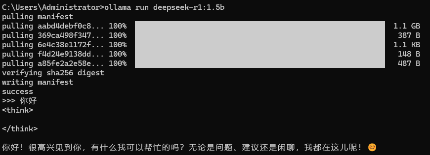

Ollama 是一款开源的本地大语言模型运行框架，支持在 Windows、macOS 和 Linux 系统上运行，能够帮助用户轻松下载和使用各种大语言模型（例如deepseek、llama、qwen）。本文将详细介绍 Ollama 的安装步骤，帮助你快速搭建本地模型环境。

## 目标

1. 在本地启动ollama
2. 通过ollama下载大模型（deepseek、llama、qwen等）
3. 通过命令行与大模型进行交互

## 一、安装Ollama

### （一）Windows 系统安装

##### **下载安装包**

- 访问 Ollama 官方网站 [https://ollama.com/download](https://ollama.com/download)，下载 Windows 安装包。
  
- 安装包通常为 `.exe` 格式，下载完成后双击运行安装程序。
  
- 安装路径默认为 `C:\Program Files\Ollama`。

##### **验证安装**

- 安装完成后，打开 PowerShell 或命令提示符，输入以下命令验证安装是否成功：
  
    ```bash
    ollama -v
    ```
    
    如果显示版本号（如 `ollama version is 0.5.11`），则表示安装成功。
    

### （二）macOS 系统安装

##### 一键安装

- 打开终端，运行以下命令进行安装：
  
    ```bash
    curl https://ollama.ai/install.sh | sh
    ```
    
- 安装完成后，运行 `ollama -v` 验证安装是否成功。
  

## 三、启动 Ollama 服务

安装完成后，需要启动 Ollama 服务，才能正常使用模型：

### 启动服务

- 在终端或命令提示符中运行以下命令：
  
    ```bash
    ollama serve
    ```
    
- 如果服务启动成功，将显示服务已启动的提示。

### 验证服务

- 打开浏览器，访问 [http://localhost:11434](http://localhost:11434/)，如果页面正常显示，则表示服务启动成功。
  

## 四、下载并启动本地大模型

### 选择大模型

在该网站选择要启动的大模型https://ollama.com/library

例如，启动`deepseek-r1:1.5b`模型

```bash
ollama run deepseek-r1:1.5b
```

执行成功后即可对话



>至此，已经在本地成功启动大模型，可以通过命令行与大模型进行交互。
>
>后面就可以通过open-webui、dify等可视化界面对接ai。

## 五、模型管理

### （一）查看已下载模型

运行以下命令查看已下载的模型：

```bash
ollama list
```

### （二）删除模型

如果需要删除某个模型，可以运行以下命令：

```bash
ollama rm model_name
```

### （三）拉取模型

Ollama 提供了丰富的模型库，可以通过以下命令拉取模型：

```bash
ollama pull model_name
```

例如，拉取 `deepseek-r1:7b`模型：

```bash
ollama pull deepseek-r1:7b
```

>其他的一些命令可以使用`ollama help`提示

## 六、总结

Ollama 提供了简单易用的安装方式，支持多种操作系统，能够帮助用户快速搭建本地大语言模型环境。通过本文的教程，你已经可以轻松安装并使用 Ollama，接下来可以尝试运行不同的模型，探索更多功能。


