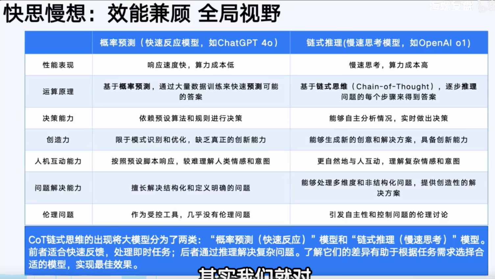
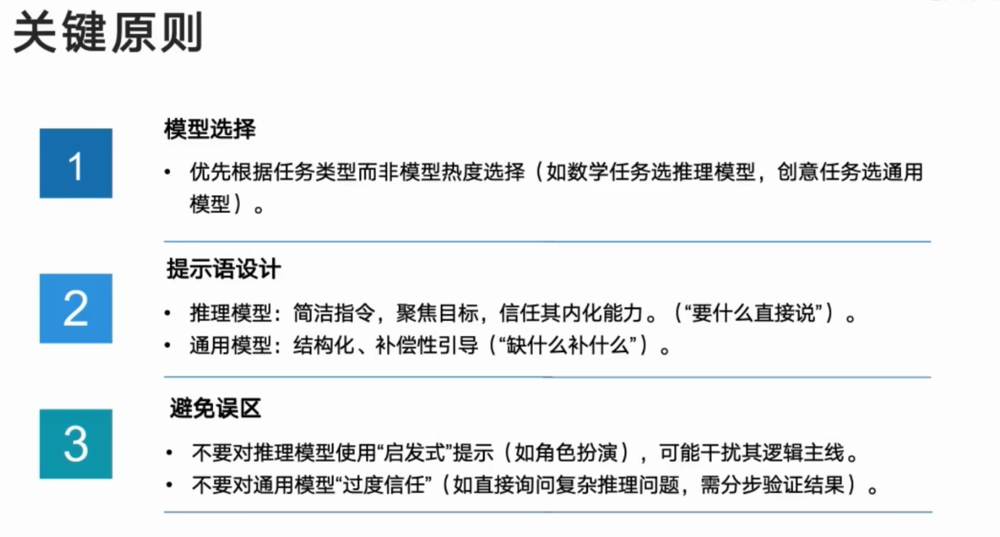
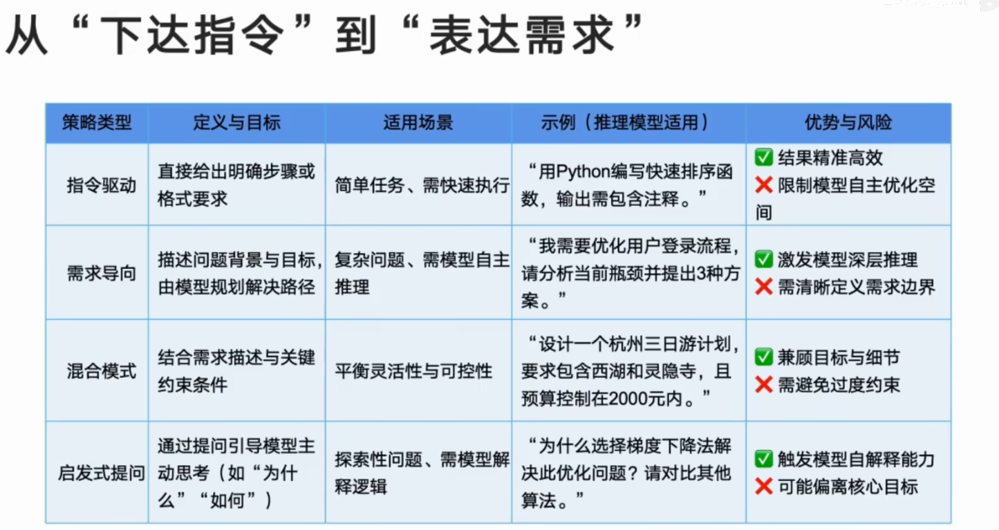

推理模型：推理大模型是指传统的大语言模型基础上，强化推理、逻辑分析和决策能力的模型。它们通常具备额外的技术，比如强化学习、神经符号推理、元学习等，来增强其推理和问题解决能力。
例如：DeepSeek-R1，GPT-o3在逻辑推理、数学推理和事实问题解决方面表现突出，
非推理模型：适用于大多数人物，非推理大模型一般侧重于语言生成、上下文理解和自然语言处理，而不强调深度推理能力。此类模型通常通过对大量文本数据的训练，掌握语言规律并能够生成合适的内容，但缺乏像推理模型那样复杂的推理和决策能力。

例如：GPT-3、GPT-4(OpenAI)，BERT(Google)，主要用于语言生成、语言理解、文本分类、翻译等任务。

| 维度     | 推理模型                                         | 通用模型                                       |
| -------- | ------------------------------------------------ | ---------------------------------------------- |
| 优势领域 | 数学推导、逻辑分析、代码生成、复杂问题拆解       | 文本生成、创意写作、多轮对话、开放性回答       |
| 性能本质 | 专精于逻辑密度高的任务                           | 擅长多样性高的任务                             |
| 强弱判断 | 并非全面更强，仅在其训练目标领域显著由于通用模型 | 通用场景更灵活，但专项任务需依赖提示语补偿能力 |

