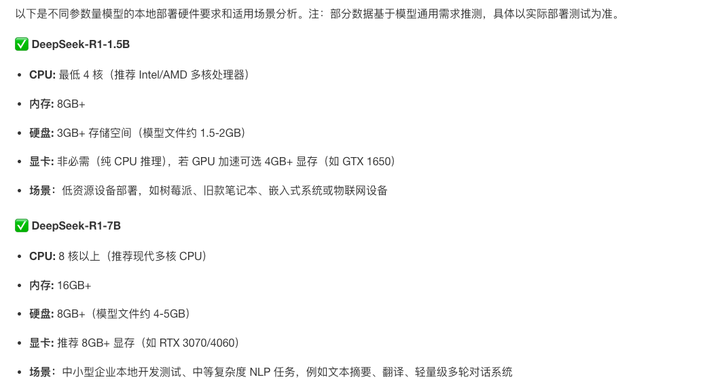

资源

• 1.5B：CPU最低4核，内存8GB+，硬盘icon3GB+存储空间，显卡icon非必需，若GPU加速可选4GB+显存，适合低资源设备部署等场景。

• 7B：CPU 8核以上，内存16GB+，硬盘8GB+，显卡推荐8GB+显存，可用于本地开发测试等场景。

• 8B：硬件需求与7B相近略高，适合需更高精度的轻量级任务。

• 14B：CPU 12核以上，内存32GB+，硬盘15GB+，显卡16GB+显存，可用于企业级复杂任务等场景。

• 32B：CPU 16核以上，内存64GB+，硬盘30GB+，显卡24GB+显存，适合高精度专业领域任务等场景。

• 70B：CPU 32核以上，内存128GB+，硬盘70GB+，显卡需多卡并行，适合科研机构等进行高复杂度生成任务等场景。

https://www.163.com/dy/article/JNPLRPQ40556B93R.html

https://cloud.tencent.com/developer/article/2493853

https://xiaoyi.vc/deepseek-specs.html

