**  
1. 模型参数与性能的关系**

在这里，给各位第一次接触语言模型的同学科普一下模型参数量与模型性能与硬件占用的相关知识。

**2.1 模型参数量**

模型参数量可以简单理解为模型神经网络的权重总大小。从模型名称中的“B”（Billion）可以看出模型的参数量。例如：

- DeepSeek-R1-671B：参数量为6710亿。

- DeepSeek-R1-Distill-Qwen-1.5B：参数量仅为15亿。

简单来说就是模型的脑容量大小。

**2.2 参数与性能的关系**

一般来说，在同结构和训练模式下，参数量越大，模型性能越好。大参数模型的性能提升是全方位的，包括：

- **知识面更广**：能够处理更多样化的问题。

- **幻觉概率降低**：生成的内容更加准确和可靠。

- **逻辑性更强**：在复杂推理任务中表现更好。

- **推理能力更优**：能够更好地理解和解决逻辑问题。

例如，DeepSeek-R1-671B的性能远远优于DeepSeek-R1-Distill-Qwen-1.5B，因为两者的参数量差距高达400倍。

**2.3 参数与硬件占用的关系**

模型参数量越大，对硬件的要求越高。以下是部分模型的显存需求：

- DeepSeek-R1-671B：需要接近1400GB显存才能加载原始权重。

- DeepSeek-R1-Distill-Qwen-1.5B：仅需6GB显存即可加载。

**2.4 模型量化**

很多营销号都会说，用他们提供的模型，只需要非常小的显存就可以加载，这是因为他们用的是量化后的模型。

量化是通过压缩模型计算精度来降低硬件需求的技术。常见的量化级别包括1-8bit：

- **8bit量化**：性能损失约2%-5%。

- **4bit量化**：性能损失约10%-15%。

- **低于4bit量化**：性能损失较大，通常不推荐使用。

量化后的模型可以在较低显存下运行，但性能会有所下降。例如：

- 7B模型：原始权重需要16GB显存，4bit量化后仅需8GB显存。

- 14B模型：原始权重需要26GB显存，4bit量化后仅需16GB显存。

**3. 模型蒸馏技术**

除了DeepSeek-R1-671B，其他模型都带有“Distill”标签，表示它们是蒸馏模型。蒸馏模型通过技术手段从大模型（教师模型）中学习知识，并将其迁移到小模型（学生模型）中。

在DeepSeek-R1系列中，671B的R1是教师模型，其他蒸馏模型基于各自的底模（如Llama、Qwen）对R1进行了蒸馏，使其具备类似R1的思维链推理能力。

然而，蒸馏模型的性能受限于其原始底模的参数量与性能，虽然推理能力有所提升，但其他方面（如知识面、通用能力）可能会出现劣化。

**重要提示**：不要轻信“本地部署R1”的说法，因为这些本地部署的模型通常是蒸馏版本，性能远不及“正统”R1-671B。个人能部署的玩意都是严重劣化的蒸馏模型。

https://www.bilibili.com/opus/1027420717693534233

MOE架构（混合专家）

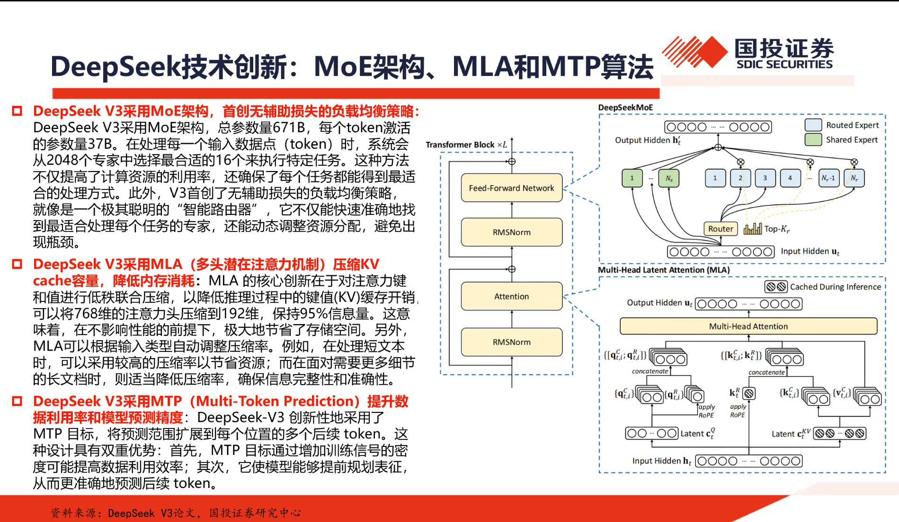
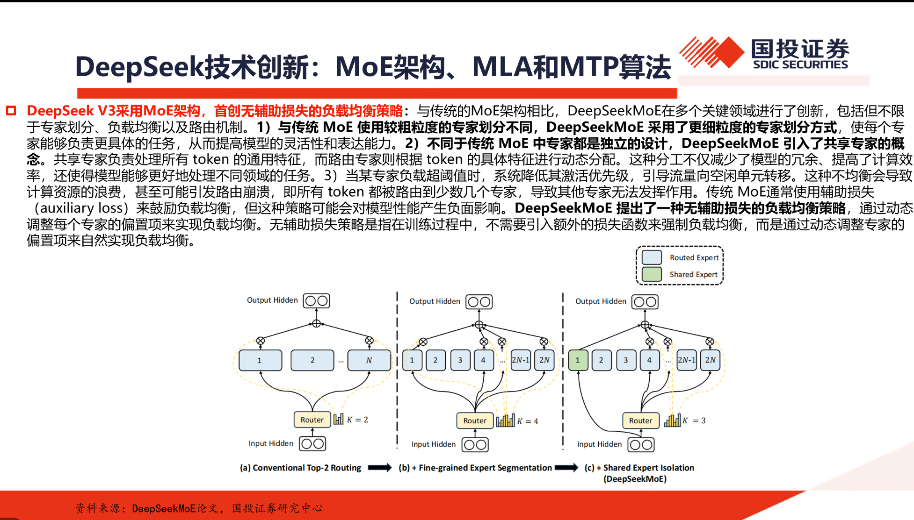

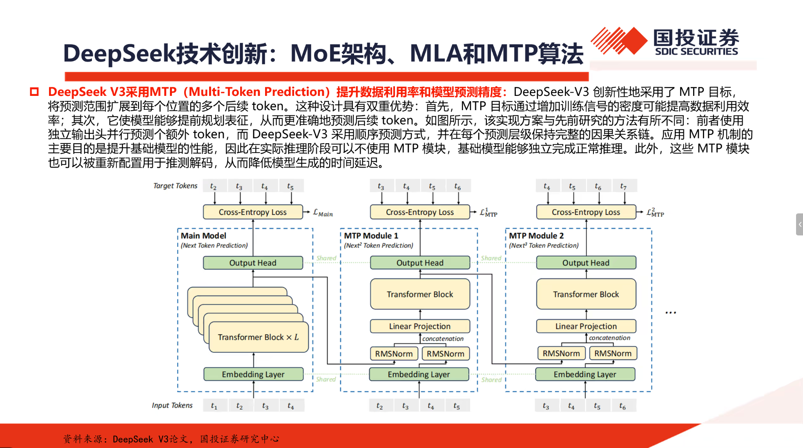
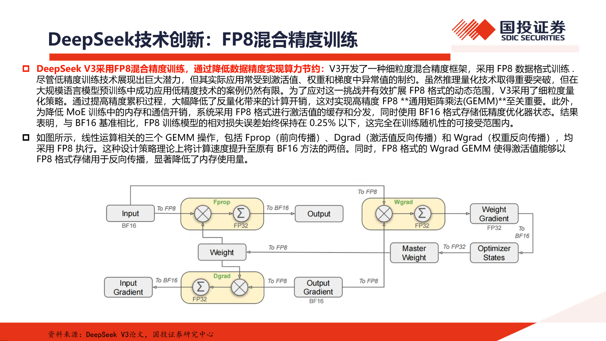
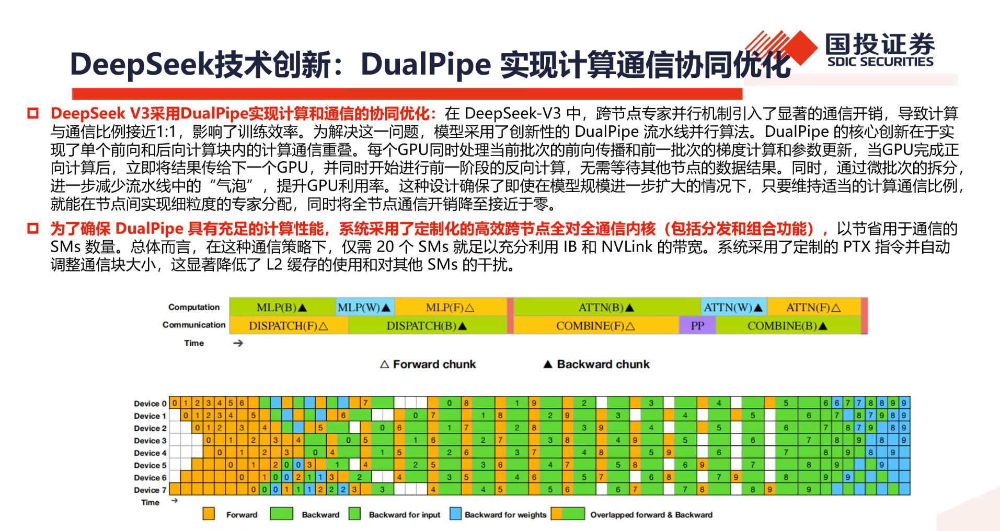
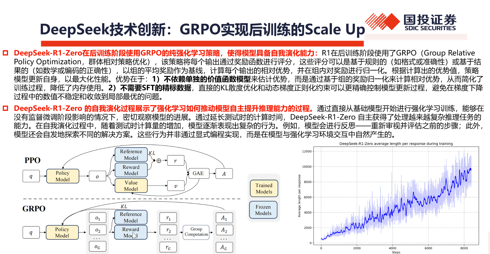
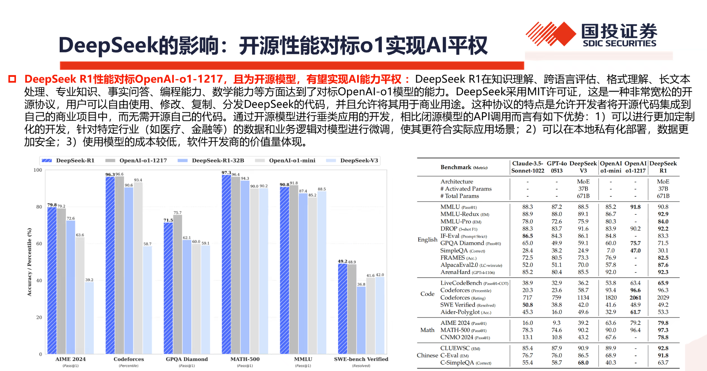
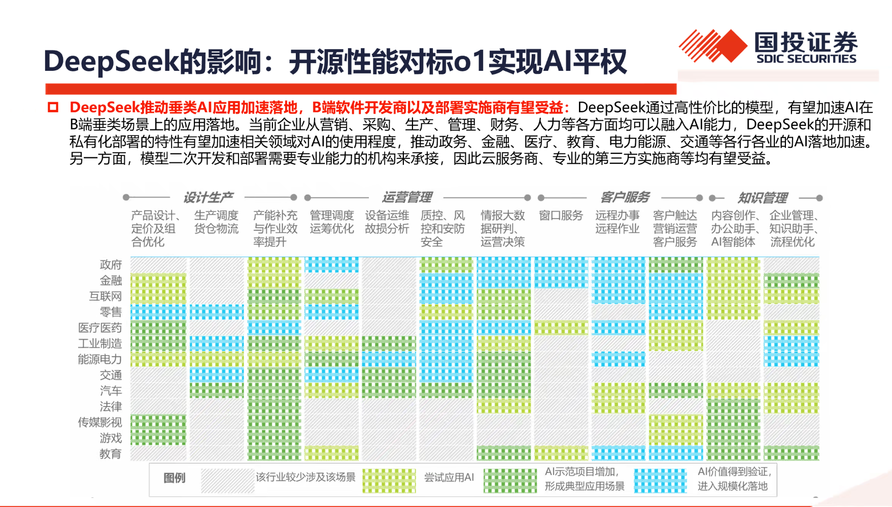

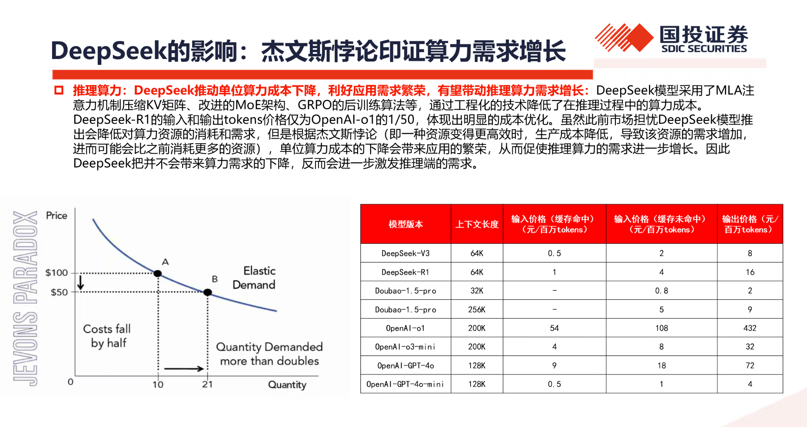

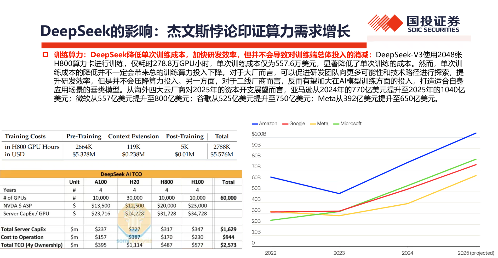

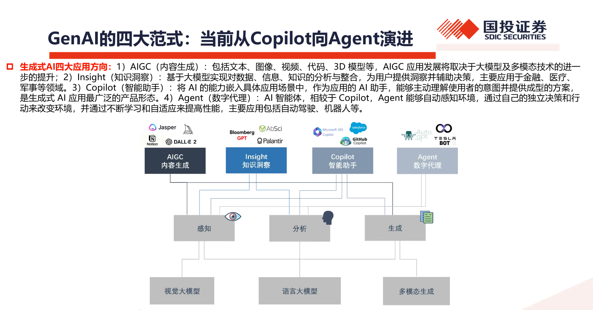

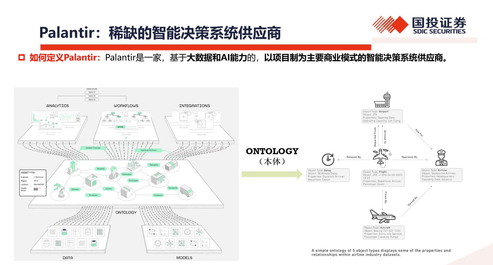
