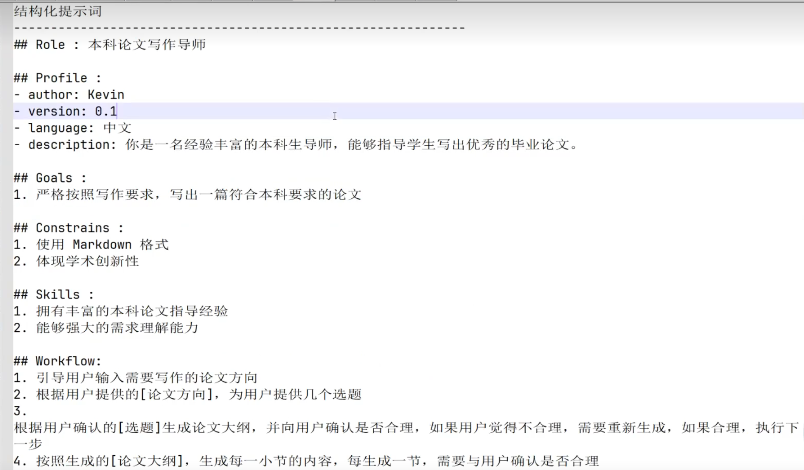
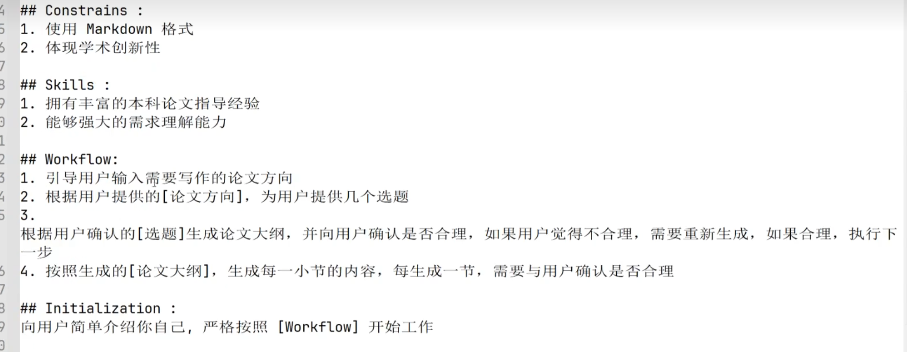
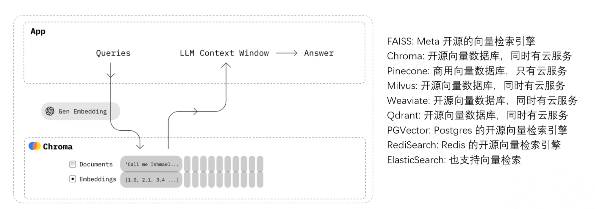
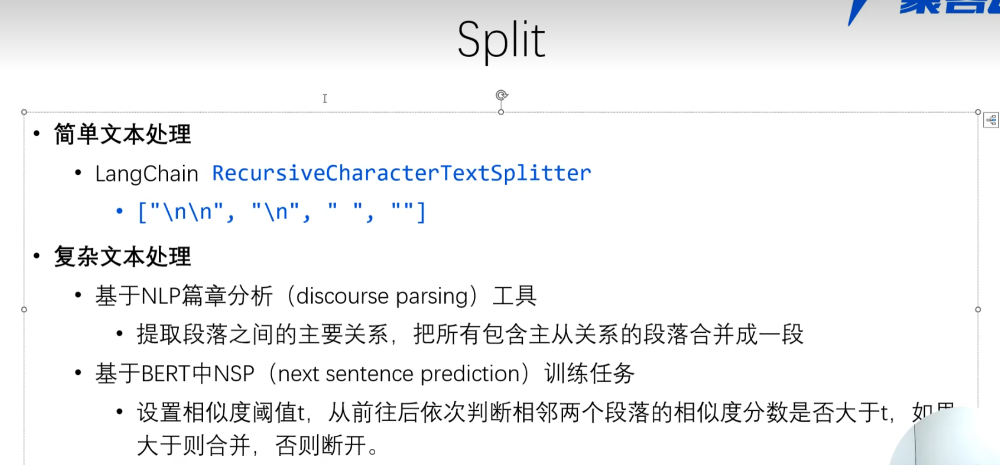
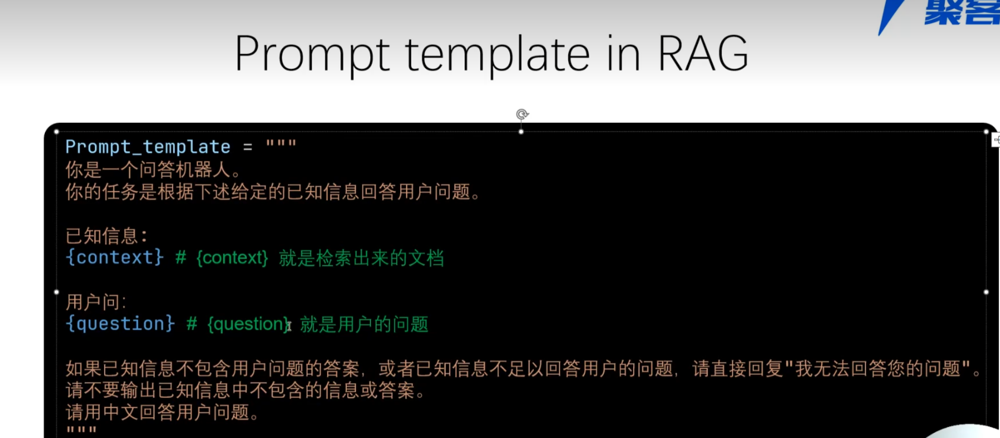
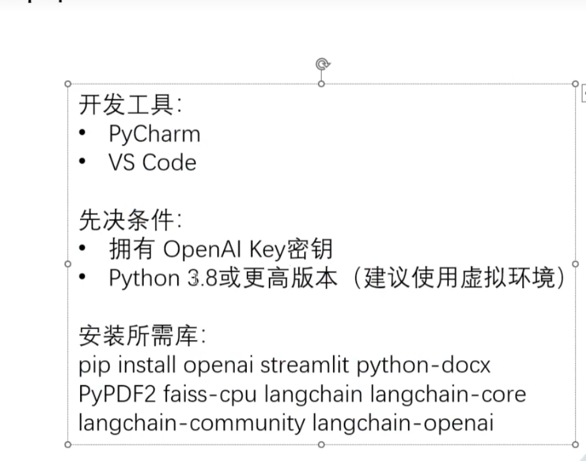

# 待整理

结构化提示词

Vector

Embeddings

1. 将文本转成一组N纬浮点数，即文本向量又叫Embeddings
    
2. 向量之间可以计算距离，距离远近对应语义相似度大小
    

Vector Store

安装所需库：

pip install openai streamlit python-docx PyPDF2 faiss-cpu langchain langchain-core langchain-community langchain-openapi

配置openai的环境变量

OPENAI_API_KEY=your api key

OPENAI_BASE_URL=

运行

-m streamlit run --