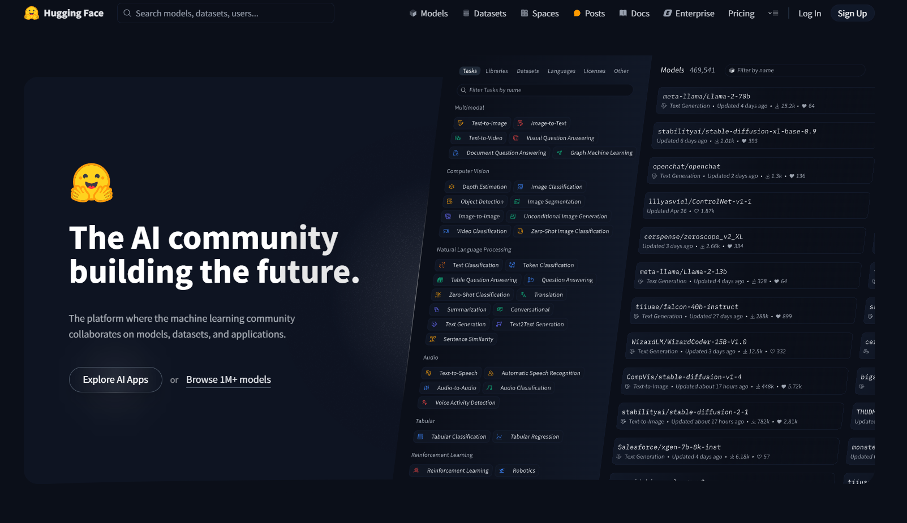
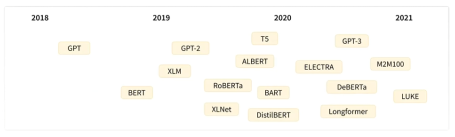
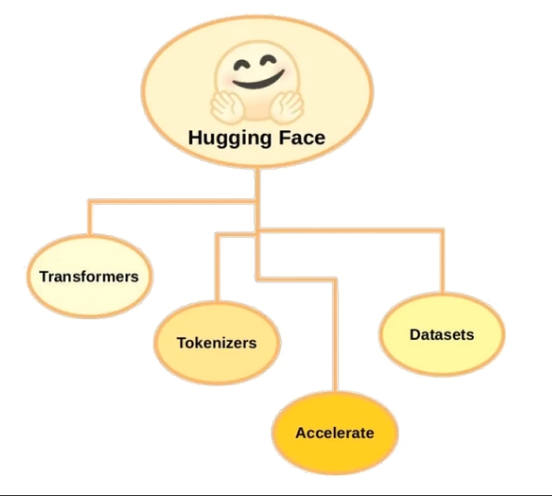
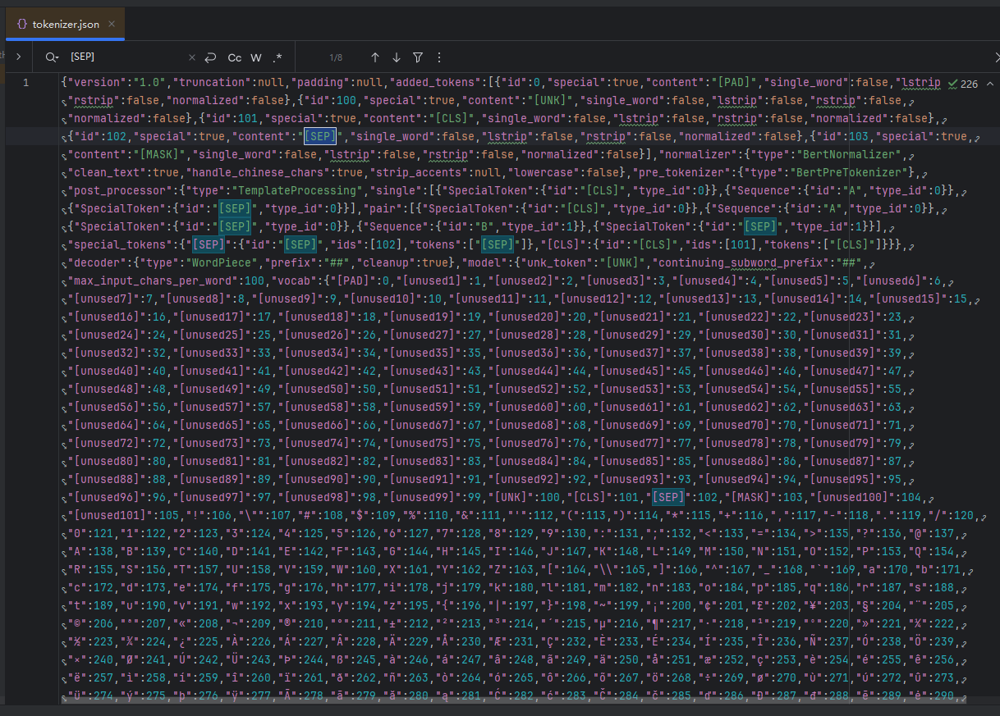

**内容**

1. 什么是Hugging Face? 它的目标是什么？
2. Hugging Face中包含哪些知名的预训练模型？
3. 如果我们要在Hugging Face中下载BERT，那么
   - 只有一个版本，还是有多种版本可以选择？
   - 每一种版本的BERT中国，只有一种格式还是有多种格式可以适应多种下游任务？
4. Hugging Face库中有哪些有用的组件？

# 一 Hugging Face简介

官网：[https://huggingface.co/](https://huggingface.co/)

Hugging Face是一个开源的AI社区网站，站内几乎囊括了所有常见的AI开源模型，号称：一网打尽，应有尽有，全部开源。



在Hugging Face中可以下载到总多开源的预训练大模型，模型本身包含相关信息和参数，可以拿来做微调和重新训练，非常方便



# 二 Hugging Face核心组件




Hugging Face核心组件包括Transformers、Dataset、Tokenizer，此外还有一些辅助工具，如Accelerate，用于加速深度学习训练过程。

更多内容可以去Hugging Face官网发掘，下面重点介绍下它的三个核心组件。

## 1、Hugging Face Transformers

Transformers 是Hugging Face的核心组件，主要用于自然语言处理，提供了预训练的语言模型和相关工具，使得研究者和工程师能够轻松的训练和使用海量的NLP模型。

常用的模型包括BERT、GPT、XLNet、RoBERTa等，并提供了模型的各种版本。

通过Transformers库，开发人员可以用这些预训练模型进行文本分类、命名实体识别、机器翻译、文档系统等NLP任务。

Transformers库本身还提供方便地API、示例代码、文档，让开发者学习和使用这些模型都变得非常简单，同时开发者也可以上传自己的预训练模型和API。

```python
# 导入transformers相关库
from transformers import AutoModelForSequenceClassification
# 初始化分词器和模型
model_name = "bert-base-cased"
model = AutoModelForSequenceClassification.from_pretrained(model_name, num_labels=2)

# 将编码后的张量输入模型进行预测
outputs = model(**inputs)

# 获取预测结果和标签
predictions = outputs.logits.argmax(dim=-1)
```

## 2、Hugging Face Dataset

Dataset 是Hugging Face 的公共数据集，以下是常用的一些数据集：

1. SQuAD：Stanford大学发布的问答数据集
2. IMBDB：电影评论数据集
3. CoNLL-2003：NER命名实体识别数据集
4. GLUE：公共基准测试集

Hugging Face Dataset简化了数据集的下载、预处理过程，并具备数据集分割、采样和迭代器等功能。

```python
# 导入数据集
from datasets import load_dataset

# 下载数据集并打乱数据
dataset_name = "imdb"
datset = load_dataset(dataset_name)
```

## 3、 Hugging Face Tokenizer

Tokenizer是Hugging Face的分词器，它的任务是将输入文本转换为一个个标记（tokens），它还能对文本序列进行清洗、截断和填充等预处理，以满足模型的输入要求。它的主要功能是将文本分解为更小的单元（通常是词或子词），并将这些单元映射到数值表示

以下是分词器的简单解释：

1. **文本分割**：分词器首先将文本分割成更小的单元。例如：对于句子“I love NLP”，分词器可能会将其分割为`["I", "LOVE", "NLP"]`。
2. **词汇映射**：分词器会将每个单元映射到一个唯一的数值索引，这些索引通常来自一个与定义的词汇表。例如，假设词汇表中“I”的索引是1，“love”的索引是2，“NLP”的索引是3，那么分词器会将句子转换为`[1,2,3]`。
3. **处理特殊标记**：分词器还会处理一些特殊的标记，比如句子开头的`[CLS]`标记和句子结尾的`[SEP]`标记，这些标记在某些模型中是必须的。
4. **填充和截断**：为了使输入的长度一致，分词器可以对较短的序列进行填充（添加特殊的填充标记）或对较长的序列进行截断。

通过这些步骤，分词器将文本转换为模型可以理解的数值格式，使得模型能够进行进一步的处理和预测。希望这个解释能够帮助你理解分词器的作用。

```python
# 导入分词器
from transformers import AutoTokenizer

# 初始化分词器和模型
tokenizer = AutoTokenizer.from_pretrained(model_name)

# 将文本编码为模型期望的张量格式
inputs = tokenizer(datset["train"]["text"][:10], padding=True, truncation=True, return_tensors="pt")
```

### 张量概念

在机器学习和深度学习中，“张量”（Tensor）是一个多为数组的通用属于。它是数据的基本结构，类似于标量、向量和矩阵，但可以拓展到更高的维度。

以下是张量的简单解释：

1. 标量（0维张量）：一个单一的数值。例如，`3`或`-1.5`
2. 向量（1维张量）：一组有序的数组。例如，[1,2,3]
3. 矩阵（2维张量）：一个二维数组。例如：

```
[[1,2,3],
[4,5,6]]
```

4. 高维张量（3维及以上）：可以想象成多层的矩阵。例如：一个3维张量可以是一个矩阵的集合。

在代码中，`inputs`是一个张量，它是通过分词器将文本数据转换为模型可以理解的格式。这个张量通常是一个二维的，形状为`[batch_size, sequence_length]`，其中`batch_size`是批处理的样本数量，`sequence_length`是每个样本的最大长度。这个张量包含了文本的数值化表示，通常是词汇表中每个词的索引。

通过这种方式，模型可以处理文本数据并进行预测。

### [CLS] [SEP] 标记作用

在一些自然语言处理模型（如BERT）中，特殊标记`[CLS]`和`[SEP]`被用来帮助模型理解输入的结构和上下文。一下是他们的作用和简单解释：

1. [CLS] 标记：

   [CLS] 的英文全程是"Classification"。在中文中，它通常被翻译为“分类”。这个标记在模型中用于表示输入序列的聚合信息，特别是分类任务中。

   **作用**：`[CLS]`标记通常放在输入序列的开头，用于表示整个序列的聚合信息。对于分类任务，模型会使用与`[CLS]`标记对应的输出向量来进行最终的分类。

   **例子**：假设你有一个句子“I love NLP”，在输入到模型之前，分词器会将其转换为`["[CLS]]"，"I"，"love"，"NLP"]`。模型会特别关注`[CLS]`的输出，因为它代表了这个跟句子的语义。

2. [SEP]标记：

   [SEP]的英文全程是“Separator”。在中文中，它通常被翻译为“分隔符”。这个标记用于分割不同的句子或段落，帮助模型理解句子之间的边界。

   **作用**：`[SEP]`标记用于分割不同的句子或段落，帮助模型理解句子之间的边界。在句子对任务（如问答或句子对分类）中，`[SEP]`标记用于分割两个句子。

   **例子**：如果你有两个句子“I love NLP”和“It is facinating”，在输入到模型之前，分词器会将其转换为`["[CLS]", "I", "love", "NLP", "[SEP]", "It", "is". "fascinating", "[SEP]"]`。

   这样，模型就能识别出两个句子之间的分界。

例如：



通过使用这些特殊标记，模型能够更好地理解输入的结构和上下文，从而提高处理和预测的准确性。

# 三  Hugging Face 应用实战

该应用实战是通过Hugging Face Transformers完成一个很简单的文本分类任务（预测影评是正面还是负面），完整代码如下：

```python
from humanfriendly.terminal import output
from transformers import AutoTokenizer, AutoModelForSequenceClassification
from datasets import load_dataset
# pip install datasets

# 定义数据集名称和任务类型
dataset_name = "imdb"
task = "sentiment-analysis"

# 加载数据集
dataset = load_dataset(dataset_name)

# 打乱数据
dataset = dataset.shuffle()

# 初始化分词器和模型
model_name = "bert-base-cased"
tokenizer = AutoTokenizer.from_pretrained(model_name)

# num_labels=2 意味着模型被设置为进行二分类任务，例如情感分析中的正面和负面分类。模型的输出层将有两个节点，每个节点
model = AutoModelForSequenceClassification.from_pretrained(model_name, num_labels=2)

# 获取前10条数据集数据
# https://huggingface.co/datasets/stanfordnlp/imdb/viewer?row=0
data = dataset["train"]["text"][:10]

inputs = tokenizer(data, padding=True, truncation=True, return_tensors="pt")

# 将编码后的张量输入模型进行预测
outputs = model(**inputs)

# 获取预测结果和标签
# outputs.logits是一个张量，其中包含模型对每个输入样本的每个类别的预测分数。
# argmax(dim=-1)会在最后一个维度找到最大值的索引，这个索引对应于预测的类别
predictions = outputs.logits.argmax(dim=-1)
labels = dataset["train"]["label"][:10]
# 标签0：在二分类情况分析任务中，0 通常表示“负面”情感
# 标签1：1 通常表示“正面”情感

# 遍历预测结果和真实标签，并打印每个样本的预测结果和真实标签
for i, (prediction, label, text) in enumerate(zip(predictions, labels, data)):
    prediction_label = "正面评论" if prediction == 1 else "负面评论"
    true_label = "正面评论" if label == 1 else "负面评论"
    is_correct = "正确" if prediction == label else "错误"
    print(f"Example {i+1}: Prediction: {prediction_label}, True label: {true_label}, Result: {is_correct}, Text: {text}")
```

注意：要运行代码，需要安装最新的pytorch、transformers和datasets。

运行结果如下（第一次运行需要从Hugging Face上下载数据集和模型，需要一点时间）：

```python
Some weights of BertForSequenceClassification were not initialized from the model checkpoint at bert-base-cased and are newly initialized: ['classifier.bias', 'classifier.weight']
You should probably TRAIN this model on a down-stream task to be able to use it for predictions and inference.
Example 1: Prediction: 负面评论, True label: 负面评论, Result: 正确
Example 2: Prediction: 负面评论, True label: 负面评论, Result: 正确
Example 3: Prediction: 负面评论, True label: 正面评论, Result: 错误
Example 4: Prediction: 负面评论, True label: 正面评论, Result: 错误
Example 5: Prediction: 负面评论, True label: 负面评论, Result: 正确
Example 6: Prediction: 负面评论, True label: 负面评论, Result: 正确
Example 7: Prediction: 负面评论, True label: 负面评论, Result: 正确
Example 8: Prediction: 负面评论, True label: 负面评论, Result: 正确
Example 9: Prediction: 负面评论, True label: 负面评论, Result: 正确
Example 10: Prediction: 负面评论, True label: 正面评论, Result: 错误
```

该实战主要演示如何使用Hugging Face，预测结果并不是那么准确，因为模型本身还未做过电影评论相关微调。

Hugging Face也提醒我们，可能需要用一些下游任务重新训练这个模型（即微调），再用它来预测和推理： You should probably TRAIN this model on a down-stream task to be able to use it for predictions and inference.

# 四 总结

Hugging Face是当前最知名的Transformer工具库和AI开源模型网站，它的目标是让人们更加方便地使用和开发AI模型。

1. 什么是Hugging Face? 它的目标是什么？

   Hugging Face Hugging Face是一个AI社区网站，站内几乎囊括了所有的AI开源模型。

   Hugging Face是当前最知名的Transformer工具库和AI开源模型网站，它的目标是让人们更方便地使用和开发AI模型。

2. Hugging Face中包含哪些知名的预训练模型？

   如BERT、GPT、XLNet、RoBERTa

3. 如果我要在Hugging Face中下载BERTT，那么

   只有一个版本，还是有多种版本可以选择？

   ​	多版本

   每一种版本的BERT中，只有一种格式还是有多种格式可以适应多种下游任务？

   ​	多种格式

4. Hugging Face库中有哪些有用的组件？
   核心组件包括：Transformers、Dataset、Tokenizer，此外还有一些辅助工具，如Accelerate等。

