## 基本术语

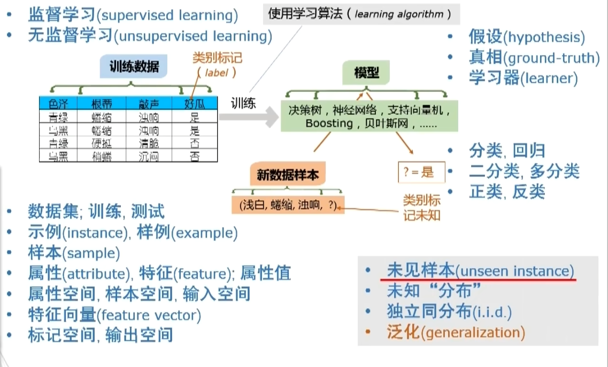

- 数据集；训练，测试
-  示例（instance），样例（example）
- 样本(sample)
- 属性(attribute) 特征 (feature)属性值
- 属性空间 样本空间 输入空间
- 特征向量(feature vector)
- 标记空间，输出空间

## 归纳偏好 （Inductive Bias）

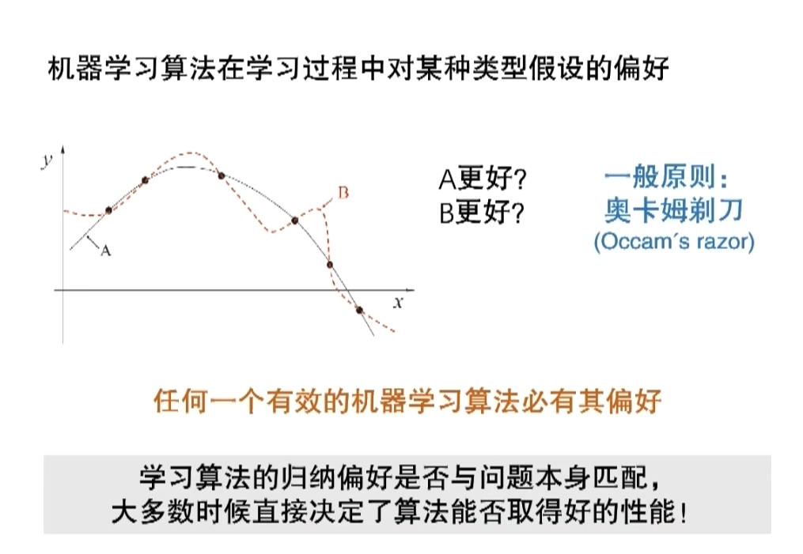

## NFL定理

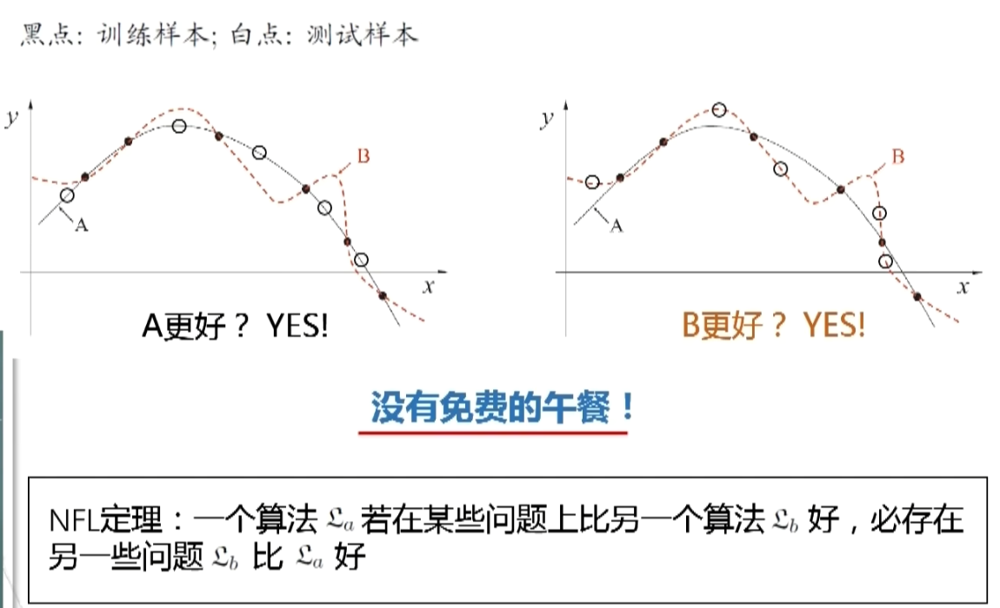

NFL定理的重要前提：

所有“问题”出现的机会相同、或所有问题同等重要

实际情形并非如此；我们通常只关注自己正在试图解决的问题

脱离具体问题，空泛地谈论“什么学习算法更好”毫无意义！

要具体问题，具体分析！

现实机器学习应用

## 2.1 泛化能力

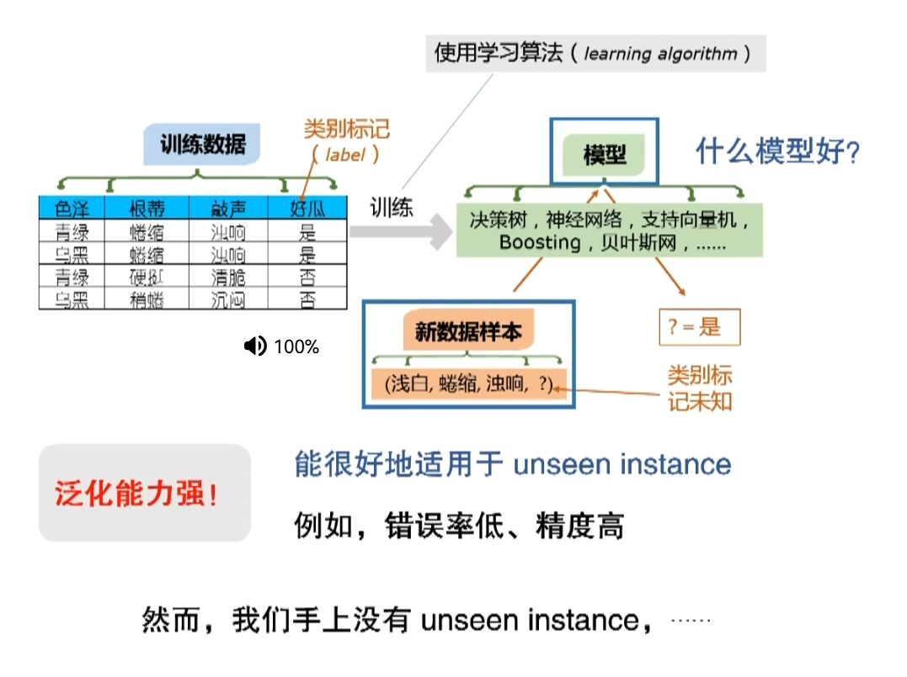

## 2.2 过拟合（Overfitting）和欠拟合（Underfitting）

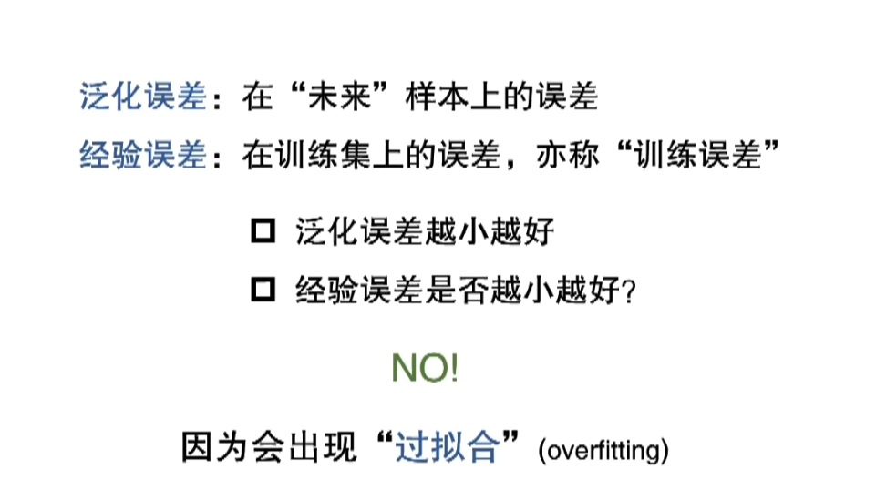

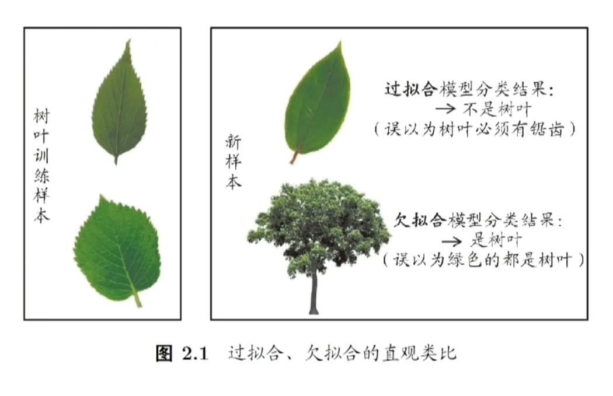

训练误差不是越小越好

## 2.3 三大问题

### 模型选择

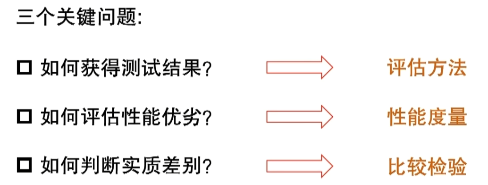

## 2.4 评估方法

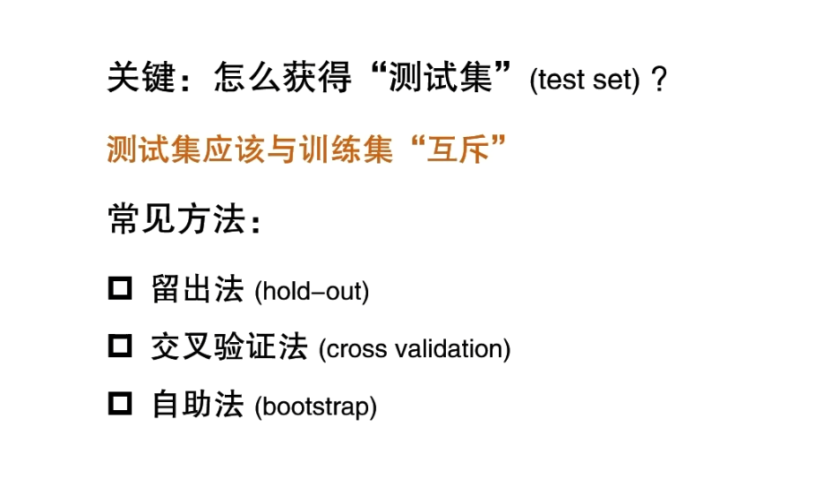

#### 留出法

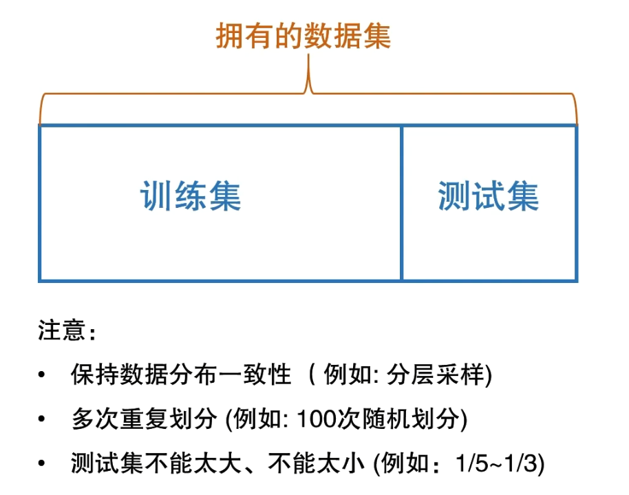

#### k-折 交叉验证法

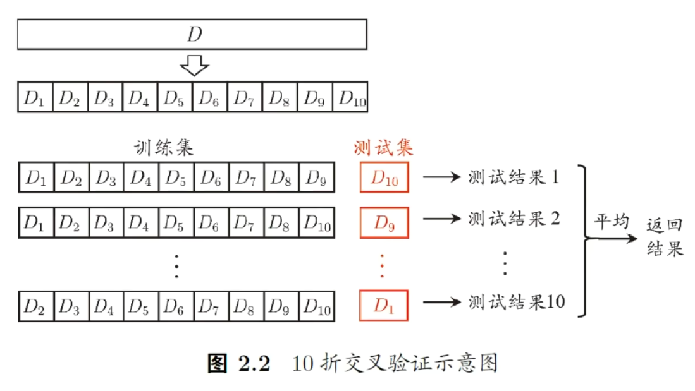

#### 自助法

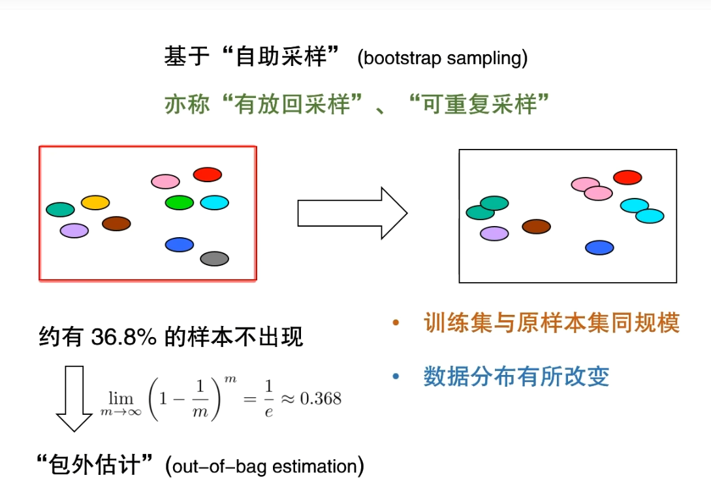

## 2.5 调参与验证集

## 5.1 神经网络模型

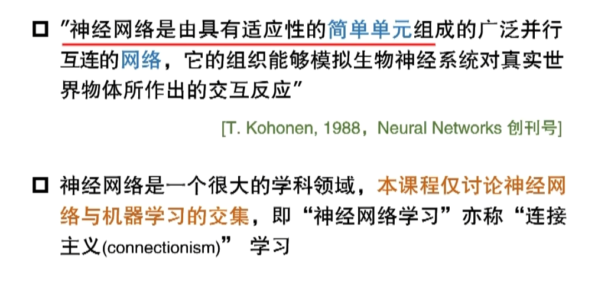

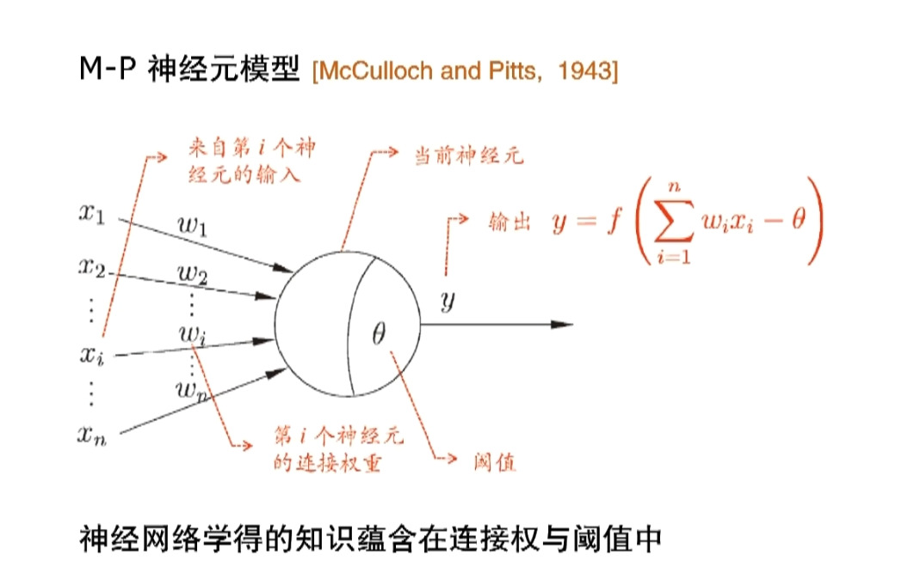

## 7.3 贝叶斯分类器和贝叶斯学习

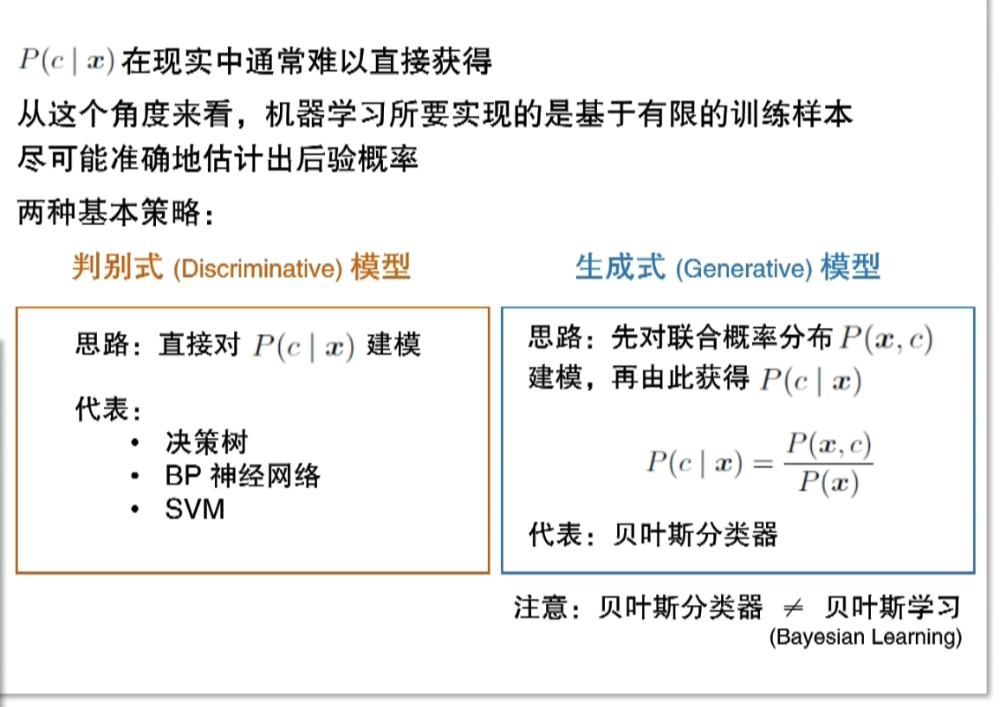
