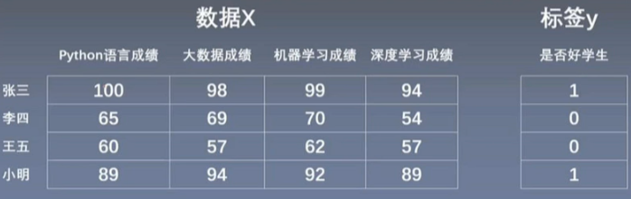
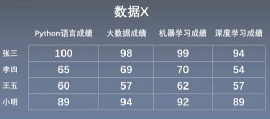
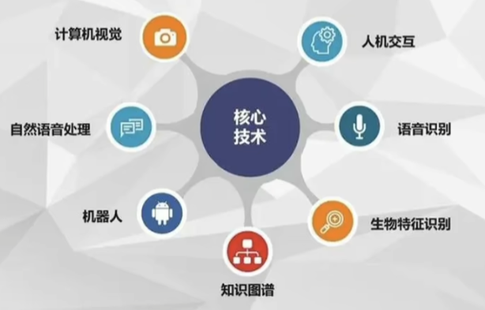
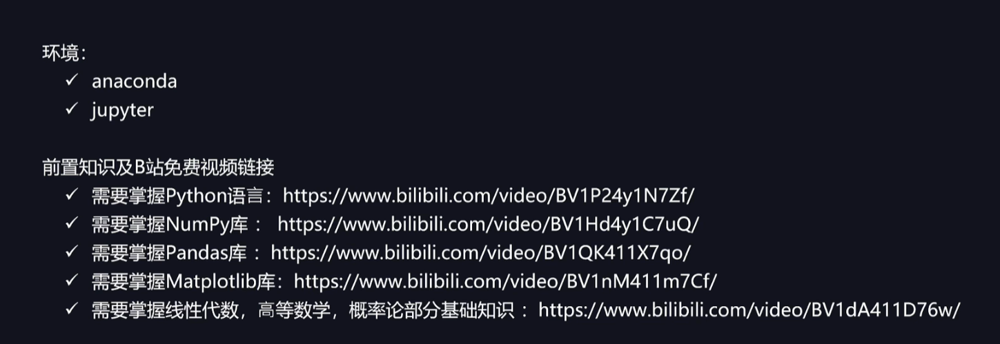

# 课程介绍

深度学习是机器学习的分支
强化学习也是机器学习的分支

## 机器学习分类

监督学习：训练集有标记信息，有分类和回归
无监督学习：训练集没有标记信息，有聚类和降维
半监督学习：一半数据有标记，另一半没有标记，为了使用所有数据，就会使用半监督学习的方式。
强化学习：数据没有label标记，但需要每一步行动环境给于的反馈来不断调整训练对象。

监督学习

无监督学习

## 机器学习分类
从算法的角度，机器学习包括分类算法，回归算法，聚类算法，集成算法等，其中分类算法在实际业务中使用较多。

分类算法包括：K近邻算法（KNN）、贝叶斯算法、决策树算法、逻辑回归算法、SVM等。
回归算法包括：线性回归、Lasso回归、Ridge回归、决策树回归、SVR等
集成算法包括：随机森林、AdaBoost、GBDT、XGBoost、LightGBM等
聚类算法：KMeans均值聚类算法、均值偏移聚类算法、GMM高斯聚类算法、DBSCAN基于密度的聚类算法、层次聚类算法等。
## 机器学习的应用场景

作为一套数据驱动的方法，机器学习已广泛应用与数据分析、计算机视觉、自然语言处理、生物特征识别、搜索引擎、医学诊断、检测信用卡欺诈、证券市场分析、DNA序列测序、语音和手写识别和机器人等领域。

机器学习的一般过程

机器学习分类算法的主要作用是：通过对历史数据进行训练，来预测新数据对应的分类结果。

### 学习机器学习的准备工作

