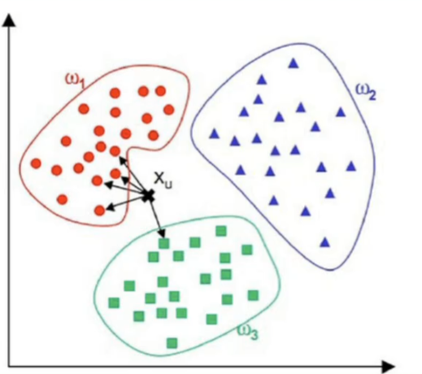
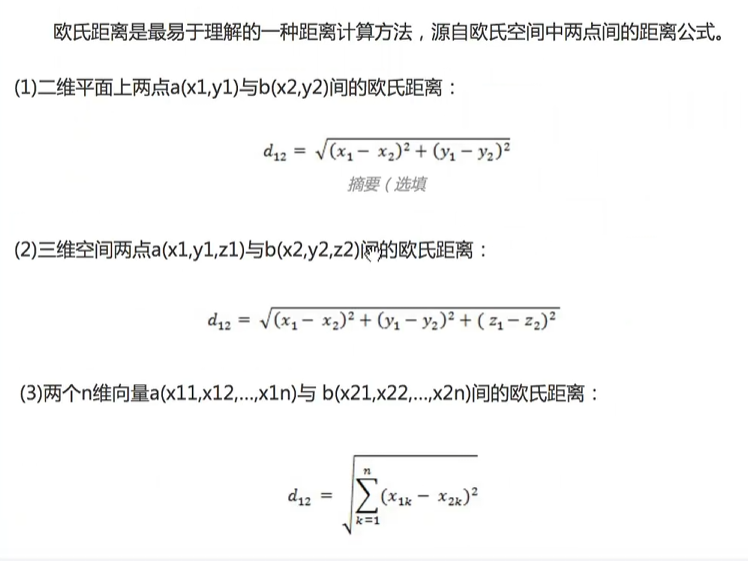
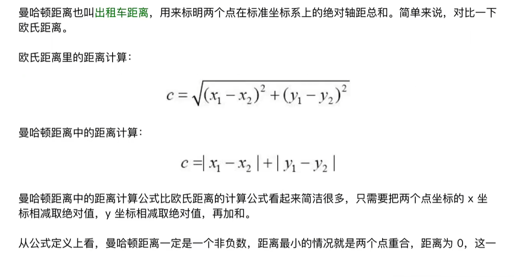
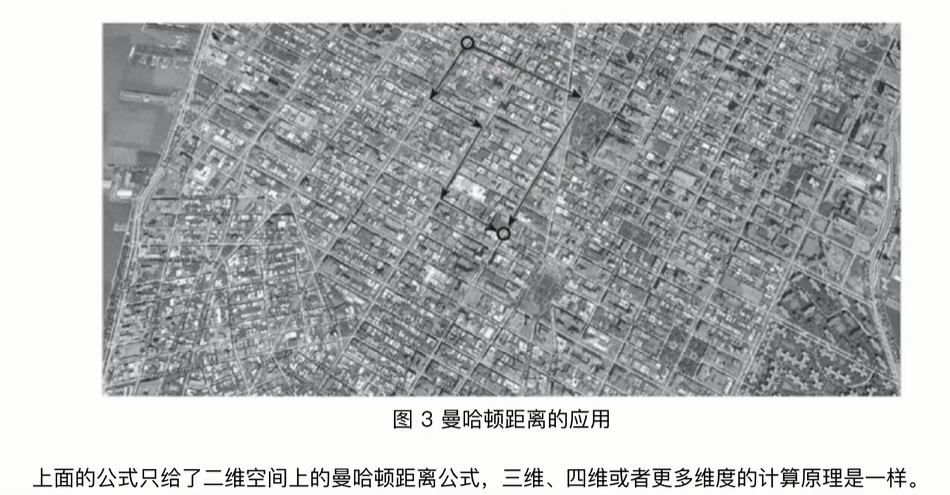

最近邻算法（KNN）
KNN (K-Nearest Neighbor) 算法是最简单的机器学习算法之一，KNN算法的核心思想是，如果一个样本在特征空间中的K个最相邻的样本中的大多数属于某一个类别，则该样本也属于这个类别。

- [ ] 如图，共有3个分类：w1，w2，w3，当有新数据X需要分类时，计算X和每个样本点的聚类，找到最近的K个样本，在这K个样本中计算最多样本的分类就是我们的分类结果（如图K=5，其中有4个属于w1）

### 欧式距离

在二维空间时 就是勾股定理
### 曼哈顿距离
欧式距离是人们在解析几何里最常用的一种计算方式，但是计算起来比较复杂，要平方，加和，再开方，而人们在空间几何中度量距离最多场合是可以做一些简化的。曼哈顿距离就是由19世纪著名的德国犹太人数学家赫尔曼·闵可夫斯基发明的。

